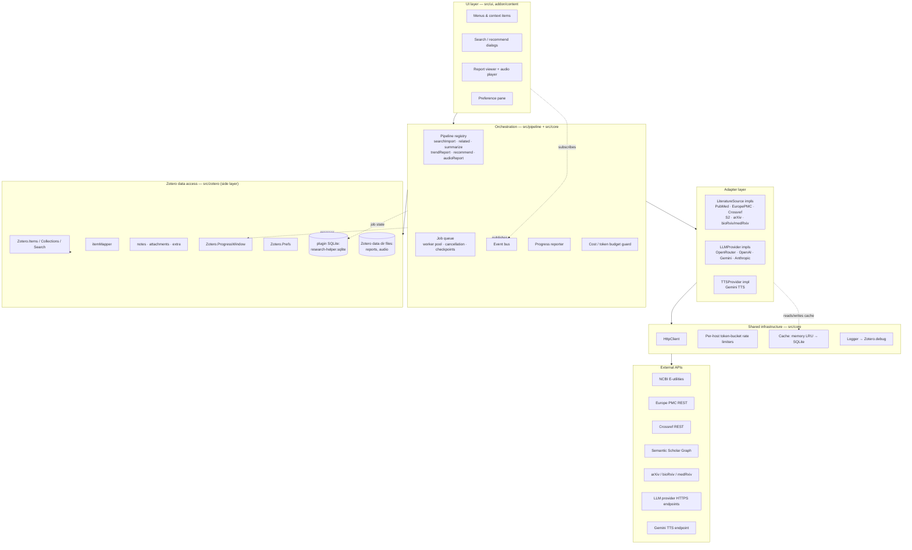
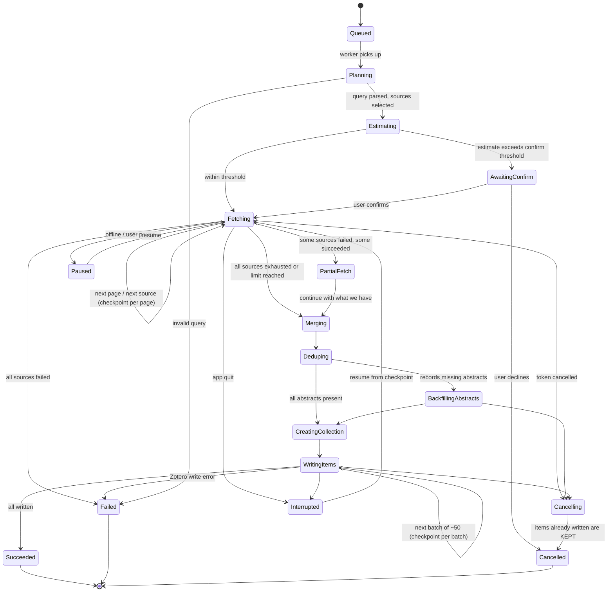
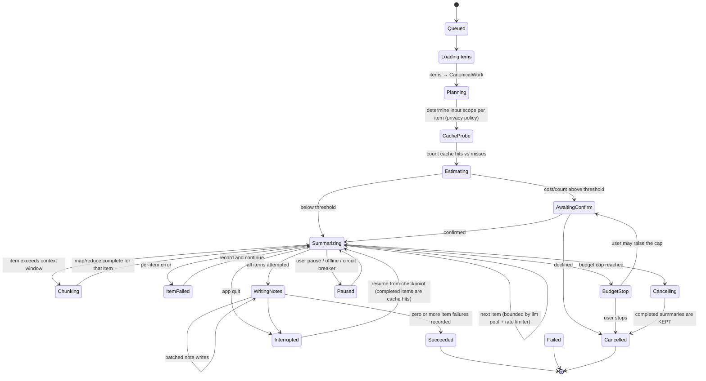
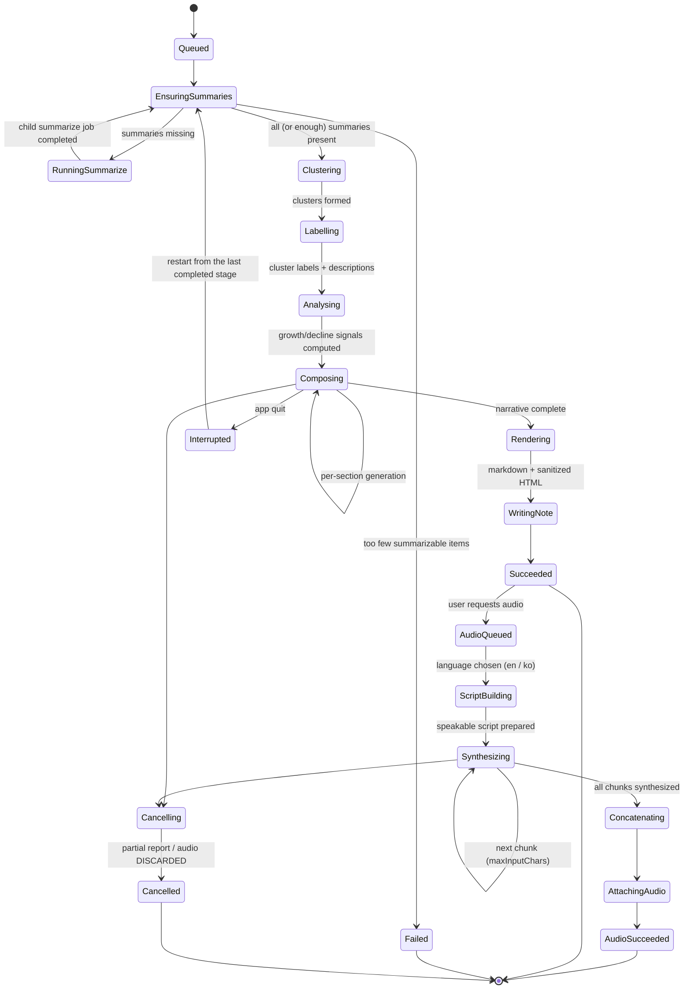
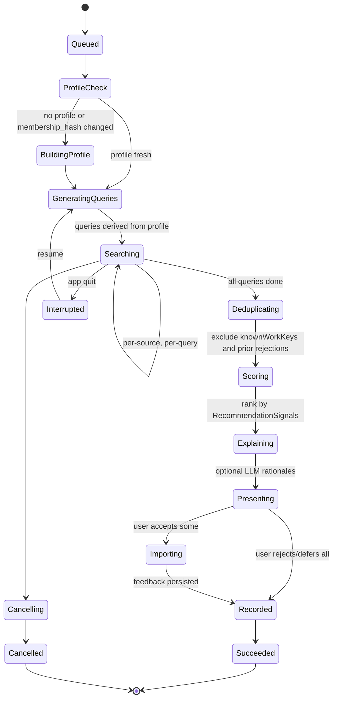

# 07 — Architecture and Data Model

**Document owner:** systems architecture
**Scope:** cross-cutting system design for the `research_helper` Zotero plugin
**Target platform:** Zotero 10.x (user runs 10.0.1), bootstrapped plugin, privileged JS context, fully client-side (no backend)
**Status:** design specification (pre-implementation)

Related documents (do not duplicate — cross-reference):

| Document | Owns |
|---|---|
| `01-zotero-plugin-platform.md` | Zotero plugin runtime, bootstrap lifecycle, XUL/HTML UI hosting, build/release |
| `02-literature-database-apis.md` | Per-API endpoints, query syntax, response schemas, field-level quirks |
| `03-llm-provider-integration.md` | Per-provider request/response formats, model IDs, token accounting |
| `04-audio-report-tts.md` | Gemini TTS specifics, audio encoding, playback |
| `05-related-work-discovery.md` | Similarity/recommendation algorithms |
| `06-summarization-and-trend-report.md` | Summarization strategy, clustering, report composition |
| `08-ui-ux-spec.md` | Screens, dialogs, interaction flows |
| `09-security-privacy-and-api-keys.md` | Threat model, key storage, egress policy |
| `12-prompt-library.md` | Prompt text, versioning conventions |

---

## 1. Platform baseline and what it constrains

### 1.1 Confirmed platform facts

Zotero 10.0 was released 2026-08-17 and 10.0.1 on 2026-08-24 ([Zotero Version History](https://www.zotero.org/support/changelog)). Zotero has moved to a rapid major-release cadence (7 → 8 → 9 → 10 in relatively quick succession), which has direct architectural consequences discussed in §1.3.

Facts that shape this architecture, from [Zotero 10 for Developers](https://www.zotero.org/support/dev/zotero_10_for_developers) and [Zotero 7 for Developers](https://www.zotero.org/support/dev/zotero_7_for_developers):

1. **Plugins run privileged.** "Zotero 7 plugins continue to provide full access to platform internals (XPCOM, file access, etc.)" ([Zotero 7 for Developers](https://www.zotero.org/support/dev/zotero_7_for_developers)). There is no WebExtension sandbox, no CORS enforcement on `Zotero.HTTP` requests, and no permission prompt model. Everything the plugin does is done with the full authority of the Zotero process. This is what makes a fully client-side design possible at all — the plugin can talk to PubMed, Crossref, OpenAI and Google directly from the desktop app.
2. **`zotero.sqlite` now runs in WAL mode** in Zotero 10, and the docs explicitly warn: "If your plugin or external tool reads zotero.sqlite directly (which it probably shouldn't — use the local API instead!), it must account for the `-wal` and `-shm` files" ([Zotero 10 for Developers](https://www.zotero.org/support/dev/zotero_10_for_developers)). **Architectural rule: `research_helper` never touches `zotero.sqlite` directly.** All Zotero data access goes through the `Zotero.Items` / `Zotero.Collections` / `Zotero.Search` JS API.
3. **Full-text search was rewritten on SQLite FTS5**; the `fulltextWords` and `fulltextItemWords` tables are gone ([Zotero 10 for Developers](https://www.zotero.org/support/dev/zotero_10_for_developers)). Any design that assumed those tables is dead. We do not depend on them.
4. **Multi-selection API change.** Singular selection getters were replaced by plural ones: `ZoteroPane.getSelectedCollection()` → `getSelectedCollections()`, `getSelectedSavedSearch()` → `getSelectedSavedSearches()`, plus a new `ZoteroPane.getSelectedLibraryIDs()`. `ItemTree#collectionTreeRow` no longer exists; use the new `viewMode` property ([Zotero 10 for Developers](https://www.zotero.org/support/dev/zotero_10_for_developers)). Our UI layer must assume *sets*, not single objects — see §3.4.
5. **`Zotero.CookieSandbox` is removed**; use `Zotero.HTTP.newCookieContext()`, which "creates an isolated cookie jar backed by a Mozilla `userContextId`" ([Zotero 10 for Developers](https://www.zotero.org/support/dev/zotero_10_for_developers)). Relevant if we ever fetch publisher pages; we default to *not* doing so (see `09-security-privacy-and-api-keys.md`).
6. **Plugin `prefs.js` files are now loaded with the script cache disabled**, so changed default prefs take effect after a plugin update rather than requiring an app restart ([Zotero 10 for Developers](https://www.zotero.org/support/dev/zotero_10_for_developers)). We can therefore ship new default prefs in an update and rely on them being live.
7. **Local HTTP server hardening**: requests must send a `Host` header of `localhost`, `127.0.0.1` or `[::1]`, and browser-like requests need a `Zotero-Allowed-Request` header unless they come from the connector ([Zotero 10 for Developers](https://www.zotero.org/support/dev/zotero_10_for_developers)). We do not expose an HTTP endpoint, so this only matters if a future version adds one.

### 1.2 The compatibility tax

Zotero uses the application version as the plugin compatibility boundary: a plugin is disabled if its `strict_max_version` has not been raised, even when it would work fine. The Zotero 10 developer notes say that if no code changes are required, "you can simply update `strict_max_version` in your plugin's update manifest without releasing a new version." Community discussion of decoupling plugin API versioning from app versioning was redirected to zotero-dev, and Zotero staff noted there is already an "API freeze and testing period before each compatibility-breaking release" ([forums.zotero.org/discussion/133127](https://forums.zotero.org/discussion/133127/frequent-major-version-changes-and-the-current-plugin-compatibility-model)).

> **Unverified:** Search results referenced "new sandboxed APIs" intended to stay stable across major versions. We could not confirm the exact shape, names, or availability of such a stable/sandboxed plugin API surface in Zotero 10.0.1. Treat it as a possible future migration target, not something to build on now.

> **Unverified:** the exact `strict_max_version` string Zotero 10 expects. The Zotero 8 docs use `8.*` and the Zotero 9 docs use `9.0.*`; the Zotero 10 developer page did not state it in what we retrieved. Check the current template's `manifest.json` before release.

### 1.2.1 The Gecko baseline and the Zotero 8 break

Version-to-platform mapping, from the per-version developer pages:

| Zotero | Gecko base | Developer impact |
|---|---|---|
| 7 | Firefox 115 ESR | Bootstrapped plugins, privileged context established |
| 8 | Firefox 115 → 140 | **Largest break.** See below. |
| 9 | Firefox 140 ESR | *"introduced various new features but did not include any major developer-facing changes"* ([Zotero 9 for Developers](https://www.zotero.org/support/dev/zotero_9_for_developers)) — bump `strict_max_version` only |
| 10 | Firefox 140 ESR | *"Zotero 10 uses the same Firefox 140 ESR base as Zotero 9, so there are no changes to the Mozilla platform itself"* ([Zotero 10 for Developers](https://www.zotero.org/support/dev/zotero_10_for_developers)) |

**Zotero 8 changes that this architecture must respect** ([Zotero 8 for Developers](https://www.zotero.org/support/dev/zotero_8_for_developers)):

- **All JSMs became ESMs.** `ChromeUtils.import("resource://gre/modules/X.jsm")` is dead; use `ChromeUtils.importESModule("resource://gre/modules/X.sys.mjs")`. Manual `Services.jsm` imports were removed (`Services` is a global).
- **Bluebird was removed.** Only standard Promises remain. `Zotero.Promise.delay()` and `Zotero.Promise.defer()` survive, but `Zotero.Promise.map()`, `.filter()`, `.isResolved()`, `.cancel()` and `Zotero.spawn()` are gone. **This is why `src/core/concurrency.ts` implements its own `mapWithConcurrency` and `Semaphore` rather than leaning on any Zotero promise helper**, and why `CancellationToken` (§4.1) is a first-class plugin concept rather than a Bluebird cancellable promise.
- **`Zotero.MenuManager`** is the supported API for menu items — `src/ui/menus/` must use it rather than injecting DOM nodes.
- **Preference panes run in isolated global scopes**, which is why `src/ui/prefs/` is a thin controller that talks to the addon through an explicit bridge rather than reaching for plugin globals.
- `nsIScriptableUnicodeConverter` and `Services.appShell.hiddenDOMWindow` were removed.

Practical consequence: **most Zotero plugin tutorials and blog posts online target Zotero 7 and are actively misleading.** The template's own README still carries a "Zotero target version: 7" badge. Treat Zotero 7-era sample code — including the official [sample plugin page](https://www.zotero.org/support/dev/sample_plugin), which is dated to the Zotero 5 era — as historical.

**Architectural response.** Concentrate every call into Zotero's internals behind one thin layer (`src/zotero/`). When Zotero 11 renames another getter, exactly one directory changes. The rest of the plugin — adapters, pipelines, data model — is plain TypeScript with no Zotero dependency and is unit-testable in Node.

### 1.3 The "no backend" consequence

Everything a server would normally do must be done in-process, on a machine that can be closed at any moment:

- **Rate limiting** is our responsibility (§7.3). There is no shared quota broker; each installation must independently obey NCBI's 3/sec, arXiv's delay, Crossref's polite pool, etc.
- **Secrets live on the user's disk**, encrypted with the OS credential store via
  `Zotero.OSKeyStore.encrypt()` → `Services.logins` — never in `Zotero.Prefs`
  (decision D5; see `09-security-privacy-and-api-keys.md` §1).
- **Long jobs must survive app restart** or be explicitly resumable, because there is no server to keep them going (§7.6).
- **Retries and backoff** are local and must be persistent across restarts to avoid hammering an API after a crash loop.
- **Cost is the user's**, per token. Caching is not an optimization; it is a core feature (§8).

---

## 2. Module decomposition

### 2.1 Toolchain baseline

We build on the [`zotero-plugin-template`](https://github.com/windingwind/zotero-plugin-template) layout driven by [`zotero-plugin-scaffold`](https://github.com/zotero-plugin-dev/zotero-plugin-scaffold), with [`zotero-plugin-toolkit`](https://github.com/windingwind/zotero-plugin-toolkit) as the helper library. The template's canonical shape is:

```
addon/           # static assets: bootstrap.js, manifest.json, content/, locale/, prefs.js
src/             # TypeScript: index.ts, addon.ts, hooks.ts, modules/, utils/
build/           # compiled output; scaffold zips this into the .xpi in production mode
typings/         # TypeScript definitions
```

The scaffold compiles `src/index.ts` with **esbuild**, copies `addon/` with placeholder substitution, renames locale files with an addon prefix, prefixes preference keys, and in production compresses to XPI. It also handles hot reload during development, version bumping, and GitHub release automation ([zotero-plugin-template README](https://github.com/windingwind/zotero-plugin-template)).

The lifecycle chain is: `addon/bootstrap.js` `startup()` → loads compiled `index.js` → `src/index.ts` constructs the addon and calls `onStartup` → `src/hooks.ts` dispatches to feature modules.

`research_helper` keeps that skeleton but replaces the flat `modules/` bag with a layered tree, because we have five pipelines, seven external adapters and a job queue.

### 2.2 Directory tree

```
research_helper/
├── addon/
│   ├── bootstrap.js                  # thin: startup/shutdown/install/uninstall,
│   │                                 #   onMainWindowLoad/onMainWindowUnload → src
│   ├── manifest.json                 # id, version, applications.zotero.strict_min/max_version,
│   │                                 #   update_url (HTTPS)
│   ├── prefs.js                      # default preference values (see §8.2, §8.3)
│   ├── content/                      # one file per UI surface. The surface NAMES are
│   │                                 #   08-ui-ux-spec.md §10.1's — that section owns the
│   │                                 #   surface set and each surface's localization home;
│   │                                 #   do not coin a name here. There is deliberately no
│   │                                 #   mainWindow.xhtml: the main window is Zotero's own
│   │                                 #   and the plugin only injects into it, which is why
│   │                                 #   §10.1 lists mainWindow.ftl with no file here. The
│   │                                 #   Phase 3 run-time dialogs (cost confirmation, the
│   │                                 #   egress disclosure, summarize) add fragments here
│   │                                 #   but NOT surfaces: §10.1's main-window rule keeps
│   │                                 #   their strings in mainWindow.ftl. There is also no
│   │                                 #   jobCenter.xhtml: the Job Center is out of v1 and
│   │                                 #   deferred to v1.1 (10-… §4 item 18), which is why
│   │                                 #   §10.1 no longer lists that surface. §7.7.1 keeps
│   │                                 #   the deferred design.
│   │   ├── preferences.xhtml         # preference pane markup
│   │   ├── searchDialog.xhtml        # keyword-search dialog
│   │   ├── reportWindow.xhtml        # trend report viewer + audio player. Named for the
│   │   │                             #   reportWindow surface in 08-… §10.1. Earlier
│   │   │                             #   drafts called this file reportViewer.xhtml,
│   │   │                             #   which gave one surface two names.
│   │   └── style/*.css
│   └── locale/                       # per-surface FTL files under a plugin subfolder;
│       ├── en-US/research-helper/    #   the layout is 01-… §9.1's and the per-surface
│       └── ko-KR/research-helper/    #   file list is 08-… §10.1's — same names in both
│
├── src/
│   ├── index.ts                      # entry: builds Addon, wires container, exports hooks
│   ├── addon.ts                      # Addon class: holds the DI container + lifecycle state
│   ├── hooks.ts                      # onStartup / onShutdown / onMainWindowLoad / ...
│   │
│   ├── bootstrap/                    # composition root — the ONLY place that news up impls
│   │   ├── container.ts              # tiny DI container (typed service locator)
│   │   ├── registerSources.ts        # LiteratureSource registry population
│   │   ├── registerProviders.ts      # LLMProvider + TTSProvider registry population
│   │   ├── registerPipelines.ts      # Pipeline registry population
│   │   ├── registerUI.ts             # menus, panes, prefs pane, notifier hooks
│   │   └── migrations.ts             # schema/version migrations for plugin-owned storage
│   │
│   ├── core/                         # platform-agnostic infrastructure; NO Zotero imports
│   │   ├── eventBus.ts               # typed pub/sub
│   │   ├── events.ts                 # the event map (single source of truth)
│   │   ├── jobQueue/
│   │   │   ├── queue.ts              # scheduler, worker pool, priority
│   │   │   ├── jobRecord.ts          # JobRecord type + state machine transitions
│   │   │   ├── store.ts              # JobStore interface (persistence-backed)
│   │   │   ├── cancellation.ts       # CancellationToken / CancellationTokenSource
│   │   │   └── progress.ts           # ProgressReporter implementations + aggregation
│   │   ├── rateLimit/
│   │   │   ├── tokenBucket.ts        # TokenBucket implementation
│   │   │   ├── hostLimiter.ts        # per-host registry + policy table
│   │   │   └── backoff.ts            # decorrelated jitter, Retry-After parsing
│   │   ├── cache/
│   │   │   ├── cache.ts              # Cache interface
│   │   │   ├── sqliteCache.ts        # SQLite-backed implementation
│   │   │   ├── memoryCache.ts        # LRU in front of SQLite
│   │   │   └── keys.ts               # cache key construction + versioning
│   │   ├── http/
│   │   │   ├── client.ts             # HttpClient facade over Zotero.HTTP.request
│   │   │   ├── retry.ts              # retry policy composition
│   │   │   └── userAgent.ts          # UA + mailto/tool/email identification (§ TOS)
│   │   ├── logger.ts                 # structured logging → Zotero.debug, with redaction
│   │   ├── provenance.ts             # SearchProvenance record + JSON export (§5.3);
│   │   │                             #   pure, imports only model/ — satisfies §2.3
│   │   ├── errors.ts                 # typed error hierarchy (§10)
│   │   ├── config.ts                 # typed config reader over prefs (no Zotero import;
│   │   │                             #   takes a PrefStore port)
│   │   ├── result.ts                 # Result<T, E> helpers for adapter boundaries
│   │   ├── concurrency.ts            # mapWithConcurrency, Semaphore, Deferred
│   │   └── clock.ts                  # injectable clock (testability)
│   │
│   ├── model/                        # canonical data model — pure types + guards
│   │   ├── canonicalWork.ts          # CanonicalWork, Author, ExternalIds
│   │   ├── sourceRecord.ts           # SourceRecord, provenance
│   │   ├── summary.ts                # StoredSummary (record); PaperSummary payload is 06-… §6.3
│   │   ├── trend.ts                  # ThemeCluster, TrendReport
│   │   ├── profile.ts                # CollectionProfile
│   │   ├── recommendation.ts         # Recommendation
│   │   ├── job.ts                    # JobRecord (re-export from core for convenience)
│   │   ├── ids.ts                    # DOI/PMID/arXiv normalization + branded ID types,
│   │   │                             #   plus the SourceId / ProviderId unions
│   │   ├── usage.ts                  # Usage (token/cost accounting)
│   │   └── merge.ts                  # deterministic multi-source merge rules
│   │
│   ├── sources/                      # one adapter per literature database
│   │   ├── types.ts                  # LiteratureSource + query/result types
│   │   ├── registry.ts               # SourceRegistry
│   │   ├── pubmed/
│   │   │   ├── pubmedSource.ts       # ESearch → EFetch/ESummary orchestration
│   │   │   ├── mapper.ts             # PubMed XML/JSON → CanonicalWork
│   │   │   └── query.ts              # query DSL → PubMed syntax
│   │   ├── europepmc/
│   │   ├── crossref/
│   │   ├── semanticscholar/
│   │   ├── arxiv/
│   │   ├── biorxiv/                  # bioRxiv + medRxiv share one adapter, two servers
│   │   │                             # NO openalex/ — OpenAlex is out of v1 (D2,
│   │   │                             #   00-… §3; 10-… §4 item 10; 02-… §9.3)
│   │   └── shared/
│   │       ├── dedupe.ts             # cross-source deduplication
│   │       └── recency.ts            # "last 3 years" window computation
│   │
│   ├── llm/                          # one adapter per LLM provider
│   │   ├── types.ts                  # LLMProvider, ChatRequest, ChatResponse, Usage
│   │   ├── registry.ts
│   │   ├── openrouter/
│   │   ├── openai/
│   │   ├── anthropic/
│   │   ├── gemini/
│   │   ├── shared/
│   │   │   ├── sse.ts                # server-sent-event stream parsing
│   │   │   ├── tokenEstimate.ts      # pre-flight token/cost estimation
│   │   │   ├── jsonMode.ts           # structured-output coercion + repair
│   │   │   └── chunking.ts           # map/reduce chunking for long inputs
│   │   └── router.ts                 # model selection, fallback chain, cost guard
│   │
│   ├── tts/
│   │   ├── types.ts                  # TTSProvider, SynthesisRequest, AudioArtifact
│   │   ├── geminiTts.ts
│   │   ├── ssml.ts                   # report → speakable script (en / ko)
│   │   └── audioStore.ts             # writes audio into Zotero attachments
│   │
│   ├── pipeline/                     # orchestration — the plugin's actual behaviour
│   │   ├── types.ts                  # Pipeline<TInput, TOutput>, PipelineContext
│   │   ├── registry.ts
│   │   ├── searchImport/             # Feature 1
│   │   │   ├── searchImportPipeline.ts
│   │   │   ├── stages.ts             # plan → fanOut → merge → dedupe → import
│   │   │   └── types.ts
│   │   ├── related/                  # Feature 2
│   │   ├── summarize/                # Feature 3a
│   │   ├── trendReport/              # Feature 3b
│   │   ├── recommend/                # Feature 6
│   │   ├── audioReport/              # Feature 5
│   │   └── shared/
│   │       ├── checkpoint.ts         # per-stage checkpointing for resume
│   │       └── budget.ts             # token/cost budget enforcement
│   │
│   ├── zotero/                       # the ONLY directory allowed to import Zotero globals
│   │   ├── zoteroApi.ts              # narrow facade; everything below uses this
│   │   ├── itemMapper.ts             # CanonicalWork ↔ Zotero item JSON (§6)
│   │   ├── collectionOps.ts          # create/find collections, add/remove items
│   │   ├── notes.ts                  # child-note creation for summaries/reports
│   │   ├── attachments.ts            # PDF/audio attachments, link attachments
│   │   ├── extraField.ts             # structured read/write of the `extra` field
│   │   ├── fulltext.ts               # read attachment text via Zotero's full-text index
│   │   ├── notifier.ts               # Zotero.Notifier observer registration/teardown
│   │   ├── progressWindow.ts         # Zotero.ProgressWindow adapter → ProgressReporter
│   │   ├── prefStore.ts              # PrefStore port implemented on Zotero.Prefs
│   │   ├── keychain.ts               # SecretStore: Zotero.OSKeyStore + Services.logins
│   │   ├── db.ts                     # plugin-owned SQLite; strategy probe (§8.2)
│   │   └── dataDir.ts                # paths under Zotero.DataDirectory.dir
│   │
│   ├── ui/
│   │   ├── menus/                    # item-pane, collection-context, Tools menu entries
│   │   ├── dialogs/                  # search dialog, confirm/cost dialogs
│   │   ├── panes/                    # item pane section, report viewer
│   │   ├── prefs/                    # preference pane controller
│   │   ├── components/               # shared widgets
│   │   └── viewModels/               # UI-facing state, subscribes to eventBus
│   │
│   ├── prefs/
│   │   ├── schema.ts                 # typed pref schema: key, type, default, secret?
│   │   ├── keys.ts                   # pref key constants (single source of truth)
│   │   └── secrets.ts                # API key read/write + redaction helpers
│   │
│   ├── prompts/                      # prompt text as data, never string literals in code;
│   │   ├── index.ts                  #   the file list, the front-matter format and the
│   │   └── schemas/                  #   versioning rules are owned by 12-… §17.3
│   │
│   └── i18n/
│       ├── ftl.ts                    # Fluent lookup helpers
│       └── keys.ts                   # typed message IDs
│
├── test/
│   ├── unit/                         # pure TS, Node, no Zotero — model, core, mappers
│   │   ├── core/
│   │   ├── model/
│   │   ├── sources/                  # mappers tested against recorded fixtures
│   │   └── llm/
│   ├── integration/                  # runs inside Zotero via the scaffold test runner
│   │   ├── zotero/                   # itemMapper round-trips, collectionOps
│   │   └── pipeline/
│   ├── fixtures/                     # recorded API responses (redacted); one directory per
│   │   │                             #   SourceId, per §11.1 step 5 — no abbreviations
│   │   ├── pubmed/ europepmc/ crossref/ semanticscholar/ arxiv/ biorxiv/ medrxiv/
│   │   └── llm/
│   └── helpers/                      # fake clock, fake HTTP, in-memory Cache/JobStore
│
├── docs/                             # the design corpus, 00–13 — living documents,
│   │                                 #   edited in place; this file is docs/07
│   └── spikes/                       # dated, IMMUTABLE spike and measurement reports
│                                     #   that the corpus cites — see §2.2.1
├── plan/                             # the execution plan — see plan/README.md. Living
│   │                                 #   documents, edited as work lands. Task cards mark
│   │                                 #   their own state here (P1-T23, P3-T31 modify
│   │                                 #   00-task-index.md), so this tree lists it for the
│   │                                 #   same reason it lists docs/: §2.2.1 owns top-level
│   │                                 #   repository directories, and a card may not write
│   │                                 #   into a directory no document declares.
│   └── decisions/                    # dated records for decisions taken during execution
│                                     #   that no design document owns (P2-T15 writes
│                                     #   D-P2-openalex.md). Unlike docs/spikes/ these are
│                                     #   arguments, not measurements.
├── schema/
│   └── provenance.schema.json        # JSON Schema for SearchProvenance (§5.3)
├── typings/                          # ambient Zotero typings (from zotero-types)
├── scripts/                          # release helpers, fixture recorder
├── .github/workflows/                # CI: lint, unit, build, release
├── package.json
├── tsconfig.json
└── zotero-plugin.config.ts           # scaffold config
```

#### 2.2.1 `docs/`, `docs/spikes/` and `plan/`

**This section declares the documentation and planning directories, because this section owns top-level repository directories.** `13-testing-build-and-release.md` §1.2 draws the same tree annotated for build

`docs/` holds the design corpus, `00-overview.md` through `13-testing-build-and-release.md`. Those are **living documents**: they are edited in place, they always describe the design as it now stands, and a claim in them that stops being true is a defect to be fixed rather than history to be preserved.

`docs/spikes/` holds the opposite kind of file. **A spike report is a record, not a document.** It states what was measured, on what date, on what hardware, against which version of which API, and it is not revised afterwards — if a later measurement disagrees, it becomes a *second* report and the design corpus is updated to cite the newer one. Revising a report in place would destroy the only thing it is for: letting a second developer reproduce a finding without re-running the spike (`11-implementation-roadmap.md` §3 R-21), and letting a reader of a design decision see the evidence as it stood when the decision was made.

What belongs there:

- **Phase-gate spike reports.** The Phase 0 report that answers every `V-*` question in `11-implementation-roadmap.md` §4 with verified / worked-around / blocked, and the equivalent acceptance report at the end of each later phase.
- **Measurement reports that a design decision cites.** The IMRaD summarization-accuracy measurement that decision **D7** (`00-overview.md` §3) created and that risk **R-19b** (`11-implementation-roadmap.md` §3) is tracked against, abstract-coverage counts per source, batch-import timings against NFR-1, and anything else where a number in the corpus came from a run rather than from a vendor's documentation.
- **Nothing else.** Not proposals, not meeting notes, not drafts of design documents. If it is going to be edited again, it belongs in `docs/` proper.

Rules:

1. **Named for what and when**, not for who ran it: `phase-0.md`, `imrad-accuracy-report.md`, `phase-3-acceptance-report.md`. Every report carries its measurement date in its own front matter; the corpus's convention of dating a claim inline applies here too.
2. **Immutable once committed.** Corrections are appended as a dated addendum inside the same file, or land as a new file. Never a silent rewrite.
3. **Redacted like the debug bundle.** No API key, key fragment, or unredacted request body — `09-security-privacy-and-api-keys.md` §2.2's rules apply to a spike report exactly as they do to a bundle the user would send us.
4. **Committed on `main`.** A report that lives in someone's notes application is not a mitigation for R-21.

**How the corpus references them.** A design document never restates a spike's numbers as its own claim; it states the design consequence and cites the report — "abstract coverage is low enough that the backfill pass is on the default path (`docs/spikes/phase-0.md`, V-13)". This is the same non-restatement rule §8.5 applies to preferences: one authority per fact. In the other direction, a report cites the section it settles, so the `> **Unverified:**` markers a spike closes can be found and removed.

> **Resolved 2026-09-09.** The two task cards briefly disagreed on this directory's name — `plan/01`'s `P0-T28` wrote `docs/spike-reports/` while `plan/04`'s `P3-T21` and `P3-T30` wrote `docs/spikes/`. `docs/spikes/` is canonical and `plan/01` was corrected, in its `Files` list and in its `Verify with` command. All three spike-report paths now agree: `docs/spikes/phase-0.md`, `docs/spikes/imrad-accuracy-report.md`, `docs/spikes/phase-3-acceptance-report.md`. A fourth was found on the same round and corrected the same way: `plan/02`'s `P1-T23` wrote its end-of-phase acceptance report to `docs/reports/phase-1-dod.md`, a directory this section does not declare, and now writes `docs/spikes/phase-1-dod.md` — the "equivalent acceptance report at the end of each later phase" named in the list above.

`plan/` holds the execution layer — `plan/README.md`'s task-card schema, the phase files, the
task index, the phases 4–7 outline and the human-gate register. Like `docs/`, these are **living
documents**: cards change state as work lands, and `plan/00-task-index.md` is regenerated from the
cards whenever they move. It is declared here for the same reason `docs/` is — **a task card may
not write into a directory no document declares**, and `P1-T23`, `P2-T15` and `P3-T31` all write
here.

`plan/decisions/` holds dated records for decisions taken *during execution* that no design
document owns — `P2-T15` writes `D-P2-openalex.md` there. The distinction from `docs/spikes/` is
the kind of content, not the timing: **a spike report records a measurement, a decision record
records an argument.** A decision that changes the design belongs in the owning `docs/` file, with
the record citing it; a decision that only ratifies what the corpus already says stays here.

### 2.3 Dependency rule

One rule, mechanically enforceable with an ESLint `no-restricted-imports` config:

```
ui/  →  pipeline/  →  { sources/, llm/, tts/, zotero/ }  →  core/  →  model/
```

- `model/` imports nothing but itself. This is why the `SourceId` / `ProviderId` unions and
  `Usage` are declared in `model/` (`ids.ts`, `usage.ts`) and re-exported by
  `sources/types.ts` and `llm/types.ts`, rather than the other way round: `WorkProvenance`,
  `SourceRecord`, `StoredSummary` and `TrendReport` all reference them (§5), so declaring them
  in an adapter would invert the rule and make `model/ ↔ sources/` circular.
- `core/` imports `model/` only. **No Zotero globals.** Where `core/` needs a platform capability (prefs, files, HTTP, clock) it declares a *port* interface and receives an implementation via the container.
- `sources/`, `llm/`, `tts/` import `core/` and `model/`. They must not import `pipeline/` or `ui/`.
- `zotero/` is the only directory permitted to reference `Zotero.*`.
- `pipeline/` composes adapters and `zotero/`. It never touches DOM.
- `ui/` never calls an adapter directly — only pipelines and the job queue.

This makes ~80% of the codebase runnable under `vitest` in plain Node with no Zotero instance, which matters enormously given the compatibility tax in §1.2.

---

## 3. Layered architecture

### 3.1 Mermaid



### 3.2 ASCII

```
 ┌───────────────────────────────────────────────────────────────────────────────┐
 │ UI LAYER                        src/ui/ , addon/content/                      │
 │  item-pane section · collection context menu · search dialog                  │
 │  report viewer + audio player · preference pane                               │
 └───────────────┬───────────────────────────────────────────────────────────────┘
                 │ commands (start job, cancel, retry)      ▲ events (progress,
                 ▼                                          │ completion, error)
 ┌──────────────────────────────────────────────────────────┴────────────────────┐
 │ ORCHESTRATION LAYER             src/pipeline/ , src/core/jobQueue/            │
 │  Pipeline<TInput,TOutput> registry                                            │
 │    searchImport · related · summarize · trendReport · recommend · audioReport │
 │  JobQueue: worker pool, priorities, cancellation tokens, checkpoints, resume  │
 │  EventBus · ProgressReporter · Budget guard                                   │
 └───┬───────────────────────────────────────────────────────────┬───────────────┘
     │                                                           │
     │ adapter calls                                             │ Zotero reads/writes
     ▼                                                           │
 ┌──────────────────────────────────────────────────────┐        │
 │ ADAPTER LAYER    src/sources/ · src/llm/ · src/tts/  │        │
 │  LiteratureSource[]      LLMProvider[]   TTSProvider │        │
 └───┬──────────────────────────────────────────────────┘        │
     │ uses                                                      │
     ▼                                                           │
 ┌──────────────────────────────────────────────────────┐        │
 │ INFRASTRUCTURE   src/core/                           │        │
 │  HttpClient → retry → per-host TokenBucket           │        │
 │  Cache (memory LRU → SQLite)   Logger   Errors       │        │
 └───┬──────────────────────────────────────────────────┘        │
     │ HTTPS                                                     │
     ▼                                                           ▼
 ┌──────────────────────────────┐   ┌──────────────────────────────────────────┐
 │ EXTERNAL APIs                │   │ ZOTERO DATA ACCESS (side layer)          │
 │  NCBI E-utilities            │   │  src/zotero/                             │
 │  Europe PMC REST             │   │   zoteroApi facade → Zotero.Items,       │
 │  Crossref REST               │   │     Zotero.Collections, Zotero.Search    │
 │  Semantic Scholar Graph      │   │   itemMapper · notes · attachments       │
 │  arXiv / bioRxiv / medRxiv   │   │   extraField · fulltext · notifier       │
 │  OpenRouter/OpenAI/Gemini/   │   │   progressWindow · prefStore             │
 │    Anthropic                 │   │   ┌──────────────────────────────────┐   │
 │  Gemini TTS                  │   │   │ research-helper.sqlite (owned)   │   │
 └──────────────────────────────┘   │   │ files under Zotero data dir      │   │
                                    │   │ Zotero.Prefs (prefs.js)          │   │
                                    │   └──────────────────────────────────┘   │
                                    └──────────────────────────────────────────┘
```

**Why Zotero is a *side* layer rather than the bottom.** It is not a data-access tier under the adapters; it is a peer system the orchestrator reads from and writes to. The pipelines read Zotero items to build inputs and write Zotero items/notes/attachments as outputs, but the adapters never see Zotero at all. This keeps adapters portable and testable, and it means a future Zotero API break has a blast radius of one directory.

### 3.3 Request path, concretely

A "summarize this collection" click travels:

```
ui/menus/collectionMenu.ts
  → viewModels/summarizeVM.startJob(collectionKey)
  → JobQueue.enqueue({ pipeline: 'summarize', input: { collectionKey, ... } })
  → JobQueue worker picks it up, creates PipelineContext { token, progress, logger, cache, budget }
  → pipeline/summarize/summarizePipeline.run(input, ctx)
      → zotero/collectionOps.getItems(collectionKey)
      → zotero/itemMapper.toCanonical(item)          [per item]
      → cache.get(summaryKey)                        [hit → skip LLM]
      → llm/router.selectProvider() → LLMProvider.chat(...)   [miss]
          → core/http/client.request()
              → rateLimit/hostLimiter.acquire('api.openai.com')
              → Zotero.HTTP.request(...)
      → zotero/notes.upsertSummaryNote(item, summary)
      → cache.set(summaryKey, summary)
      → ctx.progress.increment()
  → eventBus.emit('job:progress' | 'job:completed')
  → progressWindow update
```

### 3.4 Multi-selection adaptation

Because Zotero 10 replaced the singular selection getters with plural ones, `src/zotero/zoteroApi.ts` exposes only plural accessors and every UI command is written against a set:

```ts
// src/zotero/zoteroApi.ts (excerpt)
export interface SelectionSnapshot {
  readonly libraryIDs: readonly number[];
  readonly collections: readonly Zotero.Collection[];
  readonly savedSearches: readonly Zotero.Search[];
  readonly items: readonly Zotero.Item[];
}

export function getSelection(win: Window): SelectionSnapshot {
  const pane = (win as any).ZoteroPane;
  return {
    // Zotero 10: plural getters return arrays and are safe with any selection.
    libraryIDs: pane.getSelectedLibraryIDs?.() ?? [pane.getSelectedLibraryID?.()].filter(Boolean),
    collections: pane.getSelectedCollections?.() ?? [pane.getSelectedCollection?.()].filter(Boolean),
    savedSearches: pane.getSelectedSavedSearches?.() ?? [],
    items: pane.getSelectedItems?.() ?? [],
  };
}
```

The `?? [singular]` fallbacks exist purely so the same build can run on a Zotero 9 install during transition; they cost nothing and are removed once `strict_min_version` is 10.0.

Commands then define their own arity policy explicitly, e.g. "Summarize collection" accepts exactly one collection and disables itself otherwise; "Find related" accepts 1..N items.

---

## 4. Core interfaces

All interfaces live in `src/core/` or the relevant adapter `types.ts`. They are written to be implementable without Zotero.

### 4.1 Cross-cutting primitives

```ts
// src/core/jobQueue/cancellation.ts

/** Cooperative cancellation. Modelled on AbortSignal but decoupled from DOM. */
export interface CancellationToken {
  /** True once cancellation has been requested. */
  readonly isCancellationRequested: boolean;
  /** Why cancellation happened: user action, shutdown, budget, or timeout. */
  readonly reason: CancellationReason | undefined;
  /** Throws OperationCancelledError if cancellation was requested. */
  throwIfCancelled(): void;
  /** Register a callback; returns an unsubscribe function. */
  onCancelled(cb: (reason: CancellationReason) => void): () => void;
  /** Interop with fetch/XHR-style APIs. */
  readonly signal: AbortSignal;
}

export type CancellationReason =
  | { kind: "user" }
  | { kind: "shutdown" }
  | { kind: "budget-exceeded"; limit: number; unit: "usd" | "tokens" | "requests" }
  | { kind: "timeout"; ms: number }
  | { kind: "dependency-failed"; jobId: string };

export interface CancellationTokenSource {
  readonly token: CancellationToken;
  cancel(reason: CancellationReason): void;
  dispose(): void;
}
```

```ts
// src/core/jobQueue/progress.ts

/**
 * Progress reporting. Implementations fan out to:
 *  - the persisted JobRecord (throttled),
 *  - the event bus (for UI subscribers),
 *  - Zotero.ProgressWindow (for the transient popup).
 *
 * A reporter is a *tree*: a pipeline creates child reporters per stage so that a
 * stage reporting 0..1 maps into its slice of the parent's range.
 */
export interface ProgressReporter {
  /** Human-readable current step, e.g. "Fetching PubMed page 3 of 8". */
  setMessage(message: string): void;
  /** Absolute progress. total === undefined means indeterminate. */
  setProgress(completed: number, total?: number): void;
  /** Convenience: completed += n. */
  increment(n?: number): void;
  /**
   * Create a sub-reporter occupying [fromFraction, toFraction] of this
   * reporter's range. Weights let stages of unequal cost divide the bar fairly.
   */
  child(label: string, fromFraction: number, toFraction: number): ProgressReporter;
  /** Non-fatal issue recorded in the JobRecord's warnings, not a popup. */
  warn(message: string, detail?: Record<string, unknown>): void;
  /** Final state; further calls are ignored. */
  done(outcome: "succeeded" | "failed" | "cancelled", message?: string): void;
}
```

```ts
// src/core/rateLimit/tokenBucket.ts

/**
 * Per-host request pacing. `acquire` resolves when a token is available,
 * rejecting early if the token is cancelled.
 */
export interface RateLimiter {
  /** Stable identifier, normally the API host, e.g. "eutils.ncbi.nlm.nih.gov". */
  readonly key: string;
  /**
   * Wait until `cost` tokens are available, then consume them.
   * @param cost number of tokens (default 1); some endpoints count heavier.
   */
  acquire(cost?: number, token?: CancellationToken): Promise<void>;
  /** Non-blocking attempt. Returns false if not enough tokens right now. */
  tryAcquire(cost?: number): boolean;
  /**
   * Apply a server-directed pause (e.g. HTTP 429 `Retry-After`).
   * Blocks all future acquires on this key until the deadline.
   */
  penalize(untilEpochMs: number, reason: string): void;
  /** Runtime reconfiguration, e.g. after the user enters an NCBI API key. */
  reconfigure(config: RateLimiterConfig): void;
  readonly stats: RateLimiterStats;
}

export interface RateLimiterConfig {
  /** Sustained rate. */
  readonly ratePerSecond: number;
  /** Bucket depth = max burst. Set to 1 for strict "no burst" APIs. */
  readonly burst: number;
  /** Hard cap on simultaneous in-flight requests to this host. */
  readonly maxConcurrent: number;
  /** Optional minimum spacing between request starts, in ms. */
  readonly minIntervalMs?: number;
}

export interface RateLimiterStats {
  readonly available: number;
  readonly inFlight: number;
  readonly queued: number;
  readonly penalizedUntilEpochMs: number | undefined;
  readonly totalAcquired: number;
  readonly total429s: number;
}
```

```ts
// src/core/cache/cache.ts

export interface CacheEntryMeta {
  readonly key: string;
  readonly namespace: CacheNamespace;
  readonly createdAtEpochMs: number;
  readonly expiresAtEpochMs: number | undefined;
  readonly lastAccessedEpochMs: number;
  readonly hits: number;
  readonly sizeBytes: number;
  /** Opaque tag used for bulk invalidation, e.g. `model:gpt-4o-mini`. */
  readonly tags: readonly string[];
}

export type CacheNamespace =
  | "source-response"   // raw upstream API payloads
  | "canonical-work"    // normalized works keyed by external ID
  | "summary"           // StoredSummary
  | "embedding"         // vectors
  | "llm-completion"    // generic completion cache
  | "recommendation"
  | "report";

export interface Cache {
  get<T>(namespace: CacheNamespace, key: string): Promise<T | undefined>;
  /** Returns entry + metadata; used by cache diagnostics. */
  getWithMeta<T>(namespace: CacheNamespace, key: string):
    Promise<{ value: T; meta: CacheEntryMeta } | undefined>;
  set<T>(
    namespace: CacheNamespace,
    key: string,
    value: T,
    options?: CacheSetOptions,
  ): Promise<void>;
  /** Atomic get-or-compute; concurrent callers for the same key share one computation. */
  getOrCompute<T>(
    namespace: CacheNamespace,
    key: string,
    compute: () => Promise<T>,
    options?: CacheSetOptions,
  ): Promise<T>;
  has(namespace: CacheNamespace, key: string): Promise<boolean>;
  delete(namespace: CacheNamespace, key: string): Promise<void>;
  /** Bulk invalidation by tag, e.g. invalidateByTag("promptVersion:trend-v3"). */
  invalidateByTag(tag: string): Promise<number>;
  clearNamespace(namespace: CacheNamespace): Promise<number>;
  /** Run TTL expiry + size-cap eviction. Called on startup and on a timer. */
  prune(): Promise<CachePruneResult>;
  stats(): Promise<CacheStats>;
}

export interface CacheSetOptions {
  /** Time-to-live in ms; omit for "never expires, subject to eviction". */
  readonly ttlMs?: number;
  readonly tags?: readonly string[];
  /** Skip writing if the serialized value exceeds this many bytes. */
  readonly maxValueBytes?: number;
}

export interface CachePruneResult {
  readonly expiredRemoved: number;
  readonly evictedForSize: number;
  readonly bytesReclaimed: number;
}

export interface CacheStats {
  readonly entries: number;
  readonly bytes: number;
  readonly byNamespace: Readonly<Record<CacheNamespace, { entries: number; bytes: number }>>;
  readonly hitRate: number;
}
```

### 4.2 `LiteratureSource`

```ts
// src/sources/types.ts
import type { CanonicalWork, ExternalIds } from "../model/canonicalWork";
import type { SourceId } from "../model/ids";
import type { SourceRecord } from "../model/sourceRecord";
import type { CancellationToken } from "../core/jobQueue/cancellation";
import type { ProgressReporter } from "../core/jobQueue/progress";

/**
 * `SourceId` is declared in `model/ids.ts` (§2.3, §5.1) because model types reference it.
 * Imported above and re-exported here so adapter code has one obvious import.
 */
export type { SourceId };

/** What a given adapter can actually do. The orchestrator plans around this. */
export interface SourceCapabilities {
  /** Free-text/boolean keyword search. */
  readonly keywordSearch: boolean;
  /** "More like this" from an identifier or a work. */
  readonly relatedByWork: boolean;
  /** Fetch a work by DOI / PMID / arXiv ID. */
  readonly lookupById: readonly (keyof ExternalIds)[];
  /** Returns abstracts in search results (vs. requiring a second call). */
  readonly abstractsInSearch: boolean;
  /** Returns references / citations edges. */
  readonly citationGraph: boolean;
  /** Server-side date filtering (otherwise we filter client-side). */
  readonly dateFilter: boolean;
  /** Max page size the API accepts. */
  readonly maxPageSize: number;
  /** Hard ceiling on total results the API will paginate through, if any. */
  readonly maxTotalResults: number | undefined;
  /** True if an API key materially raises limits (surface this in prefs UI). */
  readonly benefitsFromApiKey: boolean;
}

export interface SourceQuery {
  /** Normalized query AST; each adapter renders it into its own syntax. */
  readonly terms: QueryNode;
  /** Inclusive publication-date lower bound (ISO date). */
  readonly fromDate?: string;
  readonly toDate?: string;
  /** Desired number of results from THIS source. */
  readonly limit: number;
  /** Opaque continuation from a previous page. */
  readonly cursor?: string;
  /** ISO-639-1 language filter where supported. */
  readonly languages?: readonly string[];
  /** Restrict to open-access / free-full-text where supported. */
  readonly openAccessOnly?: boolean;
  /** Source-specific escape hatch; documented per adapter. */
  readonly raw?: Record<string, string | number | boolean>;
}

export type QueryNode =
  | { kind: "term"; value: string; field?: QueryField; phrase?: boolean }
  | { kind: "and"; children: readonly QueryNode[] }
  | { kind: "or"; children: readonly QueryNode[] }
  | { kind: "not"; child: QueryNode };

export type QueryField =
  | "title" | "abstract" | "titleOrAbstract" | "author"
  | "journal" | "affiliation" | "meshTerm" | "any";

export interface SourcePage {
  readonly records: readonly SourceRecord[];
  /** Total matches reported by the server, if it reports one. */
  readonly totalAvailable: number | undefined;
  /** Pass back as SourceQuery.cursor. Undefined = no more pages. */
  readonly nextCursor: string | undefined;
  /** Warnings that should reach the job's warning list but not fail the job. */
  readonly warnings: readonly string[];
}

export interface RelatedQuery {
  /** The seed. At least one of `ids` or `work` is required. */
  readonly ids?: Partial<ExternalIds>;
  readonly work?: CanonicalWork;
  readonly limit: number;
  readonly fromDate?: string;
  /** How the caller wants relatedness computed, if the source offers a choice. */
  readonly strategy?: "citations" | "references" | "cocitation" | "embedding" | "auto";
}

export interface SourceCallContext {
  readonly token: CancellationToken;
  readonly progress?: ProgressReporter;
  /** Set when the caller wants a fresh fetch regardless of cache. */
  readonly bypassCache?: boolean;
}

/**
 * One literature database. Implementations are stateless apart from injected
 * infrastructure and MUST NOT import anything from `pipeline/`, `ui/` or `zotero/`.
 */
export interface LiteratureSource {
  readonly id: SourceId;
  /** Fluent message ID for the display name; never a hard-coded string. */
  readonly displayNameKey: string;
  readonly capabilities: SourceCapabilities;
  /** Host used to select the shared per-host RateLimiter. */
  readonly rateLimitKey: string;

  /** True if the source is usable right now (e.g. required key present). */
  isConfigured(): boolean;
  /**
   * Lightweight liveness/credential check for the preference pane.
   * Must not consume meaningful quota.
   */
  healthCheck(ctx: SourceCallContext): Promise<SourceHealth>;

  /** Single page of keyword search results. Throws SourceError subclasses. */
  search(query: SourceQuery, ctx: SourceCallContext): Promise<SourcePage>;
  /** Convenience: paginate `search` until `limit` or exhaustion. */
  searchAll(query: SourceQuery, ctx: SourceCallContext): AsyncIterable<SourceRecord>;

  /** Only meaningful when capabilities.relatedByWork is true. */
  findRelated?(query: RelatedQuery, ctx: SourceCallContext): Promise<SourcePage>;

  /** Batch lookup by external identifier. Order of results is not guaranteed. */
  lookup?(
    ids: readonly Partial<ExternalIds>[],
    ctx: SourceCallContext,
  ): Promise<readonly SourceRecord[]>;

  /**
   * Fetch an abstract for a record that came back without one.
   * Kept separate so the planner can decide whether the extra call is worth it.
   */
  fetchAbstract?(ids: Partial<ExternalIds>, ctx: SourceCallContext): Promise<string | undefined>;

  /** Render the normalized query into this source's native syntax (for UI preview + logs). */
  explainQuery(query: SourceQuery): string;
}

export interface SourceHealth {
  readonly ok: boolean;
  readonly messageKey: string;
  readonly latencyMs: number;
  readonly quotaHint?: string;
}
```

### 4.3 `LLMProvider`

```ts
// src/llm/types.ts
import type { ProviderId } from "../model/ids";
import type { Usage } from "../model/usage";

/**
 * `ProviderId` and `Usage` are declared in `model/` (§2.3, §5.1) because `StoredSummary`
 * and `TrendReport` reference them. Re-exported here so provider code has one import.
 */
export type { ProviderId, Usage };

export interface ModelInfo {
  /** Provider-native model identifier, e.g. "anthropic/claude-sonnet-5" on OpenRouter. */
  readonly id: string;
  readonly displayName: string;
  readonly contextWindowTokens: number;
  readonly maxOutputTokens: number;
  readonly supportsJsonSchema: boolean;
  readonly supportsStreaming: boolean;
  readonly supportsSystemPrompt: boolean;
  /** USD per 1M tokens; undefined when the provider does not publish it. */
  readonly inputCostPerMTokUsd: number | undefined;
  readonly outputCostPerMTokUsd: number | undefined;
  /**
   * Data-handling posture for this route, surfaced in the UI.
   * See 09-security-privacy-and-api-keys.md.
   */
  readonly dataPolicy: ModelDataPolicy;
}

export interface ModelDataPolicy {
  /** "no" = provider states it does not train on API data by default. */
  readonly trainsOnInputByDefault: "no" | "yes" | "unknown";
  /** Free-text retention description, plus a machine hint where known. */
  readonly retention: { readonly days: number | "zero" | "unknown"; readonly note: string };
  /** For OpenRouter: the upstream provider actually serving this route. */
  readonly upstreamProvider?: string;
  /** Link the UI shows next to the model. */
  readonly policyUrl?: string;
}

export type Role = "system" | "user" | "assistant";

export interface ChatMessage {
  readonly role: Role;
  readonly content: string;
}

export interface ChatRequest {
  readonly model: string;
  readonly messages: readonly ChatMessage[];
  readonly maxOutputTokens?: number;
  readonly temperature?: number;
  readonly topP?: number;
  readonly stop?: readonly string[];
  /** Request structured output. Providers without native support get prompt coercion. */
  readonly responseFormat?:
    | { readonly kind: "text" }
    | { readonly kind: "json" }
    | { readonly kind: "json_schema"; readonly name: string; readonly schema: object };
  /** Deterministic-ish sampling where supported. */
  readonly seed?: number;
  /**
   * Provider routing hints. OpenRouter uses these to restrict routes to
   * non-training / ZDR endpoints; other providers ignore unknown keys.
   */
  readonly routing?: ProviderRoutingHints;
  /** Opaque correlation ID written into logs, never sent upstream. */
  readonly traceId: string;
}

export interface ProviderRoutingHints {
  /** Refuse routes whose upstream may train on the data. */
  readonly requireNoTraining?: boolean;
  /** Refuse routes that retain prompts. */
  readonly requireZeroRetention?: boolean;
  /** Explicit allow/deny lists of upstream providers. */
  readonly allowProviders?: readonly string[];
  readonly denyProviders?: readonly string[];
}

export interface ChatResponse {
  readonly text: string;
  /** Populated when responseFormat requested JSON and parsing succeeded. */
  readonly json: unknown | undefined;
  readonly model: string;
  readonly finishReason: "stop" | "length" | "content_filter" | "tool_use" | "other";
  readonly usage: Usage;
  /** Which upstream actually served the request (OpenRouter exposes this). */
  readonly servedBy: string | undefined;
  readonly latencyMs: number;
  readonly raw: unknown;
}

export interface ChatStreamChunk {
  readonly deltaText: string;
  readonly done: boolean;
  readonly usage?: Usage;
}

export interface LLMCallContext {
  readonly token: CancellationToken;
  readonly progress?: ProgressReporter;
  readonly bypassCache?: boolean;
  /** Enforced before the call; throws BudgetExceededError. */
  readonly budget?: BudgetGuard;
}

export interface LLMProvider {
  readonly id: ProviderId;
  readonly displayNameKey: string;
  readonly rateLimitKey: string;

  isConfigured(): boolean;
  /** "Test key" button in prefs. Cheapest possible authenticated call. */
  validateCredentials(ctx: LLMCallContext): Promise<CredentialCheckResult>;

  /** Models the provider currently offers. May hit the network; cached. */
  listModels(ctx: LLMCallContext): Promise<readonly ModelInfo[]>;
  /** Metadata for one model without a full list call, if known. */
  getModel(modelId: string): ModelInfo | undefined;

  chat(request: ChatRequest, ctx: LLMCallContext): Promise<ChatResponse>;
  /** Optional; router falls back to `chat` when absent. */
  chatStream?(request: ChatRequest, ctx: LLMCallContext): AsyncIterable<ChatStreamChunk>;

  /** Optional embeddings support (used by related/recommend when available). */
  embed?(
    input: readonly string[],
    options: { model: string },
    ctx: LLMCallContext,
  ): Promise<readonly (readonly number[])[]>;

  /** Best-effort token count for budgeting. Falls back to a heuristic. */
  countTokens(text: string, modelId: string): number;
}

export interface CredentialCheckResult {
  readonly ok: boolean;
  /** Never contains any part of the key. */
  readonly messageKey: string;
  readonly httpStatus?: number;
  /** Populated on success so the UI can immediately show model choices. */
  readonly models?: readonly ModelInfo[];
}

export interface BudgetGuard {
  /** Throws BudgetExceededError if the projected spend would breach the cap. */
  reserve(estimate: { inputTokens: number; outputTokens: number; costUsd?: number }): void;
  /** Reconcile with actual usage after the call. */
  settle(usage: Usage): void;
  readonly spentUsd: number;
  readonly limitUsd: number | undefined;
}
```

### 4.4 `TTSProvider`

```ts
// src/tts/types.ts

/**
 * The three provider choices `04-audio-report-tts.md` §7.5 requires in the picker, and the
 * value set of the `tts.provider` preference (§8.5). `04-…` §7.5 owns the ranking:
 * `gemini` is the default for both languages, `openai` is the fallback when the user has no
 * Gemini key or Gemini is down, and `system` is the Web Speech path (`04-…` §7.1).
 *
 * `system` is a real member of this union but a partial implementation of the interface: the
 * Web Speech API speaks through the OS and returns no bytes, so it backs only the separate
 * "Read aloud (offline, free)" action (`04-…` §7.5 rank 3, `04-…` §12 item 7). Its `synthesize()`
 * rejects with `TTSError` when a file is required, and the report pipeline never selects it
 * for an audio attachment. Do not narrow this union to "gemini" — a one-member union makes
 * the fallback ordering in `04-…` §7.5 unrepresentable.
 */
export type TtsProviderId = "gemini" | "openai" | "system";

export interface SynthesisRequest {
  /** Plain, already-speakable text. Markdown must be flattened before this point. */
  readonly text: string;
  /** BCP-47 language tag; the plugin ships "en-US" and "ko-KR". */
  readonly language: string;
  readonly voice: string;
  readonly model: string;
  /** Optional natural-language style instruction, where the provider supports it. */
  readonly styleInstruction?: string;
  readonly traceId: string;
}

export interface AudioArtifact {
  /** Raw audio bytes as returned/converted. */
  readonly data: Uint8Array;
  readonly mimeType: string;
  readonly fileExtension: string;
  readonly durationSeconds: number | undefined;
  readonly sampleRateHz: number | undefined;
  readonly model: string;
  readonly voice: string;
  readonly usage: Usage | undefined;
}

export interface VoiceInfo {
  readonly id: string;
  readonly displayName: string;
  /** Languages the voice is documented to handle; may be "multilingual". */
  readonly languages: readonly string[] | "multilingual";
  readonly description?: string;
}

export interface TTSProvider {
  readonly id: TtsProviderId;
  readonly displayNameKey: string;
  readonly rateLimitKey: string;
  /**
   * Max characters accepted per request. Longer scripts are split by
   * `src/tts/ssml.ts` at sentence boundaries and concatenated.
   */
  readonly maxInputChars: number;

  isConfigured(): boolean;
  validateCredentials(ctx: LLMCallContext): Promise<CredentialCheckResult>;
  listVoices(language: string, ctx: LLMCallContext): Promise<readonly VoiceInfo[]>;
  synthesize(request: SynthesisRequest, ctx: LLMCallContext): Promise<AudioArtifact>;
}
```

### 4.5 `Pipeline`, `JobHandle`

```ts
// src/pipeline/types.ts

export type PipelineId =
  | "searchImport" | "related" | "summarize" | "trendReport"
  | "recommend" | "audioReport";

/** Everything a pipeline is allowed to touch, injected rather than imported. */
export interface PipelineContext {
  readonly jobId: string;
  readonly token: CancellationToken;
  readonly progress: ProgressReporter;
  readonly logger: Logger;
  readonly cache: Cache;
  readonly clock: Clock;
  readonly budget: BudgetGuard;
  readonly sources: SourceRegistry;
  readonly llm: LLMRouter;
  readonly tts: TTSProvider | undefined;
  readonly zotero: ZoteroFacade;
  readonly config: ConfigReader;
  /** Privacy posture in force for this job (see doc 09). */
  readonly privacy: PrivacyPolicy;
  /**
   * Persist a resumable checkpoint. Called at stage boundaries and every N items.
   * The queue writes it into the JobRecord.
   */
  checkpoint(state: unknown): Promise<void>;
  /** Checkpoint from a previous run of this job, if resuming. */
  readonly resumeState: unknown | undefined;
}

export interface Pipeline<TInput, TOutput> {
  readonly id: PipelineId;
  readonly displayNameKey: string;
  /** Ordered stage descriptors, used to build the progress tree. */
  readonly stages: readonly StageDescriptor[];

  /** Structural validation before a job is created. Cheap, synchronous. */
  validate(input: TInput): ValidationResult;
  /**
   * Pre-flight estimate shown in the confirmation dialog:
   * item counts, API calls, tokens, USD, wall-clock.
   */
  estimate(input: TInput, ctx: PipelineContext): Promise<PipelineEstimate>;
  /** The actual work. Must honour ctx.token and call ctx.checkpoint. */
  run(input: TInput, ctx: PipelineContext): Promise<TOutput>;
  /**
   * Best-effort cleanup of partial side effects after failure or cancellation.
   * Must be idempotent. Never deletes user-authored data.
   */
  compensate?(input: TInput, ctx: PipelineContext, partial: unknown): Promise<void>;
  /** Whether a checkpointed job of this type can be resumed after restart. */
  readonly resumable: boolean;
}

export interface StageDescriptor {
  readonly key: string;
  readonly labelKey: string;
  /** Relative cost weight used to allocate the progress bar. */
  readonly weight: number;
}

export interface ValidationResult {
  readonly ok: boolean;
  readonly errors: readonly { field: string; messageKey: string }[];
}

export interface PipelineEstimate {
  readonly itemCount: number;
  readonly externalRequests: number;
  readonly estimatedInputTokens: number;
  readonly estimatedOutputTokens: number;
  readonly estimatedCostUsd: number | undefined;
  readonly estimatedDurationSeconds: number;
  /** e.g. "43 of 200 summaries are already cached." */
  readonly notesKeys: readonly string[];
}
```

```ts
// src/core/jobQueue/queue.ts

export type JobStatus =
  | "queued" | "running" | "paused" | "cancelling"
  | "succeeded" | "failed" | "cancelled" | "interrupted";

/** The UI's handle on a running job. Returned by JobQueue.enqueue. */
export interface JobHandle<TOutput = unknown> {
  readonly id: string;
  readonly pipelineId: PipelineId;
  readonly createdAtEpochMs: number;
  /** Current snapshot; cheap, synchronous, always defined. */
  readonly status: JobStatus;
  readonly progress: JobProgressSnapshot;

  /** Resolves on success; rejects with OperationCancelledError or a ResearchHelperError. */
  readonly result: Promise<TOutput>;

  /** Request cancellation. Resolves once the job has actually stopped. */
  cancel(reason?: CancellationReason): Promise<void>;
  /** Stop scheduling new units of work; in-flight requests are allowed to finish. */
  pause(): Promise<void>;
  resume(): Promise<void>;

  /** Subscribe to progress/status changes; returns unsubscribe. */
  subscribe(listener: (snapshot: JobProgressSnapshot) => void): () => void;
  /** Full persisted record, for job detail and diagnostics. */
  getRecord(): Promise<JobRecord>;
}

export interface JobProgressSnapshot {
  readonly status: JobStatus;
  readonly completed: number;
  readonly total: number | undefined;
  readonly fraction: number | undefined;
  readonly message: string;
  readonly currentStageKey: string | undefined;
  readonly warnings: readonly string[];
  readonly startedAtEpochMs: number | undefined;
  readonly etaSeconds: number | undefined;
  readonly spentUsd: number;
}

export interface EnqueueOptions {
  readonly priority?: "interactive" | "normal" | "background";
  /**
   * Jobs sharing a key are serialized (never run concurrently).
   * e.g. `collection:${libraryID}:${collectionKey}` prevents two
   * summarize jobs racing on the same collection.
   */
  readonly exclusivityKey?: string;
  readonly budgetUsd?: number;
  /** Do not start until these job IDs have succeeded. */
  readonly dependsOn?: readonly string[];
}

export interface JobQueue {
  enqueue<TInput, TOutput>(
    pipelineId: PipelineId,
    input: TInput,
    options?: EnqueueOptions,
  ): Promise<JobHandle<TOutput>>;
  get(jobId: string): JobHandle | undefined;
  list(filter?: { status?: readonly JobStatus[] }): Promise<readonly JobRecord[]>;
  cancelAll(reason: CancellationReason): Promise<void>;
  /** Called at startup: reconcile interrupted jobs (see §7.6). */
  recover(): Promise<RecoveryReport>;
  /** Called from onShutdown; persists state and stops workers within a deadline. */
  drain(deadlineMs: number): Promise<void>;
}

export interface RecoveryReport {
  readonly interrupted: readonly string[];
  readonly autoResumed: readonly string[];
  readonly awaitingUserDecision: readonly string[];
}
```

---

## 5. Canonical data model

The canonical model is the plugin's internal lingua franca. Every literature source maps *into* it; Zotero mapping happens *out of* it. Nothing in `pipeline/` should ever see a raw PubMed or Crossref payload.

### 5.1 Identity and works

```ts
// src/model/ids.ts

/** Branded string types so a DOI can never be passed where a PMID is expected. */
export type Doi = string & { readonly __brand: "Doi" };        // lowercase, no prefix
export type Pmid = string & { readonly __brand: "Pmid" };      // digits only
export type Pmcid = string & { readonly __brand: "Pmcid" };    // "PMC" + digits
export type ArxivId = string & { readonly __brand: "ArxivId" };// "2401.01234" (no version)
export type S2CorpusId = string & { readonly __brand: "S2CorpusId" };
export type OpenAlexId = string & { readonly __brand: "OpenAlexId" };

/**
 * Adapter identity unions. They live here, not in `sources/types.ts` / `llm/types.ts`,
 * because model types reference them and `model/` may not import from adapters (§2.3).
 * Both adapter modules re-export these.
 *
 * `openalex` is RESERVED, not shipped: OpenAlex is out of v1 (decision D2,
 * `00-overview.md` §3; `10-requirements-and-user-stories.md` §4 item 10;
 * `02-literature-database-apis.md` §9.3), no adapter is registered for it, and no record
 * ever carries it. It stays in the union so that the reserved id, the `OpenAlexId` brand
 * and the `ExternalIds.openAlexId` slot below cannot be reused for something else, and so
 * that doc 02's mirrored copy of this union does not have to diverge. The v1 rules that
 * follow from that: nothing may put `openalex` in the `sources` preference (§8.5), §7.3's
 * policy table has no `api.openalex.org` row, and doc 02 §10.4's precedence entries for
 * OpenAlex are inert.
 */
export type SourceId =
  | "pubmed" | "europepmc" | "crossref" | "semanticscholar"
  | "arxiv" | "biorxiv" | "medrxiv" | "openalex";

export type ProviderId = "openrouter" | "openai" | "gemini" | "anthropic";

/**
 * External identifiers. All fields optional: a bioRxiv preprint may have only a DOI,
 * an old PubMed record may have only a PMID.
 */
export interface ExternalIds {
  readonly doi?: Doi;
  readonly pmid?: Pmid;
  readonly pmcid?: Pmcid;
  readonly arxivId?: ArxivId;
  readonly s2CorpusId?: S2CorpusId;
  readonly openAlexId?: OpenAlexId;
  /** Fallback URL when no stable identifier exists. */
  readonly url?: string;
}
```

```ts
// src/model/usage.ts

/** Token / cost accounting for one LLM or TTS call. */
export interface Usage {
  readonly inputTokens: number | undefined;
  readonly outputTokens: number | undefined;
  readonly totalTokens: number | undefined;
  /** Provider-reported cost where available (OpenRouter reports this). */
  readonly costUsd: number | undefined;
}
```

```ts
// src/model/canonicalWork.ts

export interface Author {
  /** Family name as printed. Required — an author with no name is dropped. */
  readonly family: string;
  readonly given?: string;
  /** Full name as the source gave it, kept verbatim for fidelity. */
  readonly literal?: string;
  /** Bare ORCID, e.g. "0000-0002-1825-0097" (no URL prefix). */
  readonly orcid?: string;
  /** Affiliation strings in source order; often absent. */
  readonly affiliations?: readonly string[];
  /** Position in the author list, 0-based, as given by the source. */
  readonly sequence?: number;
  /** Marked corresponding author, where the source says so. */
  readonly isCorresponding?: boolean;
}

export type WorkType =
  | "journal-article" | "preprint" | "conference-paper" | "review"
  | "book-chapter" | "dataset" | "thesis" | "report" | "other";

/** A publication date that may be only partially known. */
export interface PartialDate {
  readonly year: number;
  readonly month?: number;   // 1-12
  readonly day?: number;     // 1-31
  /** ISO 8601 rendering of whatever precision we have: "2024", "2024-03", "2024-03-07". */
  readonly iso: string;
}

export interface OpenAccessInfo {
  readonly isOpenAccess: boolean;
  /** Best available OA status label from the source, e.g. "gold", "green", "hybrid". */
  readonly status?: string;
  /** Direct link to a free full text, when the source provides one. */
  readonly pdfUrl?: string;
  readonly landingPageUrl?: string;
  /** SPDX-ish license identifier or URL, when known. Drives TDM decisions. */
  readonly license?: string;
}

/**
 * The normalized representation of a paper, merged across sources.
 * This is what pipelines, prompts, and the Zotero mapper operate on.
 */
export interface CanonicalWork {
  /**
   * Stable internal key: the first available of
   * `doi:<doi>` | `pmid:<pmid>` | `arxiv:<id>` | `s2:<corpusId>` | `hash:<sha1(title|year|firstAuthor)>`.
   * Used as the primary key in the plugin database and as a cache key component.
   */
  readonly workKey: string;
  readonly ids: ExternalIds;
  readonly type: WorkType;

  readonly title: string;
  /** Plain-text abstract, tags stripped, whitespace normalized. May be absent. */
  readonly abstract?: string;
  readonly authors: readonly Author[];

  /** Journal, conference proceedings, or preprint server name. */
  readonly containerTitle?: string;
  readonly containerAbbreviation?: string;
  readonly publisher?: string;
  readonly volume?: string;
  readonly issue?: string;
  readonly pages?: string;
  readonly issn?: readonly string[];

  /** Date used for the "last 3 years" filter. Prefer published over accepted. */
  readonly publishedDate?: PartialDate;
  /** Distinct from publishedDate for preprints that were later published. */
  readonly onlineDate?: PartialDate;

  readonly language?: string;
  /** Controlled vocabulary terms: MeSH descriptors, arXiv categories, publisher keywords. */
  readonly subjects?: readonly Subject[];
  /** Free keywords supplied by authors. */
  readonly keywords?: readonly string[];

  readonly citationCount?: number;
  readonly referenceCount?: number;
  /** Influential citation count (Semantic Scholar), when available. */
  readonly influentialCitationCount?: number;

  readonly openAccess?: OpenAccessInfo;
  /** Canonical landing URL. */
  readonly url?: string;

  /** Set when this preprint has a published version, or vice versa. */
  readonly relatedVersionIds?: ExternalIds;

  /** Provenance: which SourceRecords contributed, and which field came from where. */
  readonly provenance: WorkProvenance;

  /** ms since epoch when this canonical record was last rebuilt. */
  readonly normalizedAtEpochMs: number;
}

export interface Subject {
  readonly term: string;
  /** e.g. "mesh", "arxiv-category", "publisher-keyword". */
  readonly scheme: string;
  /** Scheme-specific identifier, e.g. a MeSH UI like "D000818". */
  readonly id?: string;
  /** MeSH major-topic flag. */
  readonly isMajor?: boolean;
}

export interface WorkProvenance {
  /** SourceRecord ids that were merged into this work, in merge order. */
  readonly recordIds: readonly string[];
  /** Which source won for each contested field. Field name → SourceId. */
  readonly fieldOrigin: Readonly<Record<string, SourceId>>;
  /** Sources that returned this work at all — useful for confidence weighting. */
  readonly seenIn: readonly SourceId[];
}
```

```ts
// src/model/sourceRecord.ts

/**
 * A single source's view of a work, before merging. Kept so that we can
 * re-run the merge with improved rules without re-hitting the network,
 * and so that provenance is auditable.
 */
export interface SourceRecord {
  /** `${sourceId}:${nativeId}` — unique across the plugin. */
  readonly id: string;
  readonly sourceId: SourceId;
  /** The identifier the source itself uses (PMID, DOI, arXiv ID, S2 paper ID...). */
  readonly nativeId: string;
  /** Normalized view produced by this source's mapper. */
  readonly work: Omit<CanonicalWork, "workKey" | "provenance" | "normalizedAtEpochMs">;
  /** Epoch ms when fetched. Drives cache TTL and staleness display. */
  readonly retrievedAtEpochMs: number;
  /**
   * The raw upstream payload. Held only for as long as the mapper needs it, and retained
   * past that point only when `logRequestBodies` (§8.5) is on — the same switch that lets
   * bodies reach the debug log, kept for the same diagnostic reason. Otherwise undefined
   * (see the §8.3 placement table). There is no separate "keep raw responses" preference;
   * §8.5 is the complete list of preferences and adding a second content switch here would
   * mean two ways to leave user content lying around.
   */
  readonly raw?: unknown;
  /** Source's own relevance score for the query that produced it, if any. */
  readonly relevanceScore?: number;
  /** Fields the mapper could not populate; surfaced in the import report. */
  readonly missingFields: readonly string[];
}
```

**Merge rules** (`src/model/merge.ts`), applied deterministically so results are reproducible.

> **Source precedence is owned by `02-literature-database-apis.md` §10.4**, and §11.5 of that document is the normative statement that "field precedence is the table in §10.4". The rules below say *how* each field is combined; they do **not** restate the per-field source ordering, and an earlier draft of this table did, with a different order for `title`. Where doc 02 §10.4 lists OpenAlex in an ordering, that entry is inert in v1 — OpenAlex ships no adapter (D2, `00-overview.md` §3; `02-literature-database-apis.md` §9.3) — and the remaining sources keep their relative order.

| Field | Rule |
|---|---|
| `ids` | Union. Conflicting values for the same ID type → keep the one from the higher-precedence source and record a warning. |
| `title` | Longest non-truncated title; prefer sources that preserve case and markup-free text. Ties break on the `title` precedence row of `02-literature-database-apis.md` §10.4. |
| `abstract` | Longest non-empty. PubMed structured abstracts are flattened with section labels preserved. |
| `authors` | Source with the most complete list wins wholesale (never interleave). Tie → the one with more ORCIDs. |
| `publishedDate` | Earliest *complete* date wins; a year-only date never overrides a full date. |
| `citationCount` | Highest, with `fieldOrigin` recorded (counts differ legitimately between sources). |
| `subjects` | Union, deduplicated by `(scheme, term)`. |
| `openAccess` | Prefer the source that supplies a `license`; Europe PMC and Crossref are authoritative. |

Precedence is a single exported constant so it can be tuned in one place and unit-tested against fixtures.

### 5.2 Analysis artifacts

**Who owns what.** The *content* of a summary — every extracted field, its JSON Schema and its
allowed values — is owned by `06-summarization-and-trend-report.md` §6.2 ("JSON Schema (canonical,
`PaperSummary` v1)") and its TypeScript form in §6.3. That is also the shape the prompts in
`12-prompt-library.md` §4, §5 and §7 are contracted to emit. **This document does not restate those
fields and must not add to them.** What it declares is the *stored record*: doc 06's payload plus
the identity, provenance and privacy envelope that the SQLite `summary` table (§8.3) and the cache
key (§9.1) need. The two are different objects and carry different names — `PaperSummary` is the
payload, `StoredSummary` is the row.

> **`tldr` is derived in code, not generated.** An earlier version of this interface declared its
> own content fields, of which `tldr` (a 1–3 sentence plain-language gist, used by the item-pane
> summary card in `08-ui-ux-spec.md` §3.3) has **no equivalent in doc 06 §6.2's v1 schema**.
> `objective` and `topics` do map onto doc 06's `researchQuestion` and `keywords` /
> `researchTheme`. **Resolved: the v1 `PaperSummary` schema does not change.** Adding a field to
> doc 06 §6.2 would force a MAJOR prompt-version bump under `12-prompt-library.md` §17.2 — and
> therefore a full re-summarization of every cached paper (§9.3 trigger 1) — for a string the model
> does not need to generate. Instead the card's gist is computed from the fields that already
> exist, by `deriveTldr()` below. It is **derived, not stored model output**: it is not a field of
> `StoredSummary`, it is not persisted in the `summary` table, it is not part of the cache key
> (§9.1), and it must never be presented as something the model said.

```ts
// src/model/summary.ts (continued)

/**
 * Short gist for list and card rendering (`08-ui-ux-spec.md` §3.3). Pure function of
 * `PaperSummary`; recomputed on every render, never persisted, never sent to a model.
 * Order of preference — first non-empty wins:
 *   1. `content.keyFindings[0].statement` (doc 06 §6.3's `KeyFinding`)
 *   2. the first sentence of `content.researchQuestion` (doc 06's objective field)
 *   3. `content.researchTheme`
 * Returns "" when all three are empty; the card then shows its empty state rather than a
 * fabricated sentence.
 */
export function deriveTldr(content: PaperSummary): string;
```

```ts
// src/model/summary.ts

import type { PaperSummary } from "./paperSummarySchema";  // 06-… §6.3, v1

export interface StoredSummary {
  /**
   * `${workKey}:${promptVersion}:${modelId}` — the row's identity in the `summary` table
   * (§8.3), and **not** the cache key. §9.1's `summaryKey` is a SHA-256 over strictly more
   * components (provider, temperature, input scope, content hash, schema version), because a
   * cache must miss when any of those change. This id deliberately does not: it means "the
   * current summary of this work under this prompt version and model", so re-summarizing the
   * same work after its full text finishes indexing **replaces** the row while producing a
   * distinct cache entry. An earlier draft of this comment called the two the same thing.
   */
  readonly id: string;
  readonly workKey: string;
  /** Zotero item key this summary is attached to, once written. */
  readonly zoteroItemKey?: string;

  /** The model's output, exactly as `06-…` §6.2 defines it. Never widened here. */
  readonly content: PaperSummary;

  /** What the model was actually shown — critical for privacy auditing. */
  readonly inputScope: SummaryInputScope;
  /** Which prompt produced `content`. Semantics owned by `06-…` §7. */
  readonly promptId: "PAPER_SUMMARY_ABSTRACT" | "PAPER_SUMMARY_FULLTEXT";
  readonly promptVersion: string;
  readonly providerId: ProviderId;
  readonly modelId: string;
  /** Sampling temperature actually used; also a `summaryKey` component (§9.1). */
  readonly temperature: number;
  readonly usage: Usage | undefined;
  readonly generatedAtEpochMs: number;
  /** Zotero item `dateModified` at generation time; drives invalidation. */
  readonly sourceItemVersion: string | undefined;
  /**
   * SHA-256 of the acquired text actually sent — not of the file and not `dateModified`.
   * §9.1's `summaryKey` requires it; see `06-…` §11.2 for why it is load-bearing.
   */
  readonly contentHash: string;
  /**
   * True when the acquired text was cut to fit the chunk budget or the page cap before it
   * was sent. Meaning owned by `06-…` §3.3.4 / §5.2.
   */
  readonly truncated: boolean;
  /**
   * Fraction of `content.keyFindings` whose `verbatimSupport` was found in the source text.
   * `undefined` when the check did not run. Meaning owned by `06-…` §12.1.
   */
  readonly groundingScore: number | undefined;
  readonly warnings: readonly string[];
}
// This is the ONLY envelope around a `PaperSummary`. `06-…` §6.3 previously declared a second
// one (`CachedPaperSummary`); it was removed, and no third variant may be added.
// Model-reported confidence is `content.confidence` (06-… §6.3, `Confidence`, which
// includes "none"). Do not declare a second, narrower confidence field here.

export type SummaryInputScope =
  | { readonly kind: "metadata-only" }
  | { readonly kind: "abstract" }
  | { readonly kind: "abstract+fulltext"; readonly charsSent: number; readonly chunks: number }
  | { readonly kind: "abstract+notes"; readonly noteCount: number };
```

```ts
// src/model/trend.ts

export interface ThemeCluster {
  readonly id: string;
  /** Short label, e.g. "Spatial transcriptomics of tumour microenvironment". */
  readonly label: string;
  /** 2-4 sentence characterization of the theme. */
  readonly description: string;
  /** Member works, ordered by centrality/representativeness. */
  readonly workKeys: readonly string[];
  /** Works chosen as exemplars for the report narrative. */
  readonly exemplarWorkKeys: readonly string[];
  readonly size: number;
  /** Share of the collection, 0..1. */
  readonly share: number;
  /** Publication-year histogram: year → count. */
  readonly yearHistogram: Readonly<Record<number, number>>;
  /**
   * Growth signal: ratio of works in the most recent 12 months to the
   * preceding 12 months. undefined when the denominator is 0.
   */
  readonly growthRatio: number | undefined;
  readonly topKeywords: readonly string[];
  readonly topAuthors: readonly { name: string; count: number }[];
  readonly topVenues: readonly { name: string; count: number }[];
  /** How the cluster was formed, for reproducibility. */
  readonly method: "llm-topic" | "embedding-kmeans" | "embedding-hdbscan" | "keyword-cooccurrence";
}

export interface TrendReport {
  readonly id: string;
  readonly libraryID: number;
  readonly collectionKey: string;
  readonly title: string;
  readonly generatedAtEpochMs: number;

  /** Scope actually analysed. */
  readonly workCount: number;
  readonly summarizedCount: number;
  readonly skippedCount: number;
  readonly dateRange: { readonly fromIso: string; readonly toIso: string };

  /** Narrative sections, in presentation order. */
  readonly sections: readonly ReportSection[];
  readonly clusters: readonly ThemeCluster[];
  /** Cross-cutting observations that don't belong to one cluster. */
  readonly emergingTopics: readonly string[];
  readonly decliningTopics: readonly string[];
  readonly openQuestions: readonly string[];
  readonly methodologicalTrends: readonly string[];

  /** Rendered artifacts. */
  readonly markdown: string;
  /** Sanitized HTML suitable for a Zotero note. */
  readonly html: string;
  /** Flattened, speakable script per language, produced for TTS. */
  readonly audioScripts: Readonly<Partial<Record<"en" | "ko", string>>>;

  /** Where the report lives in Zotero. */
  readonly zoteroNoteKey?: string;
  readonly audioAttachmentKeys?: Readonly<Partial<Record<"en" | "ko", string>>>;

  readonly promptVersion: string;
  readonly providerId: ProviderId;
  readonly modelId: string;
  readonly usage: Usage | undefined;
  /** Every workKey cited in the narrative, so the UI can link them. */
  readonly citedWorkKeys: readonly string[];
  readonly warnings: readonly string[];
}

export interface ReportSection {
  readonly key: string;
  readonly heading: string;
  readonly markdown: string;
  /** Works referenced in this section. */
  readonly citedWorkKeys: readonly string[];
}
```

```ts
// src/model/profile.ts

/**
 * A compact fingerprint of a collection, used to (a) drive recommendations,
 * (b) detect when a collection has drifted enough to need re-profiling.
 *
 * This is the *persisted* profile, and this document owns it. Two neighbouring
 * shapes carry similar names and are NOT this type:
 *   - `CollectionProfileDraft` (`05-related-work-discovery.md` §7.2) — the ranking
 *     pipeline's in-memory working set (Float32Array centroids, reference index,
 *     owned-ID sets). This record is derived from it.
 *   - the JSON Schema titled "CollectionProfile" in `12-prompt-library.md` §15 — the
 *     COLLECTION_PROFILE prompt's *output*, whose focus statement and suggested query
 *     terms land in `narrative` and `suggestedQueries` below.
 *
 * `centroids` below is deliberately plural and mirrors the draft's own `centroids`, so a
 * multi-topic profile round-trips through storage without losing all but one centroid.
 */
export interface CollectionProfile {
  readonly id: string;                 // `${libraryID}:${collectionKey}`
  readonly libraryID: number;
  readonly collectionKey: string;
  readonly collectionName: string;
  readonly builtAtEpochMs: number;
  /** Number of items considered when the profile was built. */
  readonly itemCount: number;
  /**
   * Content hash over the sorted list of member item keys + their dateModified.
   * If this changes, the profile is stale.
   */
  readonly membershipHash: string;

  /** Weighted term vector for keyword-based recommendation (TF-IDF-ish). */
  readonly termWeights: Readonly<Record<string, number>>;
  /** Controlled-vocabulary concentration: MeSH/arXiv categories with counts. */
  readonly subjectCounts: Readonly<Record<string, number>>;
  readonly topAuthors: readonly { name: string; count: number; orcid?: string }[];
  readonly topVenues: readonly { name: string; count: number }[];
  readonly yearHistogram: Readonly<Record<number, number>>;
  readonly medianYear: number | undefined;

  /**
   * Centroid embeddings, if embeddings are enabled. **k of them, not one** — a collection
   * spanning several subfields is the normal case for feature F6, and `05-…` §7.2
   * ("Multi-topic collections") splits it with k-means, k = 1..4. Persisting only the
   * primary centroid would silently degrade every recommendation for such a collection,
   * so the field is plural and `05-…`'s `CollectionProfileDraft.centroids` round-trips.
   *
   * Empty array when embeddings are unavailable — never `undefined`, so callers do not
   * need a second absence check. `centroids.length` is the k that `05-…` §7.4's
   * `max over centroids` similarity signal iterates.
   *
   * Stored as one concatenated Float32 blob in SQLite (`collection_profile.centroids`,
   * §8.3), k × `embeddingDim` floats in row-major order; hydrated to number[][] here.
   */
  readonly centroids: readonly (readonly number[])[];
  /** Optional per-centroid label, e.g. "base editing" — same order as `centroids`. */
  readonly centroidLabels?: readonly string[];
  readonly embeddingModel?: string;
  readonly embeddingDim?: number;

  /** LLM-authored description of what this collection is about. */
  readonly narrative?: string;
  /** Machine-generated search queries derived from the profile. */
  readonly suggestedQueries: readonly string[];
  /** Works already present — the exclusion set for recommendations. */
  readonly knownWorkKeys: readonly string[];
}
```

```ts
// src/model/recommendation.ts

export interface Recommendation {
  readonly id: string;                 // `${profileId}:${workKey}`
  readonly profileId: string;
  readonly work: CanonicalWork;
  /** 0..1 normalized across the recommendation batch. */
  readonly score: number;
  /** Component scores, exposed in the UI so the ranking is explainable. */
  readonly signals: RecommendationSignals;
  /** One-sentence, model-authored justification shown next to the item. */
  readonly rationale?: string;
  /** Which source surfaced it. */
  readonly discoveredVia: { readonly sourceId: SourceId; readonly strategy: string };
  readonly generatedAtEpochMs: number;
  /** User feedback, persisted so the same rejected paper is not re-suggested. */
  readonly userAction?: "accepted" | "rejected" | "deferred";
  readonly userActionAtEpochMs?: number;
}

export interface RecommendationSignals {
  /**
   * Cosine similarity to the profile's centroids, when embeddings are on:
   * the **maximum** over `CollectionProfile.centroids`, not the mean — `05-…` §7.4's
   * scoring table explains why a mean punishes a paper that fits one sub-topic perfectly.
   */
  readonly embeddingSimilarity?: number;
  /** Overlap of controlled-vocabulary subjects. */
  readonly subjectOverlap?: number;
  /** TF-IDF cosine over title+abstract. */
  readonly termSimilarity?: number;
  /** Shared authors with the collection. */
  readonly authorOverlap?: number;
  /** Cites or is cited by works in the collection. */
  readonly citationLink?: number;
  /** Recency boost, 0..1, from the publication date. */
  readonly recency?: number;
  /** Venue affinity with the collection's top venues. */
  readonly venueAffinity?: number;
}
```

```ts
// src/core/jobQueue/jobRecord.ts

/** The persisted, restart-surviving record of a job. */
export interface JobRecord {
  readonly id: string;                       // UUID
  readonly pipelineId: PipelineId;
  readonly status: JobStatus;
  readonly priority: "interactive" | "normal" | "background";
  readonly exclusivityKey: string | undefined;

  /** Serialized pipeline input. Must be JSON-safe and free of secrets. */
  readonly input: unknown;
  /** Schema version of `input`, so old queued jobs can be migrated or discarded. */
  readonly inputVersion: number;

  readonly createdAtEpochMs: number;
  readonly startedAtEpochMs: number | undefined;
  readonly finishedAtEpochMs: number | undefined;
  /** Bumped on every restart-resume; used to detect resume loops. */
  readonly attemptCount: number;

  readonly progress: {
    readonly completed: number;
    readonly total: number | undefined;
    readonly currentStageKey: string | undefined;
    readonly message: string;
  };

  /** Opaque, pipeline-defined resume state written via ctx.checkpoint(). */
  readonly checkpoint: unknown | undefined;
  readonly checkpointAtEpochMs: number | undefined;

  /** Accumulated cost/usage across attempts. */
  readonly usage: { readonly inputTokens: number; readonly outputTokens: number; readonly costUsd: number };
  readonly budgetUsd: number | undefined;

  /** Terminal error, redacted and serialized. */
  readonly error: SerializedError | undefined;
  readonly warnings: readonly string[];
  /** Result reference rather than the result itself — outputs live in their own tables. */
  readonly resultRef: { readonly kind: "collection" | "report" | "none"; readonly key?: string } | undefined;

  /** Zotero context so a job's result can be resolved to the right library. */
  readonly libraryID: number | undefined;
  /** Plugin version that created the job; guards against cross-version resume. */
  readonly createdByPluginVersion: string;
}

export interface SerializedError {
  readonly code: string;
  readonly messageKey: string;
  /** Developer-facing message; already redacted. */
  readonly detail: string;
  readonly retryable: boolean;
  readonly httpStatus?: number;
  readonly stack?: string;
}
```

### 5.3 Search provenance

**This section declares the provenance record and its JSON Schema.** `10-requirements-and-user-stories.md` FR-8 requires that "Export provenance as JSON" produce "a JSON file matching the documented schema"; this is that schema. FR-8 owns *what must be recorded* — its acceptance criteria are the field list — and this section owns the *shape*: the type name, the field names, the types, and the on-disk schema artefact. Where FR-8 names a quantity and this section names a field, they describe the same thing; adding a field here that FR-8 does not require, or dropping one it does, is a defect.

The schema ships in the repository as **`schema/provenance.schema.json`** (§2.2), a JSON Schema draft 2020-12 document generated from — and kept in step with — the interface below. `13-testing-build-and-release.md` §2.1's "Provenance" row asserts conformance against that file, and §8.2's release checklist re-asserts it on a real run.

```ts
// src/core/provenance.ts — pure; imports only model/ (§2.3)

/** One executed search run. Written once, when the run finishes or is cancelled. */
export interface SearchProvenance {
  /** Schema version of this record, independent of the plugin version. */
  readonly schemaVersion: 1;
  readonly runId: string;
  readonly pluginVersion: string;
  readonly zoteroVersion: string;
  readonly startedAt: string;              // ISO 8601
  readonly finishedAt: string;             // ISO 8601
  /** The user's query, verbatim, before per-source translation (FR-4). */
  readonly userQuery: string;
  /**
   * The resolved recency window, or `"none"` when the user chose "All years"
   * (FR-3: "the provenance record states `dateFilter: none`").
   */
  readonly dateFilter: { readonly fromIso: string; readonly toIso: string } | "none";
  readonly targetLibraryId: number;
  readonly targetCollectionKey: string | undefined;
  readonly perSource: readonly SourceProvenance[];
  /** Run totals. `deduplicatedAway` is 0, not absent, when only one source ran. */
  readonly totals: {
    readonly retrieved: number;
    readonly deduplicatedAway: number;
    readonly imported: number;
  };
}

/** FR-8's per-source enumeration, one entry per source that was asked. */
export interface SourceProvenance {
  readonly sourceId: SourceId;
  /** Endpoint base URL, without query string. */
  readonly endpointBaseUrl: string;
  /**
   * The transmitted query string, and the exact transmitted URL, **with API keys
   * redacted** (FR-4, NFR-16). Redaction uses the `KEY_PATTERNS` rules in
   * `09-security-privacy-and-api-keys.md` §2.1 and runs before either value is stored.
   */
  readonly transmittedQuery: string;
  readonly transmittedUrl: string;
  /** `"server"` when the source filtered, `"client"` when we did (FR-3), `"none"`. */
  readonly dateFilterApplied: "server" | "client" | "none";
  readonly requestedLimit: number;
  /** Raw hit count the source reported, before any local filtering. */
  readonly rawHitCount: number | undefined;
  readonly recordsRetrieved: number;
  readonly recordsDeduplicatedAway: number;
  readonly recordsImported: number;
  /** Populated when the source failed or degraded; `undefined` on a clean run. */
  readonly error: SerializedError | undefined;
  /**
   * Source-specific extras worth keeping, keyed by the source's own field names —
   * e.g. PubMed's `count`, `querytranslation` and `translationset`
   * (`02-literature-database-apis.md` §12.4). Never a credential, never a raw body.
   */
  readonly sourceExtras: Readonly<Record<string, unknown>> | undefined;
}
```

**Where it lives.** The authoritative copy is a row in the SQLite `search_provenance` table (§8.3), keyed by `runId` and indexed by target collection so `10-requirements-and-user-stories.md` FR-12 ("re-run this search") can find the record for a collection. The standalone Zotero note FR-8 requires is a *projection* of that row, never the source of truth, so "Export provenance as JSON" serialises the stored object rather than re-parsing the note. Note creation and the HTML subset allowed in it are `01-zotero-plugin-platform.md` §5.7's.

---

## 6. Mapping to and from Zotero

### 6.1 Verified Zotero field keys

Field lists below were retrieved live from the Zotero schema API ([`api.zotero.org/itemTypeFields?itemType=journalArticle`](https://api.zotero.org/itemTypeFields?itemType=journalArticle), [`?itemType=preprint`](https://api.zotero.org/itemTypeFields?itemType=preprint), [`api.zotero.org/itemTypeCreatorTypes?itemType=journalArticle`](https://api.zotero.org/itemTypeCreatorTypes?itemType=journalArticle)). The canonical schema is published at [zotero/zotero-schema](https://github.com/zotero/zotero-schema) and served from `https://api.zotero.org/schema`.

**`journalArticle` fields:** `title`, `abstractNote`, `publicationTitle`, `publisher`, `place`, `date`, `volume`, `issue`, `section`, `partNumber`, `partTitle`, `pages`, `series`, `seriesTitle`, `seriesText`, `journalAbbreviation`, `DOI`, `citationKey`, `url`, `accessDate`, **`PMID`**, **`PMCID`**, `ISSN`, `archive`, `archiveLocation`, `shortTitle`, `language`, `libraryCatalog`, `callNumber`, `rights`, `extra`.

> **Note for implementers:** `PMID` and `PMCID` are now *first-class fields* on `journalArticle`. Do **not** follow the old convention of stuffing `PMID: 12345678` into `extra` for journal articles. Older Zotero versions required that; Zotero 10's schema does not. Keep the `extra` fallback only for item types that lack these fields.

**`preprint` fields:** `title`, `abstractNote`, `genre`, `repository`, `archiveID`, `place`, `date`, `series`, `seriesNumber`, `DOI`, `citationKey`, `url`, `accessDate`, `archive`, `archiveLocation`, `shortTitle`, `language`, `libraryCatalog`, `callNumber`, `rights`, `extra`.

Note that `preprint` has **no** `PMID`/`PMCID` and no `publicationTitle`; the server name goes in `repository` and the server-native identifier in `archiveID`.

**`journalArticle` creator types:** `author`, `contributor`, `editor`, `reviewedAuthor`, `translator`.

### 6.2 `CanonicalWork` → Zotero item

```ts
// src/zotero/itemMapper.ts (mapping table, abridged)

export function toZoteroItemJSON(work: CanonicalWork): ZoteroItemJSON {
  const itemType = work.type === "preprint" ? "preprint" : "journalArticle";
  // ... see table below
}
```

| `CanonicalWork` | `journalArticle` | `preprint` | Notes |
|---|---|---|---|
| `type` | `itemType = "journalArticle"` | `itemType = "preprint"` | `conference-paper` → `conferencePaper`; everything else → `journalArticle` with a note in `extra`. |
| `title` | `title` | `title` | HTML/MathML stripped to plain text; sub/superscripts flattened. |
| `abstract` | `abstractNote` | `abstractNote` | Structured PubMed abstracts flattened as `LABEL: text` paragraphs. |
| `authors[]` | `creators[]` `{creatorType:"author", firstName, lastName}` | same | Use `{creatorType:"author", name}` (single-field mode) when only `literal` is known. ORCID → `extra` line `ORCID: <orcid>` only for the first author (Zotero has no creator-level ORCID field). |
| `containerTitle` | `publicationTitle` | `repository` | For preprints the server name (e.g. "bioRxiv") is the repository. |
| `containerAbbreviation` | `journalAbbreviation` | — | |
| `publisher` | `publisher` | — | |
| `volume` / `issue` / `pages` | `volume` / `issue` / `pages` | — | |
| `issn[0]` | `ISSN` | — | Additional ISSNs → `extra`. |
| `publishedDate.iso` | `date` | `date` | Zotero parses partial ISO dates natively; pass the ISO string. |
| `ids.doi` | `DOI` | `DOI` | Stored bare (`10.1234/abc`), never as a URL. |
| `ids.pmid` | `PMID` | `extra: PMID: <id>` | Preprint has no PMID field. |
| `ids.pmcid` | `PMCID` | `extra: PMCID: <id>` | |
| `ids.arxivId` | `extra: arXiv: <id>` | `archiveID` (`arXiv:2401.01234`) | |
| `url` | `url` | `url` | |
| `language` | `language` | `language` | ISO-639-1. |
| `openAccess.license` | `rights` | `rights` | License URL or SPDX ID. |
| `subjects[]`, `keywords[]` | `tags[]` | `tags[]` | Written as **automatic** tags (`{tag, type: 1}`) so they are visually distinct from user tags and can be bulk-removed. Prefix scheme where ambiguous, e.g. `MeSH: Neoplasms`. |
| `citationCount` | `extra: Citations: <n> (source, YYYY-MM-DD)` | same | Never overwrite a user-authored `extra` line. |
| `workKey` | `extra: rh-work-key: <key>` | same | The join key between Zotero items and plugin tables. |
| `provenance.seenIn` | `extra: rh-sources: pubmed,crossref` | same | Debug aid; togglable. |
| — | `accessDate` | `accessDate` | Set to import time. |
| — | `libraryCatalog` | `libraryCatalog` | Set to the winning source's display name, matching Zotero translator convention. |

### 6.3 The `extra` field contract

`extra` is shared with the user, with Better BibTeX, and with other plugins, so `src/zotero/extraField.ts` must be surgical:

- All plugin-owned lines are prefixed `rh-` and written as `rh-<key>: <value>`, one per line.
- Reads parse the whole field into `(key, value, lineIndex)` triples; writes replace only the plugin's own lines and preserve everything else byte-for-byte, including ordering of foreign lines.
- Standard, non-namespaced lines the ecosystem already understands (`PMID:`, `PMCID:`, `arXiv:`, `Citation Key:`) are written **only** when the item type has no dedicated field and **only** when no such line already exists.
- Total `extra` growth is capped; if the plugin would add more than ~500 characters, it writes a child note instead and stores only `rh-work-key` in `extra`.

### 6.4 `StoredSummary` → Zotero

A summary is stored as a **child note** on the item, not in `extra`:

- Note HTML begins with a machine-readable marker comment: `<!-- rh:summary v=1 promptVersion=sum-v4 model=... generatedAt=... -->`. The plugin finds its own note by scanning child notes for this marker, so the note can be freely renamed or reordered by the user.
- The note also carries a Zotero tag `research_helper/summary` for discoverability and bulk operations.
- The authoritative structured copy lives in the plugin database (§8.3); the note is the human-readable projection. If the user edits the note, the plugin does not parse the edit back — it detects divergence via a stored hash and refuses to silently overwrite, offering "regenerate (overwrites)" / "keep mine".

### 6.5 `TrendReport` → Zotero

- Written as a **standalone note** inside the target collection, with marker `<!-- rh:report v=1 ... -->` and tag `research_helper/report`.
- Cited works are linked via `zotero://select/library/items/<key>` anchors so the narrative is clickable.
- Audio is attached as a **child attachment of the report note** — an imported file attachment (`linkMode: "imported_file"`) with the audio MIME type, so it syncs and is deletable through normal Zotero UI. Filenames: `<collection-slug>-trends-<yyyymmdd>-<lang>.<ext>`.

### 6.6 Reading from Zotero

```ts
// src/zotero/itemMapper.ts
export function fromZoteroItem(item: Zotero.Item): CanonicalWork;
```

Inverse mapping is lossy-tolerant: unknown item types map to `type: "other"`; missing dates yield `publishedDate: undefined` (which excludes the item from recency-sensitive analysis with a warning rather than an error). `rh-work-key` in `extra` is trusted when present; otherwise a key is derived from DOI → PMID → arXiv → title hash, and written back on next write.

---

## 7. Job queue and concurrency

### 7.1 Why a real queue

The two headline workloads are hostile to naïve `Promise.all`:

- **Search import of 200 items**: 6 sources × paginated search + abstract backfill + per-item Zotero writes. Roughly 60-150 HTTP requests against five different hosts with five different rate policies, plus 200 database transactions.
- **Summarize 200 papers**: 200 LLM calls, each 2-30 seconds, each costing money, against a provider with its own concurrency and TPM limits.

A `Promise.all` over 200 LLM calls will trip rate limits, blow the user's budget with no confirmation, freeze the UI thread with progress churn, and lose everything if Zotero closes.

### 7.2 Worker pool sizing

Three pools, because the bottlenecks differ:

| Pool | Default concurrency | Rationale |
|---|---|---|
| `network-metadata` (literature sources) | 4 | Per-host limiters do the real throttling; the pool just bounds memory and socket use. |
| `llm` | 3 | LLM calls are long and expensive. Low concurrency keeps costs observable and makes cancellation responsive. User-configurable 1-8. |
| `zotero-write` | 1 | Serialized. Zotero item creation runs inside `Zotero.DB.executeTransaction`; concurrent writers cause lock contention and notifier storms. Writes are **batched** (see below). |

Job-level concurrency is separate: at most **one** `interactive` job and **two** `background` jobs run at once by default, so a background recommend job cannot starve a user-initiated summarize.

**Zotero write batching.** Item creation is chunked into transactions of ~50 items. Between chunks the worker yields (`await Zotero.Promise.delay(0)`) so the UI stays responsive, and `Zotero.Notifier` events are allowed to flush. For large imports the plugin wraps the whole operation in a notifier "disable/enable" window where safe, and re-enables in a `finally`.

> **Unverified:** the exact optimal transaction chunk size and whether `Zotero.Notifier` suppression is safe for bulk plugin writes in Zotero 10 should be measured against a real 200-item import before shipping. Start at 50 and instrument it.

### 7.3 Per-host token-bucket rate limiters

One `TokenBucket` per **host**, shared by every job — not per adapter instance and not per job, or two concurrent jobs would each get a full budget and together exceed the policy.

```ts
// src/core/rateLimit/tokenBucket.ts
export class TokenBucket implements RateLimiter {
  private tokens: number;
  private lastRefillMs: number;
  private inFlight = 0;
  private readonly waiters: Waiter[] = [];
  private penalizedUntilMs = 0;

  constructor(
    readonly key: string,
    private config: RateLimiterConfig,
    private readonly clock: Clock,
  ) {
    this.tokens = config.burst;
    this.lastRefillMs = clock.now();
  }

  private refill(): void {
    const now = this.clock.now();
    const elapsedSec = (now - this.lastRefillMs) / 1000;
    if (elapsedSec <= 0) return;
    this.tokens = Math.min(this.config.burst, this.tokens + elapsedSec * this.config.ratePerSecond);
    this.lastRefillMs = now;
  }

  async acquire(cost = 1, token?: CancellationToken): Promise<void> { /* ... */ }
  penalize(untilEpochMs: number, reason: string): void { /* blocks all waiters */ }
  // ...
}
```

Policy table (`src/core/rateLimit/hostLimiter.ts`). Values are governed by the terms documented in `09-security-privacy-and-api-keys.md` §5; this table is the runtime enforcement of them.

| Host | Rate | Burst | Max concurrent | Basis |
|---|---|---|---|---|
| `eutils.ncbi.nlm.nih.gov` | 2.5/s no key, 8/s with key | 1 | 3 | NCBI states *"no more than three URL requests per second"* without a key and *"up to 10 requests per second"* with one. We sit below both for clock-skew headroom. `tool` and `email` are always sent; **which address goes in which slot is owned by `02-literature-database-apis.md` §2.2** (maintainer address in the `User-Agent` on every host, user address — where the source permits it — in the `mailto`/`email` query parameter). **NCBI is the documented exception** (decision D10, `00-overview.md` §3): its `tool`/`email` parameters always carry the maintainer address, never the user's, because NBK25497 demands the developer's address. Note NCBI's own wording makes `tool`/`email` a *registration* obligation rather than a per-request one: *"merely providing values for tool and email in requests is not sufficient… these values must be registered with NCBI."* Large jobs should be scheduled off-peak (weekends, or 21:00–05:00 US Eastern on weekdays). |
| `api.crossref.org` | header-driven; **start at 2/interval** | 2 | 3 | Polite pool: `mailto` parameter **or** a `User-Agent` with a contact address → 10 requests/interval, 3 concurrent (public pool is 5/1). **Since the 2025-12-01 rate-limit revision those headline figures apply to single-record lookups; *list* endpoints such as `/works` are limited to 1/s public and 3/s polite** — which is why the static default starts low. The interval is **not fixed at one second** — it comes back in `x-rate-limit-limit` / `x-rate-limit-interval`, with `x-concurrency-limit` alongside, and `reconfigure()` is called from those headers on every response. |
| `api.semanticscholar.org` | 0.9/s in both modes | 1 | 1 | Counter-intuitive: unauthenticated requests draw on a *shared* 1000 RPS pool across all anonymous users (unpredictable under load), while an introductory API key grants a **guaranteed but lower 1 RPS on all endpoints**. We stay under 1/s in both modes. |
| `export.arxiv.org` | 0.33/s | 1 | **1** | For the *legacy* APIs (OAI-PMH, RSS, the arXiv API — which is what we use) arXiv requires *"no more than one request every three seconds, and… a single connection at a time"*, explicitly aggregated across *"all of the machines under your control as a whole"*. Enforced via `minIntervalMs: 3000` and `maxConcurrent: 1`. |
| `www.ebi.ac.uk` (Europe PMC) | 5/s | 5 | 3 | See the unverified note below. |
| `api.biorxiv.org` | 1/s | 2 | 2 | No published limit exists; this is a self-imposed conservative default. |
| LLM/TTS hosts | from provider prefs | 1 | = `llm` pool size | Driven by `Retry-After` and provider rate-limit headers rather than a fixed guess. |

> **Unverified:** Europe PMC does **not** publish rate limits on its developer pages. The commonly cited "10 requests/second (500/min), per IP" figure originates in a user's question on the [EBI epmc-webservices group](https://groups.google.com/a/ebi.ac.uk/g/epmc-webservices/c/cZLnV1JhCj8); the Europe PMC team confirmed the *per-IP scoping* in that thread but not the number itself. We default to half of it. Contact the Europe PMC team to confirm before raising it.

> **Unverified:** bioRxiv/medRxiv publish no API key mechanism, no rate limits, and no API-specific terms of use. This is a genuine documentation gap rather than a search failure. Throttle conservatively.

> **Note:** arXiv's terms of use, unlike NCBI's and Crossref's, impose **no** User-Agent or contact-identification requirement. We send one anyway — it costs nothing and it is good citizenship — but do not document it as a compliance obligation.

**429 / `Retry-After` handling.** Any 429 or 503 with `Retry-After` calls `limiter.penalize(now + retryAfterMs, ...)`, which parks *every* waiter on that host — so one job's throttling automatically slows all others. Retries use decorrelated jitter (`sleep = min(cap, random(base, prev*3))`) with a per-host attempt cap; after the cap the job fails with a retryable `RateLimitError` and the user is offered "Retry later".

### 7.4 Cancellation

Cancellation is cooperative and checked at four places:

1. Before each unit of work in every `for` loop (`ctx.token.throwIfCancelled()`).
2. Inside `RateLimiter.acquire` — a job waiting on a token bucket must not block cancellation.
3. Passed as `AbortSignal` into the HTTP layer, so in-flight requests are actually aborted rather than merely ignored.
4. Between pipeline stages.

**Cancellation is genuinely supported by the HTTP layer.** `Zotero.HTTP.request(method, url, options)` accepts a **`cancellerReceiver`** callback that is handed a cancel function, alongside `requestObserver` (which receives the `XMLHttpRequest` after `open()`). `HttpClient` wires both:

```ts
// src/core/http/client.ts (excerpt)
async function request(method: string, url: string, opts: HttpOptions): Promise<HttpResponse> {
  let cancel: (() => void) | undefined;
  let unsubscribe: (() => void) | undefined;
  try {
    const xhr = await Zotero.HTTP.request(method, url, {
      body: opts.body,
      headers: opts.headers,
      responseType: opts.responseType,
      timeout: opts.timeoutMs ?? 60_000,      // Zotero default is 30000; 0 disables
      successCodes: false,                     // we classify statuses ourselves (§10.1)
      noRetryOnThrottle: true,                 // our RateLimiter owns 429 handling
      errorDelayMax: 0,                        // disable Zotero's internal retry loop
      cancellerReceiver: (c: () => void) => {
        cancel = c;
        unsubscribe = opts.token?.onCancelled(() => c());
        if (opts.token?.isCancellationRequested) c();
      },
    });
    return toHttpResponse(xhr);
  } finally {
    unsubscribe?.();
  }
}
```

Two options above are deliberate overrides of Zotero's defaults. `Zotero.HTTP.request` has its own retry machinery (`errorDelayIntervals`, `errorDelayMax` defaulting to one hour, `noRetryOnThrottle`) and its own success-code checking. We disable both, because a retry that happens *below* our per-host token bucket is a retry the rate limiter cannot see or pace, and an hour-long internal delay is invisible to our own progress reporting and to cancellation. All 429/5xx handling belongs in `src/core/rateLimit/` and `src/core/http/retry.ts`.

`token.signal` remains on the interface for adapters that use `fetch`-shaped APIs, but the Zotero path uses `cancellerReceiver`.

> **Verified, and worth knowing before someone assumes otherwise:** `responseType` is **not** validated or restricted by `Zotero.HTTP.request`. The whole of the handling is `if (options.responseType) xmlhttp.responseType = options.responseType;` — it is passed straight to XHR, and the JSDoc says *"See XHR 2 documentation for legal values."* Zotero itself uses `arraybuffer` (`sync/syncAPIClient.js`, `pdfWorker/manager.js`) and `blob` (`editorInstance.js`, `attachments.js`); only `document` gets special treatment (meta-refresh following). So `AudioArtifact.data: Uint8Array` (§4.4) can be filled from a binary response directly if a TTS endpoint ever returns raw audio rather than base64 in JSON — there is no platform restriction forcing a text-shaped workaround.

Cancellation semantics per pipeline are declared, not implicit:

- **searchImport**: items already written to Zotero are **kept**; the collection is kept with a note in its description that the import was partial. No rollback — deleting user-visible items on cancel is surprising and destructive.
- **summarize**: summaries already written are kept. Nothing is rolled back.
- **trendReport**: the report is *not* written unless it completed; a partial report is discarded (it would be misleading).
- **audioReport**: partial audio segments are discarded.

### 7.5 Pause / resume

`pause()` sets a flag the scheduler checks before dispatching the next unit of work; in-flight requests finish (aborting them would waste money already spent on an LLM call). The job transitions `running → paused`, a checkpoint is written, and the token bucket's queued waiters for that job are released and re-queued on resume. A paused job holds its `exclusivityKey` so a competing job cannot start on the same collection.

### 7.6 Surviving "the user quit Zotero"

This is the hardest requirement and the reason the queue is persistent.

**Checkpointing.** `ctx.checkpoint(state)` writes an opaque JSON blob into `JobRecord.checkpoint`, throttled to at most once per 2 seconds and always flushed at stage boundaries. Each pipeline defines its own checkpoint shape, for example:

```ts
// src/pipeline/summarize/types.ts
export interface SummarizeCheckpoint {
  readonly version: 1;
  /** Work keys still to process, in order. */
  readonly pending: readonly string[];
  /** Work keys completed in this job (summaries already persisted). */
  readonly completed: readonly string[];
  /** Work keys that failed permanently, with error codes. */
  readonly failed: readonly { workKey: string; code: string }[];
  readonly stageKey: string;
  readonly usageSoFar: { inputTokens: number; outputTokens: number; costUsd: number };
}
```

Because summaries are written to the cache *and* to Zotero notes as they complete, the checkpoint only has to record *position*, not results. That keeps checkpoints tiny and makes resume idempotent: re-running a completed item is a cache hit.

**Shutdown path.** `bootstrap.js` `shutdown()` → `hooks.onShutdown()` → `jobQueue.drain(deadlineMs)`:

1. Stop dispatching new work.
2. Signal all running jobs with `CancellationReason { kind: "shutdown" }`.
3. Wait up to a short deadline (default 3000 ms) for jobs to checkpoint and stop.
4. Force-mark anything still running as `interrupted`, with its last checkpoint.
5. Flush the plugin database and close the connection.

The deadline must be short. Zotero's shutdown is not going to wait on a 30-second LLM call, and a plugin that hangs shutdown is a plugin users uninstall.

> **Unverified:** how long Zotero 10 will actually wait for a plugin's async `shutdown()` before proceeding, and whether an async `shutdown()` is awaited at all. Design defensively: assume it may **not** be awaited. This is why checkpoints are written continuously during the job rather than only at shutdown — if the process dies without running `shutdown()` at all, the last periodic checkpoint is still on disk.

**Crash / kill path.** No shutdown hook runs. On next startup, `jobQueue.recover()` finds records still marked `running` or `cancelling` and reclassifies them as `interrupted`.

**Startup recovery policy.**

| Condition | Action |
|---|---|
| `interrupted`, pipeline `resumable`, `attemptCount < 3`, same plugin version, checkpoint present | Offer resume. Auto-resume only if the user enabled `autoResumeJobs` (default **off** — auto-resuming a job that spends money without the user watching is unacceptable). |
| `interrupted`, `attemptCount >= 3` | Mark `failed` with `code: "resume-loop"`. Something is crashing the app; do not keep retrying. |
| `interrupted`, plugin version changed | Do not auto-resume. Offer "restart from beginning" only, since checkpoint shape may have changed. |
| `interrupted`, pipeline not `resumable` | Mark `failed`; offer restart. |
| `queued`, never started | Return to `queued`. |
| `paused` | Stay `paused`. |
| Terminal states | Untouched; pruned after `jobRetentionDays` (default 30). |

A notification bar on startup: *"3 background tasks were interrupted when Zotero closed. Resume them?"* — never a modal, never automatic spending. The bar carries the resume and discard actions itself, because v1 has no Job Center window to send the user to (§7.7.1).

### 7.7 Progress into Zotero's UI

**Two surfaces in v1**, driven by one `ProgressReporter` tree. A third — the Job Center — is designed but deferred to v1.1; the design is kept in §7.7.1 and nothing in this section depends on it.

1. **`Zotero.ProgressWindow`** — the transient corner popup, for the "something is happening" signal. One window per job, updated at most ~4×/second (throttled; a 200-item loop must not repaint 200 times).
2. **The plugin's own in-window status list** — the per-item rows, running counts, skip reasons and Cancel button drawn in `08-ui-ux-spec.md` §4 and §6.4, for bulk item operations such as a 200-item import or a 47-paper summarize.

**`Zotero.ProgressQueue` is not one of the two.** Zotero's own bulk-progress dialog is reachable from a plugin and Zotero uses it for its own bulk work, and its API is listed below because the `ProgressReporter` tree has to know what it is *not* built on — but `08-ui-ux-spec.md` §8.2.1 and `01-zotero-plugin-platform.md` §10.4 both carry the decision against building on it, on three source-verified grounds (a fixed three-column dialog that cannot express per-database or per-item status, `Zotero.getString()` throwing on a plugin FTL key under an `en-US` locale, and no `remove`/`destroy`, so a plugin-created queue leaks for the session) plus the absence of a Cancel button that FR-53 requires. **Those two sections own that decision and this one does not restate the reasoning**; §8.1 of that document is the mechanism table the surfaces above are drawn from.

**Verified API surfaces** (from [`progressWindow.js`](https://github.com/zotero/zotero/blob/main/chrome/content/zotero/xpcom/progressWindow.js), [`progressQueue.js`](https://github.com/zotero/zotero/blob/main/chrome/content/zotero/xpcom/progressQueue.js), and [`zotero.js`](https://github.com/zotero/zotero/blob/main/chrome/content/zotero/xpcom/zotero.js)):

```js
// Zotero.ProgressWindow
Zotero.ProgressWindow = function (options = {})            // { window, closeOnClick }
  .show()
  .changeHeadline(text, cssIconKey, postText)
  .addLines(labels, icons)
  .addDescription(text)
  .startCloseTimer(ms, requireMouseOver)
  .close()
  .ItemProgress(itemType, text, parentItemProgress)        // constructor on the instance
    .setProgress(percent)
    .setText(text)
    .setError()
    .setItemTypeAndIcon(itemType, cssIcon = 'item-type')

// Zotero.ProgressQueue — created via the manager
Zotero.ProgressQueues.create({ id, title, columns })       // also .get(id), .getAll()
  .addRow(item) / .updateRow(itemID, status, message) / .deleteRow(itemID)
  .getRows() / .getTotal() / .getProcessedTotal() / .getDialog()
  .addListener(name, cb) / .removeListener(name, cb) / .cancel()
// Row status constants: ROW_QUEUED=1, ROW_PROCESSING=2, ROW_FAILED=3, ROW_SUCCEEDED=4

// Whole-pane overlay + meter
Zotero.showZoteroPaneProgressMeter(msg, determinate, icon, modalOnly)  // returns a token
Zotero.updateZoteroPaneProgressMeter(percentage)
Zotero.hideZoteroPaneOverlays()
```

**Choice per pipeline.** The "200 items, 187 succeeded, 13 failed" shape is what `ProgressQueue`'s per-row `ROW_QUEUED / ROW_PROCESSING / ROW_FAILED / ROW_SUCCEEDED` model expresses, and it is the shape `searchImport` and `summarize` need — so they report into the in-window status list that `08-ui-ux-spec.md` §6.4 draws with the same four per-row states plus a Cancel button; short pipelines (`related`, `audioReport`) use a single `ProgressWindow` line. `showZoteroPaneProgressMeter` is reserved for blocking operations and is not used — nothing in this plugin should block the pane.

> **Caveat:** the progress window opens with `alwaysontop=yes`, which makes it float above other applications on macOS even when Zotero is minimized — a long-standing complaint on [zotero-dev](https://groups.google.com/g/zotero-dev/c/b9rLBMdGSIo). For a 40-minute summarize job this is unacceptable. Use `startCloseTimer()` aggressively (close the popup a few seconds after the job *starts*, not when it ends) and let the in-window status list (`08-ui-ux-spec.md` §6.4) and the item-pane status indicator (below) carry long-running progress.

> **Not on the v1 path.** `Zotero.ProgressQueue` exposes `cancel()` and the row/listener API, but no `start()`/`stop()` methods were found. Nothing in v1 wires it to the job queue, so the lifecycle does not have to be confirmed to ship; anything that revisits it — the v1.1 Job Center in §7.7.1 is the likely candidate — has to settle the lifecycle *and* re-open `08-ui-ux-spec.md` §8.2.1's decision first.

```ts
// src/zotero/progressWindow.ts
export class ZoteroProgressWindowReporter implements ProgressReporter {
  private readonly pw: any;              // Zotero.ProgressWindow instance
  private readonly line: any;            // ItemProgress line
  private lastPaintMs = 0;

  constructor(win: Window, headlineKey: string, private readonly clock: Clock) {
    this.pw = new (win as any).Zotero.ProgressWindow({ closeOnClick: false });
    this.pw.changeHeadline(getString(headlineKey));
    this.line = new this.pw.ItemProgress(/* iconURI */ "", "");
    this.pw.show();
  }

  setProgress(completed: number, total?: number): void {
    const now = this.clock.now();
    if (now - this.lastPaintMs < 250) return;      // throttle
    this.lastPaintMs = now;
    if (total) this.line.setProgress(Math.round((completed / total) * 100));
  }
  // setMessage → this.line.setText(...)
  // done → this.pw.startCloseTimer(...)
}
```

> **Unverified:** exact `Zotero.ProgressWindow` / `ItemProgress` method signatures in Zotero 10 (`changeHeadline`, `ItemProgress(iconURI, text)`, `setProgress(percent)`, `setText`, `setError`, `startCloseTimer`, `addDescription`). These names come from long-standing Zotero usage but were not verified against Zotero 10 source for this document. Confirm against `chrome/content/zotero/xpcom/progressWindow.js` in [zotero/zotero](https://github.com/zotero/zotero) and document the result in `01-zotero-plugin-platform.md`. This marker covers the `ProgressWindow` signatures only. An earlier draft of it also asked whether `Zotero.ProgressQueue` — which Zotero uses for its own bulk operations (PDF metadata retrieval) — would be a better fit for a 200-item import than a single progress line; that question is **settled** (§13 item 6) and the answer is no. The 200-item shape is carried by the in-window status list above, not by a single progress line, and `08-ui-ux-spec.md` §8.2.1 and `01-zotero-plugin-platform.md` §10.4 own the decision against `ProgressQueue`.

An aggregate reporter also updates a status indicator in the item pane so users who dismissed the popup can still see that work is ongoing.

#### 7.7.1 Deferred to v1.1: the Job Center

**Not built in v1.** The project owner decided on 2026-09-09 that the Job Center is out of v1 and deferred to v1.1; `10-requirements-and-user-stories.md` §4 item 18 is the record of that decision and carries the reasoning. Consequently there is no `addon/content/jobCenter.xhtml` and no `src/ui/jobCenter/` in §2.2's tree, and `08-ui-ux-spec.md` §10.1 — which owns the surface set — no longer lists a `jobCenter` surface or a `jobCenter.ftl`.

**No requirement is orphaned by the deferral.** The two surfaces above carry FR-53 (progress with current/total counts and a cancel affordance on every long-running operation), and FR-23 is explicit that "job state need not survive restart in v1, but completed work must" — which is exactly the line the Job Center would have crossed and the two transient surfaces do not need to.

The design below is kept rather than deleted, because v1.1 will want it:

> **Job Center** (`addon/content/jobCenter.xhtml`) — the durable list, with per-job detail, stage breakdown, warnings, cost, and pause/resume/cancel/retry. This is the only surface that survives a restart.

**What the machinery already gives it.** The deferral removes a window, not the state behind it. `JobRecord` and the `job` table (§8.3), checkpoints, `pause()`/`resume()` (§7.5), startup recovery and the `interrupted` reclassification (§7.6), per-job warnings and cost fields (§4.5), and the `ProgressReporter` tree above are all specified as v1 and are what the window would read.

**What v1.1 would have to add.** In rough order:

1. The surface itself — added back to `08-ui-ux-spec.md` §10.1's list and table first (that section owns the surface set), then to §2.2's tree, then `jobCenter.ftl` in both `en-US` and `ko-KR`.
2. **A UI specification, which was never written.** `08-ui-ux-spec.md` §§2–7 specify the menus, the item-pane section, the search window, the related-papers flow, the report flow and the preferences pane, and stop there; the Job Center's layout, states and accessibility notes exist nowhere. This section is a behaviour spec, not a UI one. That section is owed before anyone builds the window.
3. A per-pipeline result renderer (§11.3), a detail pane for `JobRecord` errors and warnings (§10.2), a cache inspector over `Cache.getWithMeta` (§9), an offline badge (§10.5), and a view over the per-job egress log (`09-security-privacy-and-api-keys.md` §3.6 item 4).
4. Re-pointing the startup recovery bar (§7.6) at the window, instead of carrying resume and discard inline.

---

## 8. Persistence strategy

### 8.1 What the plugin owns

| State | Volume | Lifetime | Sync-worthy? | Secret? |
|---|---|---|---|---|
| API keys (4 LLM + optional NCBI/S2) | ~6 short strings | until rotated | **No** | **Yes** |
| User settings (model choice, privacy mode, concurrency, language) | ~40 values | forever | Nice to have | No |
| Cached raw API responses | 10-500 MB | days | No | No |
| Canonical works | 1-100 MB | until item deleted | No | No |
| Paper summaries (structured) | 1-50 MB | until invalidated | Yes (as notes) | Depends |
| Embeddings | 4 KB/item × N | until model changes | No | No |
| Job state + checkpoints | < 5 MB | days | No | No |
| Collection profiles | < 5 MB | until stale | No | No |
| Recommendations + user feedback | < 10 MB | months | No | No |
| Generated reports | < 10 MB | forever (user artifact) | Yes | Depends |
| Audio files | 1-20 MB each | forever (user artifact) | Yes (as attachments) | No |

### 8.2 Options evaluated

**`Zotero.Prefs`.** The API is `get(pref, global)` / `set(pref, value, global)` / `clear(pref, global)` / `registerObserver(name, handler, global)` ([`prefs.js`](https://github.com/zotero/zotero/blob/main/chrome/content/zotero/xpcom/prefs.js)). Key prefixing is one line:

```js
pref = global ? pref : ZOTERO_CONFIG.PREF_BRANCH + pref;
```

`PREF_BRANCH` is `extensions.zotero.`, so `Zotero.Prefs.set('foo', v)` writes `extensions.zotero.foo`. Two conventions exist — an app-global `extensions.<plugin-id>.` branch (`global: true` on every call), or the plugin-template style that nests under Zotero's own branch. **`01-zotero-plugin-platform.md` §7.1 owns this choice and picked the template convention: `extensions.zotero.research-helper.`**, which is the prefix used by every pref name in docs 01 and 08, and the scaffold's build step applies it for you. Do not introduce a second branch here.

Underneath, `Zotero.Prefs` delegates straight to `Services.prefs.getBranch("")` and `setBoolPref`/`setStringPref`/`setIntPref`. **Zotero adds no encryption layer.** Gecko serializes user-set prefs to `prefs.js` in the profile directory as plaintext `user_pref("<key>", <value>);` lines. Confirmed by Zotero staff: *"It's set in prefs.js in the [Zotero profile directory]"* ([forums.zotero.org/discussion/117354](https://forums.zotero.org/discussion/117354/pres-js-location)).

Zotero 7+ loads a plugin's default prefs from a `prefs.js` in the plugin root; preference panes register via `Zotero.PreferencePanes.register()` and UI elements bind directly to a key via a `preference="..."` attribute. In Zotero 10 those plugin `prefs.js` files load with the script cache disabled, so updated defaults take effect on plugin update ([Zotero 10 for Developers](https://www.zotero.org/support/dev/zotero_10_for_developers)). Note that Zotero 8 made preference panes run in **isolated global scopes**, so the pane script cannot reach plugin globals directly.

*Verdict:* correct for small scalar settings. **Wrong** for anything large (the whole prefs file is rewritten on change; huge string prefs are a known performance foot-gun) and **wrong for secrets** — see below and `09-security-privacy-and-api-keys.md`. Note the profile directory is **not** the data directory; see §8.4. The authoritative list of every preference — key, type, default, allowed values — is **§8.5**; no other document declares one.

> **Correction to a common source:** [windingwind's plugin-dev docs](https://windingwind.github.io/doc-for-zotero-plugin-dev/main/preferences.html) state that `prefs.js` lives in the *data* directory. That is wrong. The official KB and Zotero staff both say **profile** directory.

**OS keychain via `Zotero.OSKeyStore` + `Services.logins` — the right home for secrets.** This is not speculative: **Zotero itself stores the user's zotero.org API key this way.** From [`syncLocal.js`](https://github.com/zotero/zotero/blob/main/chrome/content/zotero/xpcom/sync/syncLocal.js):

```js
_loginManagerHost: 'chrome://zotero',
_loginManagerRealm: 'Zotero Web API (encrypted)',

_getAPIKeyLoginInfo: async function () {
    var logins = await Services.logins.searchLoginsAsync({
        origin: this._loginManagerHost,
        httpRealm: this._loginManagerRealm
    });
    return logins.length ? logins[0] : false;
}
```

and the value written into the login manager is itself first encrypted with [`Zotero.OSKeyStore`](https://github.com/zotero/zotero/blob/main/chrome/content/zotero/xpcom/osKeyStore.js), a thin wrapper over Gecko's `resource://gre/modules/OSKeyStore.sys.mjs` (macOS Keychain / **Windows DPAPI** / Linux libsecret), exposing `encrypt()`, `decrypt()`, `isEncrypted()` with an `oskv1:` prefix marking encrypted values.

`nsILoginManager` is therefore **present and not stripped** from the Zotero build — the Zotero 7 migration notes even list an `nsILoginManager::findLogins()` signature change as a platform item, and Zotero staff routinely post `Services.logins` snippets for users to run in Tools → Developer → Run JavaScript ([forums.zotero.org/discussion/82574](https://forums.zotero.org/discussion/82574/proxy-requesting-username-and-password)).

*Verdict:* **this is where the LLM API keys go**, not `Zotero.Prefs`. Full threat model, fallback behaviour when the OS keystore is unavailable, and UI implications are in `09-security-privacy-and-api-keys.md`. The architectural contract here is that `src/prefs/secrets.ts` exposes `getSecret(id)` / `setSecret(id, value)` / `clearSecret(id)` and **no other module ever reads a key from anywhere**.

**Plugin-owned SQLite via `Zotero.DBConnection` — CONFIRMED AVAILABLE.** `Zotero.DBConnection` is defined on the global `Zotero` object and is therefore reachable from privileged plugin code ([`db.js`](https://github.com/zotero/zotero/blob/main/chrome/content/zotero/xpcom/db.js)):

```js
Zotero.DBConnection = function (dbNameOrPath) {
    if (!dbNameOrPath) {
        throw ('DB name not provided in Zotero.DBConnection()');
    }
```

If the argument is an **absolute path** it is used directly (`this._externalDB = true`); otherwise it resolves through `Zotero.DataDirectory.getDatabase(name)`, which is simply `<dataDir>/<name>.sqlite` ([`dataDirectory.js`](https://github.com/zotero/zotero/blob/main/chrome/content/zotero/xpcom/dataDirectory.js)):

```js
getDatabaseFilename: function (name) { return (name || ZOTERO_CONFIG.ID) + '.sqlite'; }
getDatabase: function (name, ext) { /* ... */ return OS.Path.join(this.dir, name + ext); }
```

So `new Zotero.DBConnection("research-helper")` yields `<dataDir>/research-helper.sqlite`. Verified prototype methods:

| Method | Signature |
|---|---|
| `queryAsync` | `async (sql, params, options = {})` |
| `queryTx` | `(sql, params, options)` |
| `valueQueryAsync` | `async (sql, params, options = {})` |
| `rowQueryAsync` | `async (sql, params)` |
| `columnQueryAsync` | `async (sql, params, options = {})` |
| `executeTransaction` | `async (func, options = {})` |
| `tableExists` / `columnExists` / `indexExists` | `async (...)` |
| `getColumns` | `(table)` |
| `executeSQLFile` / `parseSQLFile` | `async (sql)` / `(sql)` |
| `closeDatabase` | `async (permanent)` |
| `backUpDatabase` | `async ({ force, suffix, online } = {})` |
| `vacuum` / `info` / `quickCheck` / `integrityCheck` | `async (...)` |
| `inTransaction` / `requireTransaction` / `waitForTransaction` | — |
| `isCorruptionError` / `isReadOnlyError` / `addCorruptionHandler` | — |

Better BibTeX ships its own `betterbibtex.sqlite`, and its author's guidance on the Zotero forums is explicit: *"You could easily add a table to zotero.sqlite, but that could also easily break zotero database migrations. I'd recommend against it"*, and adding your own database *"is really simple"* ([forums.zotero.org/discussion/113117](https://forums.zotero.org/discussion/113117/best-practice-to-manipulate-database-in-plugin-development)). That is exactly the pattern adopted here.

**Four traps the implementer must know:**

1. **The official [sample plugin page](https://www.zotero.org/support/dev/sample_plugin) is wrong.** It shows `this.DB.query("CREATE TABLE ...")`. `query()` no longer exists — use `queryAsync`. `tableExists` is now async and must be `await`ed. That page dates to Zotero 5 (2019).
2. **Third-party SQLite extensions cannot be loaded.** `loadExtension(name)` does exist on the prototype — but re-reading the source shows *why* it is useless to us, which is stronger than the forum answer usually cited. It takes an extension **name**, not a path, and hands it to Gecko's `mozStorageConnection`, which matches it against a **hard-coded allowlist** (`storage/mozStorageConnection.cpp`: *"This is a static list of extensions we can load"* — `fts5`, plus `vec` only when `MOZ_SQLITE_VEC0_EXT` is compiled in) and returns `NS_ERROR_INVALID_ARG` for anything else. Zotero's own docstring says the same: *"Mozilla's mozStorage… disables generic extension loading, but it does allow loading specific bundled extensions by name."* The only in-tree caller is `fulltext.js` doing `await Zotero.DB.loadExtension('fts5')`. There is **no path by which a plugin ships and loads its own `.so`/`.dll`**, and `sqlite-vec` / `vec0` appears nowhere in the Zotero source. This matches the flat "No" Emiliano Heyns gave a developer explicitly *"building a plugin that uses an internal SQLite database (not the main Zotero database)"* ([zotero-dev thread](https://groups.google.com/g/zotero-dev/c/F3cDLZiZoTk)). **This kills any plan to use `sqlite-vec` or a similar vector extension for embedding search.** Embedding similarity must be computed in JS over Float32Arrays read from the `embedding` table (§8.3). For collections in the low thousands this is fine — a brute-force cosine scan over 2,000 × 768-dim Float32 vectors is a few million multiply-adds, well under a frame.
3. **`Zotero.DBConnection` is not a documented-stable plugin API.** It is reachable and was in the official sample, but there is no stability guarantee, and Zotero's 6–10 week major-version cadence makes it a moving target. Better BibTeX has since **migrated off `Zotero.DBConnection` to Mozilla's `Sqlite.sys.mjs`** directly (`resource://gre/modules/Sqlite.sys.mjs`), per the [BBT changelog](https://github.com/retorquere/zotero-better-bibtex/blob/master/CHANGELOG.md). That is the second option and arguably the more future-proof one, since it depends on Gecko rather than on Zotero internals.
4. **WAL mode.** Zotero 10 enables WAL. A plugin database created through `Zotero.DBConnection` inherits Zotero's connection setup; anything that copies or backs up the file must account for `-wal` and `-shm` sidecars.

**Decision:** `src/zotero/db.ts` exposes a `PluginStore` interface with a **connection strategy** chosen at startup by a capability probe, in this order:

1. `Zotero.DBConnection("research-helper")` — primary.
2. `ChromeUtils.importESModule("resource://gre/modules/Sqlite.sys.mjs")` → `Sqlite.openConnection({ path })` — used if (1) is absent or throws. Note the ESM path: Zotero 8 converted JSMs to ESMs, so `Sqlite.jsm` is gone.
3. `JsonFilePluginStore` (§8.3) — last resort, degraded.

Everything above `PluginStore` is agnostic to which strategy is active. Building strategy (2) is cheap insurance against (1) being removed in Zotero 11 or 12.

**JSON files under `Zotero.DataDirectory.dir`.** Simple, debuggable, no API risk. Write via `IOUtils`/`PathUtils`, which Zotero 7+ documentation directs plugins to use for file operations ([Zotero 7 for Developers](https://www.zotero.org/support/dev/zotero_7_for_developers)). Poor for anything with concurrent writers or partial updates: a 50 MB cache re-serialized on every write is unacceptable, and a crash mid-write corrupts the file unless every write is atomic (write temp + rename).

*Verdict:* the right home for **large, whole-file, write-once artifacts** (a generated report's markdown, an exported debug bundle) and the fallback store if SQLite proves unavailable.

**Zotero notes.** Sync for free, visible, editable, backed up. But they are user-owned content: the user can edit or delete them, they are HTML not structured data, and round-tripping structured data through user-editable HTML is fragile.

*Verdict:* the **presentation** copy of summaries and reports, never the authoritative one.

**Item `extra` field.** Tiny capacity, shared namespace, user-visible, syncs.

*Verdict:* only the `rh-work-key` join key and a handful of standard identifier lines (§6.3).

**IndexedDB.** Available in a Gecko runtime in principle, but there is no natural window/origin for a bootstrapped plugin to own persistently; the storage is tied to a principal that is not obviously stable across Zotero versions, it is invisible to the user, and it is not in the Zotero data directory so it is missed by Zotero backups.

*Verdict:* **rejected.** No advantage over SQLite in a privileged context, and worse operational properties.

### 8.3 The decision

```
research-helper.sqlite   (Zotero data directory, plugin-owned)
    everything structured: works, summaries, embeddings, jobs, profiles,
    recommendations, search provenance, cache index, cache values under a
    size threshold

<data dir>/research-helper/
    reports/<reportId>.md          large generated markdown
    cache/blobs/<sha256>           cache values above the size threshold
    logs/                          rotated debug bundles
    (audio is NOT here — it becomes a Zotero attachment)

Zotero.OSKeyStore.encrypt()  →  Services.logins
    API keys only. Origin "chrome://research-helper",
    realm "research_helper API Keys (encrypted)".  (mirrors Zotero's own pattern)

Zotero.Prefs   (branch: extensions.zotero.research-helper.*)
    scalar settings only. NEVER a secret.
    Stores presence flags ("openai.keyPresent": true) so the UI can render
    without touching the keychain.

Zotero notes / attachments
    the user-facing copies: summary notes, report notes, audio attachments
```

**Placement table.**

| Data | Store | Key / path | Rationale |
|---|---|---|---|
| **LLM & service API keys** | **`Services.logins`, value encrypted with `Zotero.OSKeyStore`** | origin `chrome://research-helper`, realm `research_helper API Keys (encrypted)`, username = the `SecretId` (`llm.openrouter`, `source.ncbi`, … — the union in doc 09 §1.7), one login entry per ID | Mirrors how Zotero stores its own API key. Backed by the OS keychain (Windows DPAPI / macOS Keychain / libsecret). **Never** in `Zotero.Prefs` (plaintext `prefs.js`), never in SQLite (a stray DB copy would leak them), never in a synced field. See doc 09 for the fallback when the keystore is unavailable. |
| API keys, **degraded backends only** (doc 09 §1.7 tiers 2–3) | Tier 2: process memory, cleared on shutdown. Tier 3: passphrase-encrypted file **in the profile directory** — `<profile>/research-helper/secrets.enc` — deliberately *not* the data directory, so a shared data-directory backup cannot carry it | AES-GCM, PBKDF2-HMAC-SHA256 ≥600 000 iterations | Only reached when the OS keystore probe fails. There is **no** plaintext-prefs tier (D5, doc 09 §1.7 tier 4). This is the one plugin-owned file that does **not** live in the data directory — see §8.4. |
| Key *presence* flags & last-validation result | `Zotero.Prefs` | `...openai.keyPresent`, `...openai.lastValidatedAt`, `...openai.lastValidationResult` — the full set is in **§8.5** | Lets the prefs pane render without a keychain round-trip on every paint. Booleans, timestamps and one short status enum only — never any part of a key. |
| Model / voice / language selections | `Zotero.Prefs` | `...<provider>.model`, `...tts.voice`, `...tts.language` | Small scalars. Exact keys, types and defaults: **§8.5**. |
| Privacy mode, per-collection overrides | `Zotero.Prefs` (global) + SQLite (per-collection) | `...privacy.mode`; table `collection_settings` | Per-collection overrides are unbounded in number, so they need a table. |
| Concurrency, budget caps | `Zotero.Prefs` | `...concurrency`, `...run.maxSpendUSD` | Exact keys, types and defaults: **§8.5**. |
| Cached raw source responses | SQLite `cache_entry` (+ blob file if > 256 KB) | `sha256(sourceId \| endpoint \| normalizedParams)` | High churn, needs TTL + eviction. |
| `CanonicalWork` | SQLite `work` | PK `work_key` | Queried by ID and joined constantly. |
| `SourceRecord` | SQLite `source_record` | PK `id`, FK `work_key` | Enables re-merge without refetch. |
| `StoredSummary` (authoritative) | SQLite `summary` | PK `id` (`workKey:promptVersion:modelId`) | Structured, queried by work + version. |
| `StoredSummary` (presentation) | Zotero child note | marker comment + tag | User-visible, syncs. |
| Embeddings | SQLite `embedding`, `vector BLOB` | PK `(work_key, model)` | Float32Array as a BLOB; compact and fast. Never JSON. **No vector extension** — `loadExtension` is unsupported (§8.2), so similarity is a brute-force cosine scan in JS. |
| `JobRecord` + checkpoints | SQLite `job` | PK `id` | Must survive crash; frequent small updates. |
| `SearchProvenance` (authoritative) | SQLite `search_provenance` | PK `run_id` | Written once per run. Read back by "Export provenance as JSON" (FR-8) and by "Re-run this search" (FR-12), which needs it keyed by collection. |
| `SearchProvenance` (presentation) | Zotero standalone note | title + `research_helper` tag | The user-visible projection FR-8 requires in the target collection. |
| `CollectionProfile` | SQLite `collection_profile` | PK `id` | Invalidated by `membership_hash`. |
| `Recommendation` + feedback | SQLite `recommendation` | PK `id` | Must remember rejections. |
| `TrendReport` (structured) | SQLite `report` | PK `id` | |
| `TrendReport` (markdown, if large) | File | `<data dir>/research-helper/reports/<id>.md` | Keeps the DB small. |
| `TrendReport` (presentation) | Zotero standalone note | marker + tag | |
| Audio | Zotero attachment | child of report note | Syncs, deletable through normal UI, no orphan files. |
| Debug bundles | File | `<data dir>/research-helper/logs/` | Explicitly user-exported. |

**Schema sketch** (migrations in `src/bootstrap/migrations.ts`, versioned in a `schema_version` table):

```sql
CREATE TABLE work (
  work_key           TEXT PRIMARY KEY,
  doi                TEXT, pmid TEXT, pmcid TEXT, arxiv_id TEXT, s2_corpus_id TEXT,
  type               TEXT NOT NULL,
  title              TEXT NOT NULL,
  abstract           TEXT,
  container_title    TEXT,
  published_year     INTEGER,
  published_iso      TEXT,
  citation_count     INTEGER,
  json               TEXT NOT NULL,   -- full CanonicalWork
  normalized_at      INTEGER NOT NULL
);
CREATE UNIQUE INDEX idx_work_doi   ON work(doi)  WHERE doi  IS NOT NULL;
CREATE UNIQUE INDEX idx_work_pmid  ON work(pmid) WHERE pmid IS NOT NULL;
CREATE INDEX idx_work_year ON work(published_year);

CREATE TABLE source_record (
  id            TEXT PRIMARY KEY,
  source_id     TEXT NOT NULL,
  native_id     TEXT NOT NULL,
  work_key      TEXT NOT NULL REFERENCES work(work_key) ON DELETE CASCADE,
  json          TEXT NOT NULL,
  retrieved_at  INTEGER NOT NULL
);

CREATE TABLE summary (
  id                  TEXT PRIMARY KEY,
  work_key            TEXT NOT NULL REFERENCES work(work_key) ON DELETE CASCADE,
  zotero_item_key     TEXT,
  prompt_version      TEXT NOT NULL,
  provider_id         TEXT NOT NULL,
  model_id            TEXT NOT NULL,
  input_scope         TEXT NOT NULL,
  source_item_version TEXT,
  json                TEXT NOT NULL,
  generated_at        INTEGER NOT NULL
);
CREATE INDEX idx_summary_work ON summary(work_key);

CREATE TABLE embedding (
  work_key   TEXT NOT NULL,
  model      TEXT NOT NULL,
  dim        INTEGER NOT NULL,
  vector     BLOB NOT NULL,          -- Float32Array bytes
  created_at INTEGER NOT NULL,
  PRIMARY KEY (work_key, model)
);
-- Serves the bulk read in `05-related-work-discovery.md` §5.4: "load every vector for
-- embedding model X" (profile centroids, and the brute-force cosine scan that ranks
-- candidates). The primary key is (work_key, model), so a model-only predicate cannot use
-- it and the read degrades to a full table scan of every vector the plugin has ever cached.
CREATE INDEX idx_embedding_model ON embedding(model);

CREATE TABLE job (
  id            TEXT PRIMARY KEY,
  pipeline_id   TEXT NOT NULL,
  status        TEXT NOT NULL,
  priority      TEXT NOT NULL,
  exclusivity_key TEXT,
  input_json    TEXT NOT NULL,
  input_version INTEGER NOT NULL,
  checkpoint_json TEXT,
  checkpoint_at INTEGER,
  progress_json TEXT NOT NULL,
  usage_json    TEXT NOT NULL,
  error_json    TEXT,
  library_id    INTEGER,
  attempt_count INTEGER NOT NULL DEFAULT 0,
  plugin_version TEXT NOT NULL,
  created_at    INTEGER NOT NULL,
  started_at    INTEGER,
  finished_at   INTEGER
);
CREATE INDEX idx_job_status ON job(status);

CREATE TABLE cache_entry (
  namespace    TEXT NOT NULL,
  key          TEXT NOT NULL,
  value        TEXT,                  -- inline value, or NULL when blob_path set
  blob_path    TEXT,                  -- relative path for large values
  size_bytes   INTEGER NOT NULL,
  tags         TEXT NOT NULL DEFAULT '',   -- comma-joined
  created_at   INTEGER NOT NULL,
  expires_at   INTEGER,
  last_access  INTEGER NOT NULL,
  hits         INTEGER NOT NULL DEFAULT 0,
  PRIMARY KEY (namespace, key)
);
CREATE INDEX idx_cache_expiry ON cache_entry(expires_at);
CREATE INDEX idx_cache_lru    ON cache_entry(last_access);

CREATE TABLE collection_profile (
  id              TEXT PRIMARY KEY,
  library_id      INTEGER NOT NULL,
  collection_key  TEXT NOT NULL,
  membership_hash TEXT NOT NULL,
  json            TEXT NOT NULL,
  centroids       BLOB,              -- k × dim Float32Array bytes, row-major; NULL when k = 0
  centroid_count  INTEGER NOT NULL DEFAULT 0,   -- k, so the blob can be sliced without dim math
  built_at        INTEGER NOT NULL
);

CREATE TABLE recommendation (
  id           TEXT PRIMARY KEY,
  profile_id   TEXT NOT NULL,
  work_key     TEXT NOT NULL,
  score        REAL NOT NULL,
  json         TEXT NOT NULL,
  user_action  TEXT,
  action_at    INTEGER,
  generated_at INTEGER NOT NULL
);
CREATE INDEX idx_rec_profile ON recommendation(profile_id, score DESC);

CREATE TABLE report (
  id             TEXT PRIMARY KEY,
  library_id     INTEGER NOT NULL,
  collection_key TEXT NOT NULL,
  json           TEXT NOT NULL,
  markdown_path  TEXT,
  note_key       TEXT,
  generated_at   INTEGER NOT NULL
);

-- One row per executed search run (§5.3). `json` is a SearchProvenance object and is
-- what "Export provenance as JSON" writes out; it validates against
-- schema/provenance.schema.json. Keys are already redacted before insert (doc 09 §2.1).
CREATE TABLE search_provenance (
  run_id         TEXT PRIMARY KEY,
  library_id     INTEGER NOT NULL,
  collection_key TEXT,
  note_key       TEXT,
  json           TEXT NOT NULL,
  started_at     INTEGER NOT NULL,
  finished_at    INTEGER NOT NULL
);
CREATE INDEX idx_provenance_collection ON search_provenance(library_id, collection_key);

CREATE TABLE collection_settings (
  library_id     INTEGER NOT NULL,
  collection_key TEXT NOT NULL,
  json           TEXT NOT NULL,     -- privacy overrides, model overrides
  PRIMARY KEY (library_id, collection_key)
);

CREATE TABLE schema_version (version INTEGER NOT NULL);
```

**JSON-file fallback.** If the capability probe finds no usable SQLite path, `JsonFilePluginStore` implements `PluginStore` over a directory of sharded JSON files with atomic writes (temp + rename) and an in-memory index rebuilt at startup. It is slower and caps the cache aggressively (50 MB), and the UI shows a one-time notice that some features are degraded. This is a real, shipped fallback — not a stub — because, although `Zotero.DBConnection` is confirmed present today, it carries **no stability guarantee** across Zotero's major-version cadence (§8.2, trap 3).

### 8.4 Profile directory vs. data directory

These are two different places and confusing them is a classic bug. Both are documented officially: [Profile Directory](https://www.zotero.org/support/kb/profile_directory) and [Zotero Data](https://www.zotero.org/support/zotero_data).

| | Profile directory | Data directory (`Zotero.DataDirectory.dir`) |
|---|---|---|
| Holds | `prefs.js` — everything written via `Zotero.Prefs` | `zotero.sqlite`, `storage/`, `translators/`, `styles/`, `logs/` |
| Windows | `C:\Users\<User>\AppData\Roaming\Zotero\Zotero\Profiles\<random>` | `C:\Users\<User>\Zotero` |
| macOS | `~/Library/Application Support/Zotero/Profiles/<random>` | `~/Zotero` |
| Linux | `~/.zotero/zotero/<random>` | `~/Zotero` |
| Backed up by users? | Rarely | Yes — this is "your Zotero data" |
| Moves with the library? | No | Yes |

**Plugin-owned files go in the data directory.** That is where users' backups reach, where a library migration carries them, and where `Zotero.DBConnection("research-helper")` puts the database by default.

**One deliberate exception:** the tier-3 passphrase-encrypted secrets file (`research-helper/secrets.enc`, doc 09 §1.7) goes in the **profile** directory *precisely because* the data directory is backed up and shared. Nothing else the plugin writes belongs there.

The paths above are the defaults; the data directory is user-relocatable. **Never hard-code either.** Use `Zotero.DataDirectory.dir` for the data directory, and resolve the profile path through `Services.dirsvc` / `PathUtils` rather than assuming — a user who has moved their data directory (`extensions.zotero.dataDir` in `prefs.js`) will otherwise silently get a database in the wrong place.

A practical consequence for `09-security-privacy-and-api-keys.md`: because `prefs.js` lives in the *profile* directory and the plugin database lives in the *data* directory, a user sharing a backup of their Zotero data with a collaborator ships the plugin database — cached abstracts, summaries, job history — but **not** `prefs.js`. That asymmetry is another reason no secret may ever live in the database.

---

### 8.5 The preference schema

**This section is authoritative for every `research_helper` preference: its key, its type, its default, and its allowed values.** No other document declares a preference. `01-zotero-plugin-platform.md` §7.2 ships the literal `prefs.js` file and must stay byte-consistent with the defaults below; `08-ui-ux-spec.md` §7.3 binds a subset of these keys into the preferences pane and must use the exact key strings below; `06-summarization-and-trend-report.md` §15 is a *subset view* of the summarization-related rows, kept there for reading convenience. Where a feature document explains what a setting *means*, it owns the semantics (the "Semantics owned by" column records which); where any document restates a key, a type or a default and disagrees with this table, this table wins and the other document is the defect. Add a preference here first, then to `prefs.js`, then to the pane.

All keys below are **relative to the branch** `extensions.zotero.research-helper.` (§8.2; the choice is owned by `01-zotero-plugin-platform.md` §7.1). A row's `Key` is what `src/prefs/keys.ts` exports and what `Zotero.Prefs.get()` is called with; the `preference=` attribute in the pane markup carries the fully-qualified form.

Rows marked **⚠** are settings the design uses but no document had declared as a preference at the time this table was consolidated, or whose shape had to be pinned down here. They are flagged so a human can confirm the key name and default before they are written into `prefs.js`.

#### Sources & search

| Key | Type | Default | Values | Semantics owned by | Surfaced in UI |
|---|---|---|---|---|---|
| `sources` | string | `"pubmed,europepmc,crossref,semanticscholar,arxiv,biorxiv,medrxiv"` | comma-separated source IDs, from the `SourceId` union (§5.1) minus `openalex` | `02-literature-database-apis.md` | Search dialog source checkboxes (doc 08 §4); no control in the prefs pane |
| `searchYears` | integer | `3` | 1–20 | `08-ui-ux-spec.md` §4.2 | Prefs pane → Search |
| `maxResults` | integer | `100` | 10–200, step 10 | `02-literature-database-apis.md` | Prefs pane → Search |
| `useTranslators` | boolean | **`false`** | — | `01-zotero-plugin-platform.md` §6.3 | Prefs pane → Search |
| `hideExisting` | boolean | `true` | — | `08-ui-ux-spec.md` §4.2 | Prefs pane → Search; mirrored by the results-table "Hide items already in my library" checkbox |
| `contactEmail` | string | `""` | an e-mail address, or empty | `02-literature-database-apis.md` §2.2 | Prefs pane → NCBI groupbox (labelled as a *general* contact address) |

`contactEmail` is a **general** contact address, not an NCBI one: it fills Crossref's `mailto` parameter only. NCBI always receives the maintainer address (decision D10, `00-overview.md` §3).

**The `sources` default is all seven v1 sources**, which is what `10-requirements-and-user-stories.md` FR-2 requires the dialog to offer and what `08-ui-ux-spec.md` §4.2 renders ("Databases … all on"). An earlier draft of this row shipped five and silently dropped both preprint servers, which are v1 sources under decision **D2** (`00-overview.md` §3). Note what enabling them buys: `02-literature-database-apis.md` §8.4 establishes that **bioRxiv/medRxiv have no keyword search**, so on a keyword run those two adapters contribute ID-based lookup and preprint↔published resolution only — keyword discovery of preprints goes through Europe PMC `SRC:PPR` and Crossref `type:posted-content`, per that section. `openalex` is **not** a valid member: OpenAlex is out of v1 (D2; `10-requirements-and-user-stories.md` §4 item 10; `02-literature-database-apis.md` §9.3), no adapter ships, and there is no `api.openalex.org` row in §7.3's policy table.

**`useTranslators` ships off.** `01-zotero-plugin-platform.md` §6.3 describes identifier lookup through `Zotero.Translate.Search` (Strategy B) as the higher-quality import path, and it is — but it costs **one network lookup per record**, which puts a 100-record import outside `10-requirements-and-user-stories.md` NFR-1's budget by construction, since the lookup *is* the import and cannot be pre-fetched. The shipped default is therefore the hand-mapped path (Strategy A), which is what NFR-1 measures; the preference exists so a user who values Zotero-canonical metadata over speed can opt in, and it is read once, at the entry to the `WritingItems` state of the `searchImport` pipeline (§12.1), which then selects Strategy B per record and falls back to Strategy A on failure or timeout exactly as doc 01 §6.3 specifies. An earlier draft shipped this `true`, which promised a path no phase built and a throughput target it could not meet at the same time.

#### LLM providers & models

| Key | Type | Default | Values | Semantics owned by | Surfaced in UI |
|---|---|---|---|---|---|
| `llmProvider` | string | `"openrouter"` | `openrouter` \| `openai` \| `gemini` \| `anthropic` | `03-llm-provider-integration.md` §16 (decision D6) | Prefs pane → LLM providers |
| `openrouter.model` | string | `"anthropic/claude-sonnet-5"` | any model ID from the provider's models endpoint | `03-llm-provider-integration.md` §2.5 | Prefs pane → LLM providers (editable menulist, repopulated at run time) |
| `openai.model` | string | `"gpt-5.6-terra"` | as above | `03-llm-provider-integration.md` §3.5 | as above |
| `gemini.model` | string | `"gemini-3.8-flash"` | as above | `03-llm-provider-integration.md` §4.6 | as above |
| `anthropic.model` | string | `"claude-sonnet-5"` | as above | `03-llm-provider-integration.md` §5.5 | as above |
| `openrouter.baseUrl` | string | `""` (empty = the provider's documented base URL) | an absolute `https://` URL with no trailing slash, or empty | `03-llm-provider-integration.md` §5.1 | Prefs pane → LLM providers (per-provider block, doc 08 §7.3) |
| `openai.baseUrl` | string | `""` (as above) | as above | `03-llm-provider-integration.md` §2.1 | as above |
| `gemini.baseUrl` | string | `""` (as above) | as above | `03-llm-provider-integration.md` §4.1 | as above |
| `anthropic.baseUrl` | string | `""` (as above) | as above | `03-llm-provider-integration.md` §3.1 | as above |
| `summaryModel` | string | `""` (empty = use `<provider>.model`) | a model ID | `03-llm-provider-integration.md` §16 | **Not in the pane.** §16 settles the two-model split (cheap map pass, strong reduce pass) — "the design to build" — and names these two prefs. They are read through the typed accessor in §8.5.1 and need no `pref()` line. |
| `reportModel` | string | `""` (empty = use `<provider>.model`) | a model ID | `03-llm-provider-integration.md` §16 | as above; `04-audio-report-tts.md` §8.4 also refers to it for audio-script rewriting |
| `screening.model` | string | `""` (empty = use `summaryModel`, and `<provider>.model` when that is also empty) | a model ID | `12-prompt-library.md` §3 | **Not in the pane.** **This is not a third model tier.** Doc 03 §16 sanctions exactly two tiers (`summaryModel` / `reportModel`); this key exists only so a user can point the cheap relevance-screening pass (doc 12 §3, `RELEVANCE_SCREEN` — the highest-volume call in the plugin) at an even cheaper model. Left empty, screening runs on `summaryModel` and no third model is in play. |
| `privacy.mode` | string | `"balanced"` | `strict` \| `balanced` \| `full` | `09-security-privacy-and-api-keys.md` §3.5 | Prefs pane → Privacy (doc 08 §7.3). This row is the **global** default only; per-collection overrides live in the `collection_settings` table (§8.3), are surfaced in the collection context menu, and can only ever be *stricter* than this value (doc 09 §3.5). |
| ⚠ `privacy.egressAcknowledged` | boolean | `false` | — | `09-security-privacy-and-api-keys.md` §3.6 | **Not in the pane.** The one-time data-egress acknowledgement `10-requirements-and-user-stories.md` FR-36 requires be "recorded in prefs". Written **once**, by the first-job confirmation dialog, when the user acknowledges the notice; read to decide whether to show that notice again. It is *not* a suppression switch for the per-job disclosure, which doc 09 §3.6 item 1 requires on every job that sends content, and it does not suppress any of the four non-suppressible warnings in doc 09 §3.6 items 2–3. No document named the key; the shape is pinned here. |
| ⚠ `llm.tokenEstimateCalibration` | string (JSON) | `"{}"` | JSON object, model ID → correction factor (a positive number) | `03-llm-provider-integration.md` §10.2 | **Not user-visible.** The rolling per-model correction factor that `06-summarization-and-trend-report.md` §5.1 and `12-prompt-library.md` §11 ask be measured from the returned `usage` blocks and stored "in prefs" so the heuristic estimator becomes self-calibrating. This row is that store, and it is a **preference rather than a database table** because it is bounded (one entry per model the user actually runs), tiny, and read at estimate time by `src/llm/shared/tokenEstimate.ts` — the same reasoning that makes `cache.lastSeenPromptVersions` a pref. Write it at most **once per job**, on completion, never per call: §8.2's rule that prefs rewrite the whole file on every change still applies. An absent or unparseable value means "no calibration yet" and the raw heuristic is used. |

Model IDs churn on a scale of weeks. These are **seed defaults only** — the pickers are repopulated from each provider's models endpoint at run time (`03-llm-provider-integration.md` §9). Never hardcode a model ID outside `prefs.js`.

#### Summarization

| Key | Type | Default | Values | Semantics owned by | Surfaced in UI |
|---|---|---|---|---|---|
| `summary.fullTextMode` | string | `"auto"` | `never` \| `auto` \| `always` | `06-summarization-and-trend-report.md` §5.4 (decision D7) | Report/summarize dialog, per run; `strict` privacy mode forces `never` (doc 09 §3.5) |
| `summary.fullTextAutoMaxPapers` | integer | `25` | ≥ 1 | `06-summarization-and-trend-report.md` §5.4 | Not user-visible; changes which option the cost dialog pre-selects |
| `summary.confirmAboveUSD` | number | `2.00` | ≥ 0 | `06-summarization-and-trend-report.md` §5.4 | Cost-confirmation dialog names the figure; no prefs-pane control yet |
| `summary.minAbstractChars` | integer | `250` | ≥ 0 | `06-summarization-and-trend-report.md` §5.4 | Not user-visible |
| `fullText.preferJATS` | boolean | `true` | — | `06-summarization-and-trend-report.md` §3.1 (D-06-1) | Not user-visible |
| `fullText.hardPageCap` | integer | `60` | ≥ 1 | `06-summarization-and-trend-report.md` §3.3 (D-06-3) | Not user-visible |
| `autoSummarize` | boolean | `false` | — | `08-ui-ux-spec.md` §3.3 | Prefs pane → Report & audio. **Must ship off**: `onAsyncRender` fires on every selection change, so an unconditional LLM call here burns credits. Debounce 300–500 ms even when on. |
| `screening.threshold` | integer | `60` | 0–100 | `12-prompt-library.md` §3 | Search & Import window, per run: the relevance-screening control doc 12 §3 requires, with the live count preview ("importing 47 of 210 results") beside it. **Not in the prefs pane.** This row is the seeded default for that control; doc 12 §3 owns the behaviour, including its two non-negotiable rules — never hard-filter without showing the number, and always offer "show excluded" so a false negative can be rescued. `0` disables screening's filtering effect while still recording the scores. |
| `screening.retractionPolicy` | string | `"exclude_from_synthesis"` | `include` \| `exclude_from_synthesis` \| `exclude_entirely` | `06-summarization-and-trend-report.md` §13.3 | Not user-visible |
| `screening.nonEnglishPolicy` | string | `"translate_summary"` | `skip` \| `translate_summary` \| `summarize_in_source_language` | `06-summarization-and-trend-report.md` §13.2 | Not user-visible |
| `screening.dedupe` | boolean | `true` | — | `06-summarization-and-trend-report.md` §13.4 | Not user-visible |
| `cache.enabled` | boolean | `true` | — | `06-summarization-and-trend-report.md` §11.3 | "Clear cache" button in Prefs pane → Advanced; no on/off control yet |
| `cache.ignoreModel` | boolean | `false` | — | `06-summarization-and-trend-report.md` §11.2 | Not user-visible; when on, the report warns that it mixes model generations |
| ⚠ `cache.lastSeenPromptVersions` | string (JSON) | `"{}"` | JSON object, prompt ID → version string | `07-architecture-and-data-model.md` §9.3 | Not user-visible. §9.3 says the last-seen prompt-version set is "stored in prefs" but never names the key; this is that key. |
| `cache.maxSizeMB` | integer | `500` | 100–5000 | `07-architecture-and-data-model.md` §9.2 | Prefs pane → Advanced, beside the "Clear cache" button (doc 08 §7.3). This row is the **global** cache cap that this document's §9.2 requires be "shown in preferences"; that section defers to this row for the number. The per-namespace caps in §9.2's table are fixed and are **not** preferences. |

The allowed-value enumerations for `screening.retractionPolicy` and `screening.nonEnglishPolicy` are the states doc 06 §13.2–13.4 describes in prose; the string spellings are pinned here.

#### Report & audio

| Key | Type | Default | Values | Semantics owned by | Surfaced in UI |
|---|---|---|---|---|---|
| `reportLanguage` | string | `"auto"` | `auto` (follow `Zotero.locale`) \| `en` \| `ko` \| `both` | `06-summarization-and-trend-report.md` §7.7–7.8 | Prefs pane → Report & audio; overridable per run in the report dialog |
| `report.targetWords` | integer | `0` (= auto) | `0`, or ≥ 400 | `06-summarization-and-trend-report.md` §9.2 | Not user-visible. `0` means "derive from corpus size" using the `06-summarization-and-trend-report.md` §9.2 table. An earlier draft of doc 06 §15 wrote this default as the string "auto", which is not a value an integer pref can hold; that table now agrees with this row. |
| `report.maxCritiqueRounds` | integer | `1` | 0–2 (`0` disables the self-critique pass) | `06-summarization-and-trend-report.md` §12.2 | Not user-visible |
| `report.critiqueModel` | string | `""` (= auto) | a model ID | `06-summarization-and-trend-report.md` §12.2 | Not user-visible. Empty means "pick a model different from the writer". |
| `report.saveNote` | boolean | `true` | — | `06-summarization-and-trend-report.md` §14.2 | Report dialog |
| `report.perPaperNotes` | boolean | `false` | — | `06-summarization-and-trend-report.md` §14.2 | Report dialog (opt-in) |
| `report.addRelatedLinks` | boolean | `false` | — | `06-summarization-and-trend-report.md` §10.4 | Report dialog (opt-in — it writes to N items) |
| `tts.voice` | string | `"Charon"` | one of the 30 Gemini prebuilt voice names | `04-audio-report-tts.md` §2.7 | Prefs pane → Report & audio (menulist populated from the live voice list). `Charon` ("Informative") is `04-audio-report-tts.md` §2.7's recommended default narrator; an earlier draft shipped `Kore`, which appears in doc 04 only inside Google's own API examples. |
| ⚠ `tts.language` | string | `"auto"` | `auto` (follow `reportLanguage`) \| `en` \| `ko` | `04-audio-report-tts.md` §9.4 | **Not in the pane.** Declared in this document's own §8.3 placement table and required by doc 04 §7.5 ("Present the choice in prefs as … **Language**"); the default is inferred from doc 04 §9.4's "defaulting from Zotero's UI locale (`Zotero.locale`) on first run". |
| ⚠ `tts.provider` | string | `"gemini"` | `gemini` \| `openai` \| `system` | `04-audio-report-tts.md` §7.5 | **Not in the pane.** Doc 04 §7.5 says the TTS provider must be a prefs choice and ranks the three options, but no document names a key. |
| `tts.model` | string | `""` (empty = use the TTS model `04-audio-report-tts.md` recommends for the selected `tts.provider`, resolved at call time) | a TTS model ID from the provider's model list | `04-audio-report-tts.md` §12 (the ranking behind it is doc 04 §2.2 and doc 04 §11 lever 2) | **Not in the pane** in v1; when a control is added the picker is populated from the live list (doc 04 §2.2). **Never hardcode a TTS model ID** — not here, and not in `prefs.js`. Doc 04 §2.2's IDs all carry `-preview` and churn on a scale of weeks, so the empty default defers the choice to doc 04 at call time instead of freezing one ID into the schema. |
| `tts.targetMinutes` | integer | `0` (= auto) | `0`, or 1–60 | `04-audio-report-tts.md` §11 (cost lever 1); the auto derivation is `06-summarization-and-trend-report.md` §9.2 | Report dialog (audio length control). `0` means "derive the target duration from the report length using the §9.2 table" — the same auto convention as `report.targetWords`. Duration is ~99% of the TTS bill (doc 04 §11), so this is the one lever that matters. |
| `tts.outputFormat` | string | `"wav"` | `wav` \| `mp3` | `04-audio-report-tts.md` §10.2 (delivery), with the size trade-off in doc 04 §6.4 | Prefs pane → Report & audio (doc 08 §7.3). Doc 04 owns the trade-off, and this pref does not decide import-vs-link directly: §10.2's 10 MB size threshold does. Format is what puts a file on one side of it — ~28.8 MB per 10 minutes of WAV lands above (linked, never syncs), ~3.6–9.6 MB of MP3 below (imported, counts against the Zotero storage quota). |
| ⚠ `tts.linkedFileDir` | string | `""` (empty = ask on first use) | an absolute directory path, or empty | `04-audio-report-tts.md` §10.2 | **Not in the pane.** Doc 04 §10.2 requires that the folder for linked WAVs be chosen once and "persist[ed] … in prefs", and doc 04 §12 item 1 lists it, but no document names a key. Confirm the name and the first-use flow before it is written into `prefs.js`. |

**Do not hardcode the 30 Gemini voice names as a fixed UI list** (`04-audio-report-tts.md` §2.7): ship them as a default list and validate the stored `tts.voice` against a real test call.

`tts.model`, `tts.targetMinutes` and `tts.outputFormat` are the three settings `04-audio-report-tts.md` §12 item 1 requires beyond provider / voice / language. Doc 04 §12 names them and defers to this table for key, type, default and allowed values.

#### Runtime & concurrency

| Key | Type | Default | Values | Semantics owned by | Surfaced in UI |
|---|---|---|---|---|---|
| `concurrency` | integer | `3` | **1–8** | `07-architecture-and-data-model.md` §7.2 | Prefs pane → Advanced |
| `timeoutSeconds` | integer | `60` | 10–600, step 10 | `07-architecture-and-data-model.md` §7.3 | Prefs pane → Advanced |
| `run.maxSpendUSD` | number | `0` (off) | ≥ 0 | `06-summarization-and-trend-report.md` §11.4 | Cost dialog; no prefs-pane control yet |
| `run.maxSessionSpendUSD` | number | `0` (off) | ≥ 0 | `06-summarization-and-trend-report.md` §11.4 | Cost dialog; no prefs-pane control yet. Same semantics as `run.maxSpendUSD` — a hard ceiling that aborts with partial results preserved — but scoped to the **Zotero session** rather than to one job: the running total lives in memory and resets to zero when Zotero restarts, so it is never persisted. Required by `10-requirements-and-user-stories.md` NFR-5, which asks for a per-session ceiling distinct from the per-job one. |
| ⚠ `background.enabled` | boolean | `true` | — | `05-related-work-discovery.md` §9.6 | **Not in the pane.** §9.6 requires "a user preference to disable background network activity entirely (some institutions require this)" but names no key. |
| ⚠ `prefsSchemaVersion` | integer | `0` | ≥ 0 | `07-architecture-and-data-model.md` §8.5.3 | Not user-visible. Bookkeeping for the pref migrations in §8.5.3; `0` means "no migration has run yet". No document declared it — it exists because the migration rule needs somewhere to record how far it has got. |

`concurrency` is the **`llm` worker pool size** (§7.2) and the plugin's single concurrency setting. The `network-metadata` (4) and `zotero-write` (1) pools are not user-configurable and are not preferences. Read it as `Number(Zotero.Prefs.get("research-helper.concurrency"))` — the pane's `preference=` binding stringifies on the way out (doc 08 §7.2).

`timeoutSeconds` × 1000 is the `timeout` passed to `Zotero.HTTP.request`; `60` matches the `opts.timeoutMs ?? 60_000` in §7.3, which deliberately doubles Zotero's own 30 000 ms default because LLM calls are long.

#### Diagnostics

| Key | Type | Default | Values | Semantics owned by | Surfaced in UI |
|---|---|---|---|---|---|
| `logLevel` | string | `"warn"` | `error` \| `warn` \| `info` \| `debug` | `07-architecture-and-data-model.md` §10.3 | Prefs pane → Advanced, **indirectly**: the "Verbose debug logging" checkbox in `08-ui-ux-spec.md` §7.3 writes `debug` when checked and `warn` when unchecked, and renders checked when the stored value is `debug`. `error` and `info` are reachable only through `about:config`. |
| `logRequestBodies` | boolean | `false` | — | `07-architecture-and-data-model.md` §10.3 | Not user-visible; enabling it must show an explicit warning that abstracts and prompts reach the debug log. Independent of `logLevel` — raising the level never turns it on — and it must **never** write credentials: the `KEYISH_FIELD` / `KEY_PATTERNS` redaction rules in `09-security-privacy-and-api-keys.md` §2.1 run at the logger regardless of this setting. |

**There is no `debug` preference.** The "verbose diagnostics" checkbox in `08-ui-ux-spec.md` §7.3 (FR-54, `10-requirements-and-user-stories.md` §2.7 — it lives in the pane FR-52 requires but it is FR-54 that governs what it does) is a **UI convenience over `logLevel`**, not a stored setting of its own: checked sets `logLevel` to `debug`, unchecked sets it to `warn`. An earlier draft declared a separate `debug` boolean here and shipped a `pref()` line for it in `01-zotero-plugin-platform.md` §7.2; both are removed, because two switches over one logger is exactly how a checkbox and a level drift apart. `logRequestBodies` remains a third, separate, warned opt-in — it is a *content* switch, not a verbosity one, which is why the checkbox does not touch it.

Neither of these controls Zotero's *own* debug output: `extensions.zotero.debug.log` and `extensions.zotero.debug.level` are Zotero's, they require a restart, and the plugin must not write them (§10.3).

#### Non-secret key-presence flags

Per decision **D5** (`00-overview.md` §3) and `09-security-privacy-and-api-keys.md` §1.7, **no API key is ever a preference.** These booleans and timestamps exist so the prefs pane can render a per-provider status row without a keychain round-trip on every paint. They are written by the `SecretStore` and read by the pane; nothing else may write them.

| Key | Type | Default | Values | Semantics owned by | Surfaced in UI |
|---|---|---|---|---|---|
| `openrouter.keyPresent` | boolean | `false` | — | `09-security-privacy-and-api-keys.md` §1.7 | Prefs pane status row (indirectly: it drives "key present / absent") |
| `openai.keyPresent` | boolean | `false` | — | as above | as above |
| `gemini.keyPresent` | boolean | `false` | — | as above | as above |
| `anthropic.keyPresent` | boolean | `false` | — | as above | as above |
| `ncbi.keyPresent` | boolean | `false` | — | as above | as above |
| `semanticscholar.keyPresent` | boolean | `false` | — | as above | Doc 08 §7.3 renders an S2 key field with a backend badge and doc 09 §1.7 assigns the `source.semanticscholar` `SecretId`, so the flag is required; `01-zotero-plugin-platform.md` §7.2's `prefs.js` ships the `pref()` line for it. |
| `<provider>.lastValidatedAt` | string | `""` | ISO 8601 timestamp, or empty | `09-security-privacy-and-api-keys.md` §2.3 | Prefs pane status row ("last validated …"). One key per provider ID, same set as `keyPresent`. |
| `<provider>.lastValidationResult` | string | `""` | `ok` \| `rejected` \| `forbidden` \| `inconclusive` \| `""` (never validated) | `09-security-privacy-and-api-keys.md` §2.4 | Prefs pane key-status row — the per-credential `role="status"` hint element beside the key field in doc 08 §7.3's markup (`rh-or-status` in the OpenRouter block, one per key-holding block) supplies its colour and wording. **One key per credential-holding ID — exactly the same six as `keyPresent` and `lastValidatedAt` above**: `openrouter`, `openai`, `gemini`, `anthropic`, `ncbi`, `semanticscholar`. Doc 09 §2.3 defines a validation test call for all six. It was scoped to the four LLM providers in an earlier draft; **the owner extended it to all six on 2026-09-09**, because the two source credentials fail *silently*: a wrong or expired NCBI key does not error, it simply drops the user from 10 req/s back to the unkeyed 3 req/s (`02-literature-database-apis.md` §3.1), and a wrong Semantic Scholar key drops features F2 and F6 onto the saturated anonymous pool that `02-literature-database-apis.md` §6.4 measured returning HTTP 429 on three consecutive attempts. Without a stored validation status neither failure has any surface at all. Written together with `<provider>.lastValidatedAt` by the validation flow and by doc 09 §2.4 step 3; reset to `""` on key rotation (doc 09 §2.5). It is a **status**, not an input, so doc 08 §7.3 gives it no `preference=` binding — the status element is driven imperatively by `preferences.js`, like the key field itself. |
| ⚠ `secretBackend` | string | `""` | `oskeystore` \| `session` \| `passphrase` \| `""` (unprobed) | `09-security-privacy-and-api-keys.md` §1.7 | Prefs pane storage-backend badge. `09-security-privacy-and-api-keys.md` §1.7 says "the selected backend" goes in prefs but names no key. |

There is **no** `*.apiKey`, `apiKey.*`, or similarly-named preference, and there must never be one. `src/prefs/schema.ts` carries a `secret: true` flag per entry, and a unit test asserts that no `secret: true` entry has a `Zotero.Prefs` writer (`09-security-privacy-and-api-keys.md` §1.7). The debug bundle's `settings.json` uses the same flag to replace secret-flagged values with `"[present]"` / `"[absent]"` (§10.4).

#### 8.5.1 Accessing preferences

`Zotero.Prefs.get(pref, global)` prefixes `pref` with `ZOTERO_CONFIG.PREF_BRANCH` (`"extensions.zotero."`) **when `global` is falsy** (§8.2). Our branch nests under Zotero's own, which produces two call conventions that must not be mixed up:

| Caller | Form | `global` |
|---|---|---|
| Plugin code (`src/**`) | `Zotero.Prefs.get("research-helper.concurrency")` — branch-relative | omitted / falsy |
| The `preference=` attribute in `content/preferences.xhtml` | `extensions.zotero.research-helper.concurrency` — fully qualified | `true`, applied by Zotero's own `_syncFromPref` / `_syncToPrefOnModify` (doc 08 §7.2) |
| `prefs.js` `pref()` lines | `extensions.zotero.research-helper.concurrency` — fully qualified | n/a |

The scaffold's build step prefixes the keys in `prefs.js` and the `preference=` attributes for you (`13-testing-build-and-release.md` §1.4), so the source files may carry bare keys; the table above is stated in post-build terms.

Plugin code never calls `Zotero.Prefs` directly. It goes through a typed wrapper so that the key strings, the types and the defaults in this table exist in exactly one place:

```ts
// src/prefs/schema.ts

export interface PrefDef<T> {
  /** Branch-relative key, e.g. "summary.fullTextMode". */
  readonly key: string;
  readonly type: "boolean" | "integer" | "number" | "string";
  readonly default: T;
  /** Closed value set, where §8.5 gives one. */
  readonly values?: readonly T[];
  /** Inclusive numeric bounds, where §8.5 gives them. */
  readonly min?: number;
  readonly max?: number;
  /** D5: never true for anything a Zotero.Prefs writer can reach. */
  readonly secret?: boolean;
}

export const PREFS = {
  concurrency:          { key: "concurrency",          type: "integer", default: 3,      min: 1, max: 8 },
  fullTextMode:         { key: "summary.fullTextMode", type: "string",  default: "auto",
                          values: ["never", "auto", "always"] },
  // … one entry per row of §8.5, and no entry that is not a row of §8.5
} as const satisfies Record<string, PrefDef<unknown>>;

export type PrefName = keyof typeof PREFS;
export type PrefValue<K extends PrefName> = (typeof PREFS)[K]["default"];
```

```ts
// src/prefs/index.ts — the only module that touches Zotero.Prefs for non-secret settings.

const BRANCH = "research-helper.";

/**
 * Reads a preference, coercing to the schema's type and falling back to the
 * schema default when the value is absent, the wrong type, or out of range.
 * Never throws: a corrupt pref must not be able to stop a job from starting.
 */
export function getPref<K extends PrefName>(name: K): PrefValue<K> {
  const def = PREFS[name];
  const raw = Zotero.Prefs.get(BRANCH + def.key);     // branch-relative, global omitted
  return coerce(def, raw) ?? (def.default as PrefValue<K>);
}

export function setPref<K extends PrefName>(name: K, value: PrefValue<K>): void {
  const def = PREFS[name];
  if (def.secret) throw new Error(`D5 violation: ${def.key} may not be written to Zotero.Prefs`);
  Zotero.Prefs.set(BRANCH + def.key, coerceOrThrow(def, value));
}

/** Restores the prefs.js default. */
export function clearPref(name: PrefName): void {
  Zotero.Prefs.clear(BRANCH + PREFS[name].key);
}

/** Returns the Symbol from Zotero.Prefs.registerObserver, for unregisterObserver. */
export function observePref(name: PrefName, handler: (value: unknown) => void): symbol {
  return Zotero.Prefs.registerObserver(BRANCH + PREFS[name].key, handler);
}
```

`coerce()` exists because of a real foot-gun: the pane's `preference=` binding applies `String(value)` on the way out, so `concurrency` and `maxResults` come back as **strings** after a user touches the control (doc 08 §7.2). Every integer and number pref must go through `Number()`; string arithmetic on `maxResults` is a classic and very confusing bug. `core/config.ts` consumes this module through a `PrefStore` port so that `core/` keeps its no-Zotero-globals rule (§2.3).

**When each preference is read.** Read **at startup**: `llmProvider`, `<provider>.model`, `sources`, `concurrency`, `timeoutSeconds`, `logLevel`, `logRequestBodies`, `privacy.mode`, `secretBackend`, every `*.keyPresent`, and `cache.lastSeenPromptVersions` (§9.3 compares it against the shipped prompt versions during bootstrap). Everything else is read **on demand**, at the point the job or dialog needs it, so a change takes effect on the next run without a restart. `observePref` is used only where a change must repaint live UI — the provider picker's dependent blocks, and the storage-backend badge.

#### 8.5.2 What is deliberately *not* a preference

| Not a pref | Where it lives instead | Authority |
|---|---|---|
| **API keys** (LLM, TTS, NCBI, Semantic Scholar) | `Zotero.OSKeyStore.encrypt()` → `Services.logins`, origin `chrome://research-helper`, realm `research_helper API Keys (encrypted)`, username = the `SecretId` (§8.3). Degraded tiers: session memory, or `<profile>/research-helper/secrets.enc`. **Only the non-secret trio is prefs: the `*.keyPresent` booleans, the `*.lastValidatedAt` timestamps and the `*.lastValidationResult` status strings, one set per credential ID (§8.5).** | Decision **D5** (`00-overview.md` §3); `09-security-privacy-and-api-keys.md` §1.7 — tier 4 (plaintext `Zotero.Prefs`) is **not implemented** and must not be added |
| **Cached summaries and cached source responses** | SQLite `summary` / `cache_entry` in `research-helper.sqlite`, with blobs over 256 KB in `<data dir>/research-helper/cache/blobs/` (§8.3) | §8.2 — prefs rewrite the whole file on every change and large string prefs are a known performance foot-gun |
| **Job state, checkpoints, progress** | SQLite `job` (§8.3). Frequent small updates that must survive a crash. | §7.6 |
| **Embeddings** | SQLite `embedding`, `vector BLOB` (§8.3). Never JSON, never a pref. | §8.2 trap 2 |
| **Per-collection privacy overrides and other per-collection settings** | SQLite `collection_settings` (§8.3) — unbounded in number, so a table rather than N prefs. Only the *global* `privacy.mode` default is a pref. | `09-security-privacy-and-api-keys.md` §3.5 |
| **Generated reports and audio** | `<data dir>/research-helper/reports/<id>.md` and Zotero notes / attachments (§8.3) | §8.3 |
| **Per-run choices** (this run's language, this run's full-text mode, "don't ask again for this collection") | The run's options object, seeded from the prefs above; the collection-scoped suppression goes in `collection_settings` | `08-ui-ux-spec.md` §6; `09-security-privacy-and-api-keys.md` §3.6 |

`09-security-privacy-and-api-keys.md` §1.7 is the normative statement of the first row and the reason the table has a `secret` flag at all: *"There is no code path that writes an API key to a preference. If tiers 1–3 all fail, the plugin operates without LLM features and says so."*

#### 8.5.3 Migration on upgrade

Zotero 10 loads a plugin's `prefs.js` on install, on enable, and on **every startup**, with the script cache disabled (§1, §8.2), and registers those values on the **default** branch. Three consequences:

1. **Changed defaults take effect on update** for every user who has not overridden the pref. Shipping a better default is a normal release change and needs no migration code.
2. **User-set values survive an upgrade** — they are `user_pref(...)` lines in the profile's own `prefs.js` and are untouched by plugin install/uninstall. A user who has set `concurrency` to 8 keeps 8 across upgrades and across an uninstall/reinstall cycle.
3. **A removed pref leaves an orphan `user_pref` line** in the profile if the user had set it. It is inert, but the schema no longer describes it.

**The rule: renaming or retyping a shipped preference requires a migration step.** Because the user's value lives under the old key and nothing will move it, a rename silently reverts that user to the default — which for a setting like `run.maxSpendUSD` is a spending-control regression, not a cosmetic one. Migrations go in `src/bootstrap/migrations.ts` alongside the SQLite ones, keyed off a `prefsSchemaVersion` integer pref, and run once at startup before any pref is read:

```ts
// src/bootstrap/migrations.ts
const PREFS_SCHEMA_VERSION = 1;

const PREF_MIGRATIONS: ReadonlyArray<(get: RawGet, set: RawSet, clear: RawClear) => void> = [
  // v0 → v1: example shape. Copy, then clear, and never write over a value the
  // user has already set under the new key.
  (get, set, clear) => {
    const old = get("report.language");
    if (old !== undefined && get("reportLanguage") === undefined) set("reportLanguage", old);
    if (old !== undefined) clear("report.language");
  },
];
```

Renames applied before first release need no migration entry — there is no installed base — but they **do** need every document updated in the same change, which is what §8.5 exists to make checkable. A pref that has shipped may only be renamed with an entry above.

---

## 9. Caching layer

### 9.1 Key construction

Every cache key is a SHA-256 hex digest of a **canonical, ordered** string. Nothing is keyed on object identity or insertion order.

```ts
// src/core/cache/keys.ts

/** Bumped whenever the shape of a cached value changes. */
export const CACHE_SCHEMA_VERSION = 1;

export function sourceResponseKey(
  sourceId: SourceId, endpoint: string, params: Record<string, unknown>,
): string {
  return sha256([
    `v${CACHE_SCHEMA_VERSION}`, "source", sourceId, endpoint, stableStringify(params),
  ].join("|"));
}

export function summaryKey(input: {
  workKey: string; promptVersion: string; providerId: ProviderId; modelId: string;
  temperature: number;
  /** Acquisition tier, so an abstract-only summary cannot satisfy a full-text request. */
  inputScopeKind: SummaryInputScope["kind"];
  /**
   * Hash of the *acquired text actually sent*, not of the file and not the item's
   * `dateModified` — see `06-summarization-and-trend-report.md` §11.2. Zotero finishing its
   * full-text index changes the text without touching `dateModified`, and that must invalidate.
   */
  contentHash: string;
  /** `PaperSummary` schema version, e.g. "paper-summary-v1". */
  schemaVersion: string;
}): string {
  return sha256([
    `v${CACHE_SCHEMA_VERSION}`, "summary", input.workKey, input.promptVersion,
    input.schemaVersion, input.providerId, input.modelId, String(input.temperature),
    input.inputScopeKind, input.contentHash,
  ].join("|"));
}

export function embeddingKey(workKey: string, model: string, textHash: string): string {
  return sha256([`v${CACHE_SCHEMA_VERSION}`, "embedding", workKey, model, textHash].join("|"));
}

export function llmCompletionKey(req: ChatRequest): string {
  return sha256([
    `v${CACHE_SCHEMA_VERSION}`, "llm", req.model,
    stableStringify(req.messages), String(req.temperature ?? ""),
    String(req.seed ?? ""), stableStringify(req.responseFormat ?? {}),
  ].join("|"));
}
```

Two rules that matter:

- **`stableStringify`** sorts object keys recursively. Without it, `{a:1,b:2}` and `{b:2,a:1}` are different keys and the hit rate silently collapses.
- **Everything that could change the output is in the key**: provider, model, prompt version, schema version, temperature, input scope, and the content hash of the text actually sent. A cache that returns a summary generated by a different model under a different prompt is worse than no cache.
- **`06-summarization-and-trend-report.md` §11.2 owns the summary-cache-key component list** and explains why each component is load-bearing; the coarser `tc` / `cr` / `rp` namespaces for clustering, theme analysis and the report are defined there too. `summaryKey` above must stay in step with it. This section owns the hashing mechanics (`stableStringify`, `CACHE_SCHEMA_VERSION`) and the non-summary key builders.

### 9.2 TTLs and size caps

| Namespace | TTL | Size cap | Notes |
|---|---|---|---|
| `source-response` (search results) | 24 h | 200 MB | Search results genuinely change; a day is a good balance for "last 3 years" queries. |
| `source-response` (ID lookup / metadata) | 30 d | included above | Bibliographic metadata for a published paper is near-immutable. |
| `canonical-work` | 30 d | 100 MB | Refreshed on demand from the item pane. |
| `summary` | none (indefinite) | 200 MB | Expensive; invalidated by key change, not by time. |
| `embedding` | none | 100 MB | Same. |
| `llm-completion` | 7 d | 100 MB | Guard against accidental duplicate spend, not a long-term store. |
| `recommendation` | 7 d | 20 MB | Recommendations should refresh as literature appears. |
| `report` | none | 50 MB | User artifact. |
| **Global** | — | **the `cache.maxSizeMB` preference** | User-configurable. Its default and its allowed range are §8.5's row, not restated here. Shown in preferences (doc 08 §7.3 → Advanced) with a "Clear cache" button and a per-namespace breakdown. |

Values over **256 KB** are written to `<data dir>/research-helper/cache/blobs/<sha256>` and the row stores `blob_path` instead of `value`; this keeps the SQLite file from bloating with rare huge payloads. Orphaned blobs are swept during `prune()`.

### 9.3 Invalidation

Four triggers, all implemented as tag-based bulk invalidation so they are one statement rather than a scan:

Every entry carries tags: `promptVersion:<v>`, `model:<id>`, `provider:<id>`, `source:<id>`, `work:<workKey>`, `schema:<n>`.

1. **Prompt version change.** `12-prompt-library.md` assigns every prompt a version string. On startup, the plugin compares shipped prompt versions to the last-seen set stored in prefs; for each changed prompt it calls `cache.invalidateByTag('promptVersion:<old>')`. Summaries are *not* deleted from Zotero notes — only the cache entry — so the user's existing notes survive and are regenerated on request.
2. **Model change.** Switching the summarization model invalidates by `model:<oldId>` for the `summary` and `llm-completion` namespaces only. Embeddings are keyed separately and a change in embedding model invalidates all `embedding` entries plus every `CollectionProfile`'s `centroids` (all k of them, not just the first).
3. **Item modification.** A `Zotero.Notifier` observer on `item` `modify` events extracts the item's `dateModified`; since `sourceVersion` is part of `summaryKey`, a modified item simply *misses* rather than needing explicit deletion. The stale entry is later evicted by LRU. Explicit `invalidateByTag('work:<key>')` is used on item **delete** and on user-triggered "refresh metadata".
4. **Schema version bump.** `CACHE_SCHEMA_VERSION` is in every key, so a bump makes the entire cache miss; `prune()` then reclaims it. A migration also drops rows whose `tags` lack the current `schema:<n>` tag, so the space is reclaimed immediately rather than over time.

### 9.4 Eviction

`prune()` runs at startup (deferred ~30 s so it does not compete with Zotero's own startup), every 6 hours while running, and immediately after any write that pushes the cache over its cap.

Order of operations:

1. Delete all entries with `expires_at < now`.
2. If still over the global cap, evict by **cost-aware LRU**: score each entry as `lastAccess + hits * bonusMs - costWeight`, where `costWeight` strongly favours retaining entries that were expensive to produce. Concretely: `summary` and `embedding` entries get a large retention bonus (they cost money and tokens); `source-response` entries get none (re-fetchable for free).
3. Evict lowest-scoring entries until 90% of the cap is reached (evict to a low-water mark, not exactly to the cap, so eviction is not triggered again on the next write).
4. Never evict an entry whose `work_key` belongs to a currently running job.
5. Sweep orphaned blob files.

Per-namespace caps are enforced first, so a runaway `source-response` cache cannot starve summaries.

---

## 10. Error handling and observability

### 10.1 Typed error hierarchy

```ts
// src/core/errors.ts

/** Base for everything the plugin throws deliberately. */
export abstract class ResearchHelperError extends Error {
  /** Stable machine code, e.g. "SOURCE_RATE_LIMIT". Used in logs and telemetry-free analytics. */
  abstract readonly code: string;
  /** Fluent message ID for the user-facing string. Never a raw English sentence. */
  abstract readonly messageKey: string;
  /** Whether a retry could plausibly succeed without user intervention. */
  abstract readonly retryable: boolean;
  /** True when this should be shown to the user; false = log only. */
  readonly userFacing: boolean = true;
  /** Structured context. MUST already be redacted by the thrower. */
  readonly context: Readonly<Record<string, unknown>>;

  constructor(message: string, context: Record<string, unknown> = {}, options?: { cause?: unknown }) {
    super(message, options as ErrorOptions);
    this.name = new.target.name;
    this.context = Object.freeze({ ...context });
  }

  toSerialized(): SerializedError {
    return {
      code: this.code,
      messageKey: this.messageKey,
      detail: redact(this.message),
      retryable: this.retryable,
      httpStatus: (this as unknown as { httpStatus?: number }).httpStatus,
      stack: this.stack,
    };
  }
}

/* ---- Configuration ---- */
export class ConfigurationError extends ResearchHelperError {
  readonly code = "CONFIGURATION";
  readonly messageKey = "rh-error-configuration";
  readonly retryable = false;
}
export class MissingCredentialError extends ConfigurationError {
  override readonly code = "MISSING_CREDENTIAL";
  override readonly messageKey = "rh-error-missing-credential";
  constructor(readonly providerId: string) { super(`No API key configured for ${providerId}`, { providerId }); }
}

/* ---- Network / transport ---- */
export class NetworkError extends ResearchHelperError {
  readonly code = "NETWORK";
  readonly messageKey = "rh-error-network";
  readonly retryable = true;
}
export class OfflineError extends NetworkError {
  override readonly code = "OFFLINE";
  override readonly messageKey = "rh-error-offline";
}
export class TimeoutError extends NetworkError {
  override readonly code = "TIMEOUT";
  override readonly messageKey = "rh-error-timeout";
  constructor(readonly timeoutMs: number, url: string) { super(`Request timed out after ${timeoutMs}ms`, { url: redactUrl(url), timeoutMs }); }
}

/* ---- Upstream HTTP ---- */
export abstract class UpstreamError extends ResearchHelperError {
  constructor(readonly httpStatus: number, message: string, ctx: Record<string, unknown> = {}) { super(message, { ...ctx, httpStatus }); }
}
export class AuthenticationError extends UpstreamError {   // 401
  readonly code = "AUTHENTICATION"; readonly messageKey = "rh-error-auth"; readonly retryable = false;
}
export class AuthorizationError extends UpstreamError {    // 403
  readonly code = "AUTHORIZATION"; readonly messageKey = "rh-error-forbidden"; readonly retryable = false;
}
export class RateLimitError extends UpstreamError {        // 429
  readonly code = "RATE_LIMIT"; readonly messageKey = "rh-error-rate-limit"; readonly retryable = true;
  constructor(status: number, readonly retryAfterMs: number | undefined, host: string) { super(status, `Rate limited by ${host}`, { host, retryAfterMs }); }
}
export class QuotaExceededError extends UpstreamError {
  readonly code = "QUOTA_EXCEEDED"; readonly messageKey = "rh-error-quota"; readonly retryable = false;
}
export class UpstreamServerError extends UpstreamError {   // 5xx
  readonly code = "UPSTREAM_SERVER"; readonly messageKey = "rh-error-upstream"; readonly retryable = true;
}
export class BadRequestError extends UpstreamError {       // 4xx other
  readonly code = "BAD_REQUEST"; readonly messageKey = "rh-error-bad-request"; readonly retryable = false;
  override readonly userFacing = false;  // almost always our bug
}

/* ---- Adapter-level ---- */
export class SourceError extends ResearchHelperError {
  readonly code = "SOURCE"; readonly messageKey = "rh-error-source"; readonly retryable = false;
  constructor(readonly sourceId: string, message: string, ctx?: Record<string, unknown>, options?: { cause?: unknown }) { super(message, { ...ctx, sourceId }, options); }
}
export class ParseError extends SourceError {
  override readonly code = "PARSE"; override readonly messageKey = "rh-error-parse";
  override readonly userFacing = false;
}
export class LLMError extends ResearchHelperError {
  readonly code = "LLM"; readonly messageKey = "rh-error-llm"; readonly retryable = false;
  constructor(readonly providerId: string, readonly modelId: string, message: string, ctx?: Record<string, unknown>) { super(message, { ...ctx, providerId, modelId }); }
}
export class ContextLengthExceededError extends LLMError {
  override readonly code = "CONTEXT_LENGTH"; override readonly messageKey = "rh-error-context-length";
  // Handled internally by re-chunking before it ever reaches the user.
  override readonly userFacing = false;
}
export class ContentFilterError extends LLMError {
  override readonly code = "CONTENT_FILTER"; override readonly messageKey = "rh-error-content-filter";
}
export class StructuredOutputError extends LLMError {
  override readonly code = "STRUCTURED_OUTPUT"; override readonly messageKey = "rh-error-structured-output";
  override readonly retryable = true;   // retried once with a repair prompt
  // Inherits LLMError's (providerId, modelId, message, ctx?) constructor and adds no
  // parameters. `12-prompt-library.md` §18.3's `parseOrRepair` is the canonical thrower and
  // passes the adapter's `id` and the model that produced the malformed output, in that
  // order, before the message. A two-argument `new StructuredOutputError(message, ctx)` does
  // not compile — and would strip exactly the two fields that make the report actionable.
}
export class TTSError extends ResearchHelperError {
  readonly code = "TTS"; readonly messageKey = "rh-error-tts"; readonly retryable = false;
}

/* ---- Zotero-side ---- */
export class ZoteroApiError extends ResearchHelperError {
  readonly code = "ZOTERO_API"; readonly messageKey = "rh-error-zotero"; readonly retryable = false;
}
export class StorageError extends ResearchHelperError {
  readonly code = "STORAGE"; readonly messageKey = "rh-error-storage"; readonly retryable = false;
}

/* ---- Control flow ---- */
export class OperationCancelledError extends ResearchHelperError {
  readonly code = "CANCELLED"; readonly messageKey = "rh-error-cancelled"; readonly retryable = false;
  override readonly userFacing = false;   // cancellation is not an error to report
  constructor(readonly reason: CancellationReason) { super("Operation cancelled", { reason: reason.kind }); }
}
export class BudgetExceededError extends ResearchHelperError {
  readonly code = "BUDGET_EXCEEDED"; readonly messageKey = "rh-error-budget"; readonly retryable = false;
}
export class PolicyViolationError extends ResearchHelperError {
  readonly code = "POLICY"; readonly messageKey = "rh-error-policy"; readonly retryable = false;
  // e.g. privacy mode forbids sending full text to a provider that may retain it.
}
```

### 10.2 User-facing vs. developer-facing

| Audience | Where it appears | Content |
|---|---|---|
| **User** | Progress window, progress-queue row, inline dialog | Localized `messageKey` string + one actionable next step. Never a stack trace, never a raw provider message (which can contain request IDs or echoed content), never an error code alone. |
| **User (detail)** | The "see details" expansion on the job's completion message (a Job Center detail pane is v1.1 — §7.7.1) | Error code, HTTP status, host, timestamp, affected item count. Copyable. |
| **Developer** | `Zotero.debug` output | Full structured record including redacted context and stack. |

Failure aggregation matters more than any individual message. For a 200-item job, do not emit 200 popups. Individual item failures accumulate in the `JobRecord`, and the job completes with `"Summarized 187 of 200 papers. 13 failed — see details."` Only a failure that stops the *whole* job produces a modal.

Mapping of common conditions to user text:

| Condition | User sees | Next step offered |
|---|---|---|
| `MissingCredentialError` | "No API key set for OpenAI." | "Open settings" |
| `AuthenticationError` (401) | "Your OpenAI API key was rejected." | "Open settings" + the key is marked invalid in prefs and its "Test" state reset (see doc 09 §2 on 401 handling) |
| `RateLimitError` | "PubMed is rate-limiting requests. Slowing down." | Automatic; only surfaced if it persists past the retry budget |
| `OfflineError` | "No internet connection." | "Retry" |
| `BudgetExceededError` | "Stopped at the $2.00 limit you set for this task." | "Raise limit and continue" / "Stop" |
| `ContentFilterError` | "The model declined to summarize this paper." | Item marked skipped, job continues |
| `ParseError` | *(nothing)* | Logged; item counted as failed with a generic message |

### 10.3 Structured logging

```ts
// src/core/logger.ts

/** The four values of the `logLevel` preference (§8.5, Diagnostics), in severity order. */
export type LogLevel = "error" | "warn" | "info" | "debug";

export interface Logger {
  child(bindings: Record<string, unknown>): Logger;
  error(msg: string, ctx?: Record<string, unknown>): void;
  warn(msg: string, ctx?: Record<string, unknown>): void;
  info(msg: string, ctx?: Record<string, unknown>): void;
  debug(msg: string, ctx?: Record<string, unknown>): void;
  /** Times an operation and logs duration + outcome. */
  time<T>(msg: string, fn: () => Promise<T>, ctx?: Record<string, unknown>): Promise<T>;
}
```

Every line is emitted through `Zotero.debug()` with a single-line JSON payload behind a fixed prefix so it is greppable in a Zotero debug log:

```
[research_helper] {"t":1757300000000,"lvl":"info","jobId":"a1b2","pipeline":"summarize",
 "stage":"llm","msg":"chat completed","model":"gpt-4o-mini","inTok":2411,"outTok":388,"ms":3120}
```

**Verified signature and level semantics** ([`zotero.js`](https://github.com/zotero/zotero/blob/main/chrome/content/zotero/xpcom/zotero.js)):

```js
Zotero.debug(message, level /* default 3 */, maxDepth, stack)
Zotero.logError(err)     // debug at level 1 + Mozilla console "error"
Zotero.warn(err)         // debug at level 2 + Mozilla console "warning"
Zotero.getErrors(asStrings)
```

**Lower level = more severe**, default 3. Output is gated by `extensions.zotero.debug.log` and `extensions.zotero.debug.level`, both of which **require a restart** to take effect — so the plugin cannot turn Zotero's debug logging on for a user mid-session, and the bug-report instructions must say "enable logging, restart, reproduce."

Our `LogLevel` maps onto Zotero's numeric levels as: `error → 1`, `warn → 2`, `info → 3`, `debug → 4`. `Logger.error()` additionally calls `Zotero.logError()` so the entry reaches the Mozilla error console and `Zotero.getErrors()`.

`Zotero.getErrors(asStrings)` returns startup errors plus a ring buffer of **the last 25 errors** (`ERROR_BUFFER_SIZE = 25`) — small enough that the plugin must keep its **own** larger ring buffer (5000 lines, §10.4) rather than relying on Zotero's for bug reports.

Users view and submit output via **Help → Debug Output Logging → View Output**; the command-line flags `-ZoteroDebugText` and `-jsconsole` are useful during development, and `-jsdebugger` opens the Browser Toolbox ([Zotero: Debug Output Logging](https://www.zotero.org/support/debug_output), [Plugin Development](https://www.zotero.org/support/dev/client_coding/plugin_development)).

**Redaction is enforced at the logger, not at call sites.** `redact()` runs over every message and every context value before emission:

- Any value whose key matches `KEYISH_FIELD` → `"[redacted:<len>]"`.
- Any string matching known key shapes (`sk-…`, `sk-ant-…`, `sk-or-v1-…`, `sk-proj-…`, `AIza…`, `Bearer …`, long opaque runs) → `"[redacted:<len>]"`.

The exact patterns are normative in `09-security-privacy-and-api-keys.md` §2.1 (`KEYISH_FIELD`, `KEY_PATTERNS`) and must not be duplicated with drift; `src/core/logger.ts` imports them from one place.
- `Authorization` and `x-api-key` headers are never logged, at any level.
- URLs are passed through `redactUrl()`, which strips `key`, `api_key`, `apikey`, `token`, and `access_token` query parameters.

Log levels are controlled by `extensions.zotero.research-helper.logLevel`; its shipped default and its four allowed values are §8.5's row (Diagnostics), not restated here. `debug` is the most verbose level and includes request/response *shapes* — method, host, status, sizes, timings — but never bodies containing user content unless the user separately enables `logRequestBodies`, which is an independent switch (§8.5) carrying an explicit warning that it may write abstracts and prompts into the debug log. Neither switch can put a credential in the log: `redact()` above runs on every message and every context value, at every level, and the `Authorization` and `x-api-key` headers are never logged at all (`09-security-privacy-and-api-keys.md` §2.1 owns the patterns).

**There is no `debug` preference and no `trace` level.** The "Verbose debug logging" checkbox in `08-ui-ux-spec.md` §7.3 is a UI convenience that writes `logLevel = "debug"` when checked and `logLevel = "warn"` when unchecked — one setting, one logger. §8.5's Diagnostics table is the normative statement of that relationship.

### 10.4 Debug bundle

A **Help → Research Helper → Export Debug Bundle** action writes a zip to a user-chosen location containing:

1. `environment.json` — Zotero version, plugin version, OS, locale, enabled sources, **provider IDs and model IDs but never keys**, whether each key is *present* (boolean), cache stats, DB schema version.
2. `settings.json` — every plugin pref **with all secret-flagged prefs replaced by `"[present]"` / `"[absent]"`**. The pref schema's `secret: true` flag drives this mechanically; a new secret pref is redacted automatically.
3. `jobs.json` — last 50 `JobRecord`s with inputs, progress, errors, usage — with any free-text query strings included (they are the user's own queries) but no item content.
4. `log.txt` — the plugin's own ring buffer (last 5000 lines), already redacted.
5. `errors.txt` — `Zotero.getErrors()` output.
6. `cache-stats.json` — counts and sizes only, no values.

A confirmation dialog lists exactly what is included and states plainly that **no API keys and no paper content are included**, with a "Preview" button that opens the bundle contents before saving. Nothing is uploaded anywhere; the user attaches the file to a GitHub issue themselves.

### 10.5 Offline behaviour

The plugin should be *useful* offline, not merely non-crashing.

- A connectivity probe (`navigator.onLine` plus a cheap HEAD against a stable host) gates job start. Starting a network job offline produces `OfflineError` immediately rather than after N timeouts.
- **Reads served from cache.** Previously generated summaries, reports, and profiles are fully browsable offline — they live in SQLite and Zotero notes.
- Jobs already queued stay `queued`; the scheduler does not dispatch network work while offline and resumes automatically when connectivity returns (with a debounce, so a flapping connection does not thrash).
- A job that goes offline **mid-flight** pauses rather than failing: transient `NetworkError`s inside a job trip a circuit breaker per host after 3 consecutive failures, which pauses the job with status `paused` and reason "offline" instead of burning through 200 items' worth of retries.
- The UI shows an offline badge on the progress surface (§7.7) rather than an error dialog.

---

## 11. Extensibility

### 11.1 Adding a literature source

1. **Create `src/sources/<newsource>/`** with `<newsource>Source.ts`, `mapper.ts`, `query.ts`.
2. **Implement `LiteratureSource`.** Declare `capabilities` honestly — the planner uses them. If the API has no server-side date filter, set `dateFilter: false` and let the shared recency filter handle it; do not fake it.
3. **Add the `SourceId`** to the union in `src/model/ids.ts` (re-exported by `src/sources/types.ts`, §2.3). TypeScript will now flag every exhaustive `switch` that needs a case — this is intentional.
4. **Add a rate-limit policy** entry in `src/core/rateLimit/hostLimiter.ts`, derived from the API's published terms. Include required identification (`tool`/`email`, `mailto`, `User-Agent`) in `src/core/http/userAgent.ts`. Document the terms in `09-security-privacy-and-api-keys.md` §5.
5. **Record fixtures.** Run `npm run fixtures:record -- --source <newsource>` — the script name is `13-testing-build-and-release.md` §1.6's, which owns `package.json`'s scripts — to capture real responses into `test/fixtures/<newsource>/`. Redact anything identifying. Commit them.
6. **Write mapper unit tests** in `test/unit/sources/<newsource>.test.ts`: at minimum a journal article, a preprint, an item with no abstract, an item with a partial date, an item with 50+ authors, and a Unicode/CJK title. Assert against `CanonicalWork`.
7. **Add merge precedence** for the new source in `src/model/merge.ts` and update the precedence test.
8. **Register it** in `src/bootstrap/registerSources.ts`.
9. **Add prefs**: add the source's ID to the `sources` list in §8.5 (there is no per-source `enabled` boolean — membership in `sources` *is* the enable flag) and, if the source needs a credential, a `SecretId` plus the full non-secret trio — `<source>.keyPresent`, `<source>.lastValidatedAt` and `<source>.lastValidationResult`. A credential-holding source gets all three, not just the presence flag: a source key that is wrong rather than absent usually degrades quietly (see the `lastValidationResult` row in §8.5), so it needs a validation surface, which means a test call in `09-security-privacy-and-api-keys.md` §2.3 and a status element in `08-ui-ux-spec.md` §7.3. Add the rows to §8.5 first, then to `src/prefs/schema.ts` and `prefs.js`. **A key is never a pref** (D5).
10. **Add i18n strings** for the display name and any source-specific errors in both `en-US` and `ko-KR` FTL files.
11. **Update the UI**: the source appears automatically in the search dialog because it is rendered from the registry — but confirm the capability badges render correctly.
12. **Update docs**: `02-literature-database-apis.md` (endpoints, quirks) and `09-security-privacy-and-api-keys.md` (terms, rate limits, what is sent).

No change to `pipeline/`, `ui/`, or `model/` should be required. If one is, the `LiteratureSource` interface is wrong and should be extended rather than worked around.

### 11.2 Adding an LLM provider

1. **Create `src/llm/<provider>/`** with `<provider>Provider.ts` and, if needed, `mapper.ts`.
2. **Implement `LLMProvider`.** Reuse `src/llm/shared/sse.ts` for streaming and `jsonMode.ts` for structured-output coercion. Map provider error bodies onto the typed hierarchy in §10.1 — especially 401 → `AuthenticationError` and 429 → `RateLimitError` with a parsed `Retry-After`.
3. **Populate `ModelInfo.dataPolicy` for every model**, including `trainsOnInputByDefault`, `retention`, and `policyUrl`. If the policy cannot be confirmed, set `"unknown"` — the UI shows an explicit warning for `"unknown"` and the strict privacy mode refuses to use it. **Do not guess.**
4. **Add the `ProviderId`** to the union in `src/model/ids.ts` (re-exported by `src/llm/types.ts`, §2.3); fix the resulting type errors.
5. **Add prefs**: add rows to **§8.5** first — a `<provider>.model` seed default and the `<provider>.keyPresent` / `<provider>.lastValidatedAt` / `<provider>.lastValidationResult` trio — then to `src/prefs/schema.ts` and `prefs.js`. The API key itself is a `SecretId` in the keystore, **not a preference** (D5); its `schema.ts` entry carries `secret: true` and has no `Zotero.Prefs` writer. A base-URL override or an organization/project header, if the provider needs one, is a new §8.5 row and must be added there before it is used.
6. **Implement `validateCredentials`** with the cheapest authenticated call the API offers — ideally a model-list call, not a completion.
7. **Add rate-limit defaults** and wire provider rate-limit response headers into `limiter.reconfigure()`.
8. **Fixtures + tests**: success, 401, 429 with `Retry-After`, context-length error, malformed JSON in structured mode, streaming.
9. **Register** in `src/bootstrap/registerProviders.ts` and add it to the router's fallback chain policy.
10. **i18n** strings; **docs**: `03-llm-provider-integration.md` and the retention table in `09-security-privacy-and-api-keys.md`.

### 11.3 Adding a pipeline

Implement `Pipeline<TInput, TOutput>` including `estimate()` (required — no pipeline may spend money without a pre-flight estimate), declare `stages` and `resumable`, define a versioned checkpoint type, register in `src/bootstrap/registerPipelines.ts`, and add an integration test that cancels the job mid-run and asserts the documented cancellation semantics. (A Job Center renderer for the result is a v1.1 addition, not a v1 step — §7.7.1.)

---

## 12. Pipeline state machines

Shared conventions: every pipeline starts in `Queued` and ends in one of `Succeeded` / `Failed` / `Cancelled` / `Interrupted`. `Interrupted` is entered only by process death and is resolved at next startup by §7.6. `Paused` is reachable from any running state and returns to the state it left.

### 12.1 Search → import (Feature 1)



Notes: `PartialFetch` is a first-class state, not an error. If PubMed is down but Crossref and arXiv are fine, the user gets results plus a clear warning — a total failure would be a worse outcome. Deduping runs before any Zotero write, and existing library items are checked by DOI/PMID so re-running a search does not create duplicates; matched items are added to the new collection instead.

`WritingItems` is where the two import strategies of `01-zotero-plugin-platform.md` §6.3 are selected between. It reads `useTranslators` (§8.5) once on entry: **off** — the shipped default — means hand-mapping (Strategy A) for every record, which is the path `10-requirements-and-user-stories.md` NFR-1 measures; **on** means one `Zotero.Translate.Search` identifier lookup per record that has a DOI, PMID or arXiv ID, with hand-mapping as the per-record fallback on failure or timeout, and the abstract-backfill step of doc 01 §6.3 item 4 applied after either path. The per-record lookup is a network round trip, so a run with the preference on is outside NFR-1's budget by construction; the pref's tooltip must say the path is slower before a user turns it on. `WritingItems` also produces the FR-8 counts that §5.3's `SourceProvenance` records.

### 12.2 Find related (Feature 2)

```mermaid
stateDiagram-v2
    [*] --> Queued
    Queued --> ResolvingSeed : read selected Zotero item(s)
    ResolvingSeed --> Failed : no usable identifier and no title
    ResolvingSeed --> ExpandingIds : have DOI / PMID / arXiv / title
    ExpandingIds --> Querying : identifiers resolved across sources

    Querying --> Querying : per-source related query
    Querying --> Scoring : all sources done
    Querying --> PartialResults : some sources failed
    PartialResults --> Scoring

    Scoring --> Filtering : rank by combined signals
    Filtering --> AwaitingSelection : exclude items already in library, apply date window
    AwaitingSelection --> Importing : user picks items
    AwaitingSelection --> Cancelled : user closes without selecting
    Importing --> Succeeded

    Querying --> Cancelling
    Importing --> Cancelling
    Cancelling --> Cancelled

    Querying --> Interrupted : app quit
    Interrupted --> Querying : resume (cheap; may restart from scratch)
    Succeeded --> [*]
    Failed --> [*]
    Cancelled --> [*]
```



Notes: `AwaitingSelection` is a human-in-the-loop state. The job is *not* considered running while awaiting selection — it releases its worker slot and its `exclusivityKey`, and times out into `Cancelled` after a configurable window (default 30 minutes) so an abandoned dialog does not hold state forever.

### 12.3 Summarize collection (Feature 3a)



Notes: this is the pipeline where resume matters most — 200 summaries is potentially an hour and several dollars. Because each summary is persisted to cache and to a note as it completes, resume after a crash re-runs only the incomplete tail. `BudgetStop` is deliberately not `Failed`: the user set the cap, so hitting it is an expected outcome with an offered continuation.

### 12.4 Trend report (Feature 3b) and audio (Feature 5)



Notes: the trend report is the one pipeline that **discards** partial output on cancellation — half a trends narrative is actively misleading. Audio is modelled as a continuation of the report job rather than an independent job so that the report's identity, language choice, and citations flow through without re-derivation; it can still be triggered later against a stored `TrendReport`.

### 12.5 Recommend (Feature 6)



---

## 13. Open decisions for the team

1. **Which SQLite strategy is primary** (§8.2): `Zotero.DBConnection` (confirmed present, used by the official sample, no stability guarantee) or Mozilla's `Sqlite.sys.mjs` (what Better BibTeX migrated *to*). Recommendation: implement the `PluginStore` abstraction now, ship with `Zotero.DBConnection`, keep the `Sqlite.sys.mjs` strategy tested in CI. Cost of the abstraction is roughly one day.
2. **Confirm the OS keystore fallback UX** (§8.2, doc 09 §1). `Zotero.OSKeyStore` is confirmed available and is how Zotero stores its own API key, but its wrapper does **not** expose `ensureLoggedIn()`/`hasCredentials()`, and `confirmUnencryptedFallback()` implies there *is* an unencrypted path when the OS keystore is unavailable. Decision **D5** and doc 09 §1.7 already rule out the unencrypted path: there is **no** plaintext tier. What remains open is only the choice between the two honest fallbacks — session-only (in memory, no unattended jobs) and passphrase-encrypted — and whether the passphrase tier ships in v1 at all (doc 09 §8, items 1–2).
3. **Decide the `strict_max_version` policy** given Zotero's 6–10 week major cadence (§1.2). Pinning to `10.*` means a metadata-only update roughly every two months, indefinitely. There is no way around this today; budget for it as ongoing maintenance, not a one-off.
4. ~~**Decide the default `llm` pool concurrency**~~ **Settled: 3, user-configurable 1–8.** §7.2 sizes the pool, §8.5 is the schema row, `01-zotero-plugin-platform.md` §7.2 ships the `pref()` line and `08-ui-ux-spec.md` §7.3 binds the control. `10-requirements-and-user-stories.md` NFR-4 benchmarks at 4 and records the shipped-default figure alongside it; that is a measurement condition, not a second default.
5. **Decide whether embeddings ship in v1** (§5, §9.2). They meaningfully improve clustering and recommendation but add a provider dependency, a storage cost, an invalidation axis — and, because SQLite extensions are unsupported (§8.2), a brute-force JS similarity scan. Fine to a few thousand items; measure before promising more.
6. ~~**Decide `ProgressQueue` vs. `ProgressWindow` for bulk pipelines** (§7.7), and confirm `ProgressQueue`'s lifecycle methods.~~ **Settled: neither — the bulk surface is the plugin's own in-window status list.** `08-ui-ux-spec.md` §8.2.1 and `01-zotero-plugin-platform.md` §10.4 both decide against `Zotero.ProgressQueue` (fixed three-column dialog, `Zotero.getString()` throwing on a plugin FTL key, a session-long leak, no Cancel button); `08-ui-ux-spec.md` §8.1 is the mechanism table and §6.4 draws the list. §7.7 has been brought into line and now defers to those sections. `ProgressWindow` remains the completion toast and the surface for short pipelines, so the question was never a straight either/or. The `ProgressQueue` lifecycle no longer has to be confirmed for v1.
7. **Verify the Zotero write batch size and notifier behaviour** against a real 200-item import (§7.2) before shipping.

---

## Sources

- [Zotero Version History (changelog)](https://www.zotero.org/support/changelog) — Zotero 10.0 released 2026-08-17; 10.0.1 released 2026-08-24.
- [Zotero 10 for Developers](https://www.zotero.org/support/dev/zotero_10_for_developers) — multi-selection API changes, `ZoteroPane.getSelectedCollections()`/`getSelectedLibraryIDs()`/`getSelectedSavedSearches()`, `ItemTree#viewMode`, WAL mode on `zotero.sqlite`, FTS5 full-text rewrite, plugin `prefs.js` script-cache change, local HTTP server hardening, removal of `Zotero.CookieSandbox` in favour of `Zotero.HTTP.newCookieContext()`, `strict_max_version` guidance.
- [Zotero 7 for Developers](https://www.zotero.org/support/dev/zotero_7_for_developers) — privileged plugin context ("full access to platform internals (XPCOM, file access, etc.)"), bootstrap lifecycle hooks, plugin `prefs.js` defaults, `Zotero.PreferencePanes.register()`, preference-bound UI elements, `IOUtils`/`PathUtils` guidance, update manifest with `update_hash`.
- [Zotero Plugin Development](https://www.zotero.org/support/dev/client_coding/plugin_development)
- [Zotero forums: Frequent major-version changes and the current plugin compatibility model](https://forums.zotero.org/discussion/133127/frequent-major-version-changes-and-the-current-plugin-compatibility-model) — plugin compatibility model discussion and Zotero's API-freeze/testing period.
- [Zotero forums: A faster release cycle for Zotero](https://forums.zotero.org/discussion/129153/a-faster-release-cycle-for-zotero)
- [Zotero 9 for Developers](https://www.zotero.org/support/dev/zotero_9_for_developers) — "introduced various new features but did not include any major developer-facing changes".
- [Zotero 8 for Developers](https://www.zotero.org/support/dev/zotero_8_for_developers) — JSM→ESM migration, Bluebird removal, `Zotero.MenuManager`, isolated preference-pane scopes, removal of `nsIScriptableUnicodeConverter` and `Services.appShell.hiddenDOMWindow`.
- [zotero/zotero (source)](https://github.com/zotero/zotero)
- [`chrome/content/zotero/xpcom/db.js`](https://github.com/zotero/zotero/blob/main/chrome/content/zotero/xpcom/db.js) — `Zotero.DBConnection(dbNameOrPath)` constructor and prototype method surface.
- [`chrome/content/zotero/xpcom/dataDirectory.js`](https://github.com/zotero/zotero/blob/main/chrome/content/zotero/xpcom/dataDirectory.js) — `getDatabaseFilename()` / `getDatabase()`, confirming `new Zotero.DBConnection('name')` → `<dataDir>/name.sqlite`.
- [`chrome/content/zotero/xpcom/prefs.js`](https://github.com/zotero/zotero/blob/main/chrome/content/zotero/xpcom/prefs.js) — `Zotero.Prefs.get/set/clear/registerObserver`, the `PREF_BRANCH` prefixing line, and delegation to `Services.prefs`.
- [`chrome/content/zotero/xpcom/http.js`](https://github.com/zotero/zotero/blob/main/chrome/content/zotero/xpcom/http.js) — `Zotero.HTTP.request()` options including `cancellerReceiver`, `requestObserver`, `timeout` (default 30000), `successCodes`, `errorDelayIntervals`, `errorDelayMax`, `noRetryOnThrottle`, `responseType`, `userContextId`, `anon`.
- [`chrome/content/zotero/xpcom/file.js`](https://github.com/zotero/zotero/blob/main/chrome/content/zotero/xpcom/file.js) — `Zotero.File.getContentsAsync()`, `putContentsAsync()`, `createDirectoryIfMissingAsync()`, `pathToFile()`.
- [`chrome/content/zotero/xpcom/zotero.js`](https://github.com/zotero/zotero/blob/main/chrome/content/zotero/xpcom/zotero.js) — `Zotero.debug(message, level=3, maxDepth, stack)`, `logError()` (level 1), `warn()` (level 2), `getErrors(asStrings)` with `ERROR_BUFFER_SIZE = 25`, `showZoteroPaneProgressMeter()`.
- [`chrome/content/zotero/xpcom/progressWindow.js`](https://github.com/zotero/zotero/blob/main/chrome/content/zotero/xpcom/progressWindow.js) — `Zotero.ProgressWindow` and `ItemProgress` signatures.
- [`chrome/content/zotero/xpcom/progressQueue.js`](https://github.com/zotero/zotero/blob/main/chrome/content/zotero/xpcom/progressQueue.js) — `Zotero.ProgressQueue` / `Zotero.ProgressQueues` and row-status constants.
- [`chrome/content/zotero/xpcom/sync/syncLocal.js`](https://github.com/zotero/zotero/blob/main/chrome/content/zotero/xpcom/sync/syncLocal.js) — Zotero's own API key stored in `Services.logins` under `chrome://zotero` / `Zotero Web API (encrypted)`.
- [`chrome/content/zotero/xpcom/osKeyStore.js`](https://github.com/zotero/zotero/blob/main/chrome/content/zotero/xpcom/osKeyStore.js) — `Zotero.OSKeyStore` wrapper over Gecko's `OSKeyStore.sys.mjs` (macOS Keychain / Windows DPAPI / Linux libsecret).
- [Zotero forums: prefs.js location](https://forums.zotero.org/discussion/117354/pres-js-location) — Zotero staff confirming `prefs.js` is in the profile directory.
- [Zotero forums: Best practice to manipulate database in plugin development](https://forums.zotero.org/discussion/113117/best-practice-to-manipulate-database-in-plugin-development) — Better BibTeX author on shipping a plugin-owned database rather than adding tables to `zotero.sqlite`.
- [Zotero forums: proxy requesting username and password](https://forums.zotero.org/discussion/82574/proxy-requesting-username-and-password) — Zotero staff using `Services.logins` from the Run JavaScript console, including the Zotero 7+ async form.
- [zotero-dev: SQLite extensions in a plugin-owned database](https://groups.google.com/g/zotero-dev/c/F3cDLZiZoTk) — SQLite extension loading is not supported.
- [zotero-dev: progress window always-on-top behaviour](https://groups.google.com/g/zotero-dev/c/b9rLBMdGSIo)
- [retorquere/zotero-better-bibtex CHANGELOG](https://github.com/retorquere/zotero-better-bibtex/blob/master/CHANGELOG.md) — migration from `Zotero.DBConnection` to Mozilla's `Sqlite.sys.mjs`.
- [Zotero: Sample Plugin](https://www.zotero.org/support/dev/sample_plugin) — historical; shows the removed synchronous `DB.query()` API. Cited here as a known-stale source, not as guidance.
- [zotero/zotero-schema](https://github.com/zotero/zotero-schema) — JSON representation of the Zotero data model; schema served at `https://api.zotero.org/schema`.
- [Zotero Web API: Item Type/Field Requests](https://www.zotero.org/support/dev/web_api/v3/types_and_fields)
- [`api.zotero.org/itemTypeFields?itemType=journalArticle`](https://api.zotero.org/itemTypeFields?itemType=journalArticle) — retrieved 2026-09-08; confirms `PMID` and `PMCID` are first-class fields.
- [`api.zotero.org/itemTypeFields?itemType=preprint`](https://api.zotero.org/itemTypeFields?itemType=preprint) — retrieved 2026-09-08; confirms `repository` and `archiveID`, and the absence of `PMID`/`PMCID`.
- [`api.zotero.org/itemTypeCreatorTypes?itemType=journalArticle`](https://api.zotero.org/itemTypeCreatorTypes?itemType=journalArticle) — retrieved 2026-09-08.
- [windingwind/zotero-plugin-template](https://github.com/windingwind/zotero-plugin-template) — `addon/` + `src/` layout, esbuild, scaffold-driven build, hooks organization.
- [zotero-plugin-dev/zotero-plugin-scaffold](https://github.com/zotero-plugin-dev/zotero-plugin-scaffold) — canonical repo (moved from `northword/`); AGPL-3.0; esbuild compile, dev-run with hot reload, release automation.
- [windingwind/zotero-plugin-toolkit](https://github.com/windingwind/zotero-plugin-toolkit) — helper APIs (`BasicTool`, `UITool`, `MenuManager`, `ExtraFieldTool`, `ProgressWindowHelper`, `LargePrefHelper`, `DialogHelper`, `VirtualizedTableHelper`, …). v5.1.0+ required for Zotero 8 and later.
- [zotero-types](https://github.com/windingwind/zotero-types) — TypeScript definitions for the Zotero API.
- [Zotero: Debug Output Logging](https://www.zotero.org/support/debug_output)
- [Zotero: Profile Directory](https://www.zotero.org/support/kb/profile_directory)
- [Zotero: Zotero Data](https://www.zotero.org/support/zotero_data)
