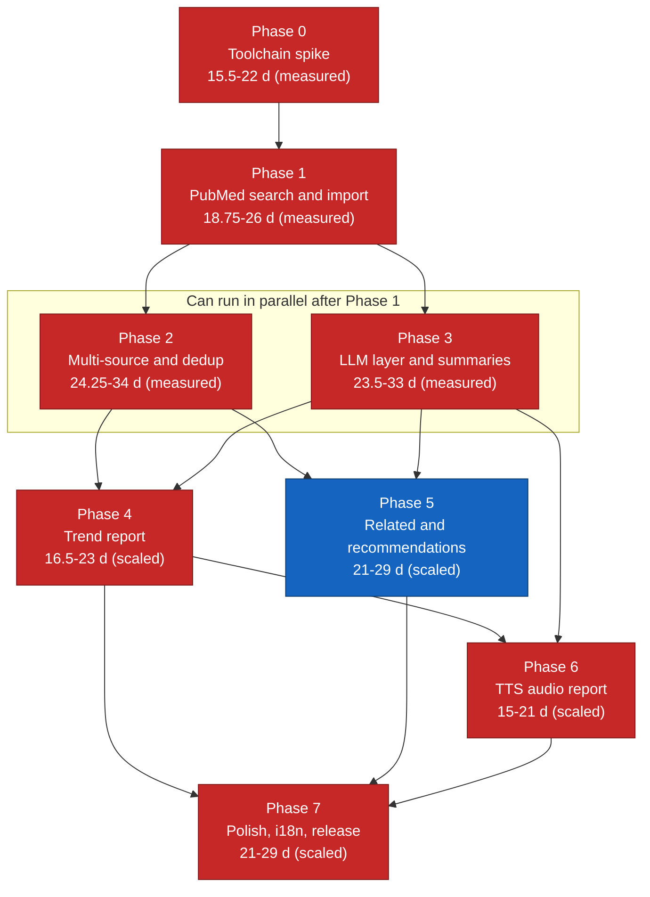

# 11 — Implementation Roadmap

**Project:** `research_helper` — Zotero 10.x plugin (bootstrapped: `manifest.json` + `bootstrap.js`), fully client-side.
**Companion documents:** requirements in `10-requirements-and-user-stories.md`; toolchain, tests, CI and release mechanics in `13-testing-build-and-release.md`; module boundaries in `07-architecture-and-data-model.md`.

**About the estimates.** Every effort figure below is for **one experienced developer** who already knows TypeScript and web APIs but is *new to Zotero plugin development*. They are in **developer-days** (one focused 6-hour day), exclude code review latency, and exclude time spent waiting for third-party API key approvals. Treat them as planning inputs, not commitments.

**How the bands are built (revised 2026-09-09).** Two different constructions, and the difference between them matters more than either number:

- **Phases 0–3 — *measured*.** The low end is the phase's task-card sum from the decompositions in `plan/` (`plan/00-task-index.md` §1 carries the sums and the per-phase reconciliations are in `plan/01`–`plan/04`). The high end is that sum × 1.4 — this document's own ±40% convention — rounded to the nearest whole day. A band rather than a point because the card estimates are themselves estimates.
- **Phases 4–7 — *scaled, not measured*.** These phases are not decomposed, so there is nothing to sum. Their low end is the **previous figure's upper bound × 1.50**, where 1.50 is the correction factor observed on Phases 0–3: the Phases 0–3 card sum divided by 52, the top of the old 39–52-day band. The high end is that × 1.4, as above. **These four figures are inference, not measurement**, and each says so in its own entry. Replace each with a card-sum band as soon as that phase is decomposed.

  **The factor has been recomputed twice and held at 1.50 both times.** It was first derived as 80.5 ÷ 52 = 1.548. The two cards Phase 2 gained on 2026-09-09 took the subtotal to 80.5 d without changing that arithmetic, and the `P3-T04` / `P3-T20` re-estimate later the same day takes it to 82.0 d, so the factor recomputes as **82.0 ÷ 52 = 1.577**. It is **held at 1.50**, and the four Phase 4–7 bands are unchanged, for the reason already applied to the Phase 2 change: moving an inferred figure on the strength of a 1.5-day change to a measured one is false precision. The arithmetic makes the point — the factor moves by 1.9%, which on Phase 4's 11-day base is 0.32 d, an order of magnitude below the rounding these bands are already stated at. Holding at 1.50 also keeps the factor *conservative in the stated direction*: 1.50 is below both 1.548 and 1.577, so the scaled figures understate rather than overstate what the measured phases actually found, which is the safer error for a number R-23 already flags as inference. `plan/05-phases-4-7-outline.md` quotes these four bands and the ×1.50 label; both documents derive the factor the same way and neither is to be changed without the other.

The whole plan now sums to roughly **155.5–217 developer-days** (the per-phase table in §1 is the authoritative sum) — at **21 working days per month** (≈252 working days a year ÷ 12), ≈ **7–10 months of full-time work**, or roughly twice that at 50% allocation. This supersedes the previous "74–101 developer-days ≈ 4–5 months"; §1's "Why these figures changed" records why, and why nobody should correct them back.

---

## 0. Sequencing principles

1. **Retire platform risk before product risk.** Nothing about summarization matters if the plugin cannot survive a Zotero 10 minor release. Phase 0 exists solely to answer "does the toolchain actually work here".
2. **One vertical slice early.** Phase 1 ships a genuinely usable feature (PubMed search → collection) end to end, so there is always something demonstrable.
3. **Cost and data-egress guardrails ship with the first LLM call**, not after. FR-24/FR-36 are Phase 3 deliverables, not Phase 7 polish.
4. **Each phase retires named risks** from the register in §3. A phase is not done until its risks are demonstrably retired or explicitly re-classified.
5. **The plugin must remain installable and non-broken at the end of every phase.** Feature flags in prefs hide incomplete work rather than leaving broken menu items.

---

## 1. Phases

### Phase 0 — Toolchain spike

**Goal.** Prove that a modern Zotero 10 plugin can be built, hot-reloaded, debugged, and can create a Zotero item — on the actual developer machine, with the actual Zotero 10.0.1 the user runs. Answer every question in the build-vs-verify list (§4) before any architecture is committed.

**Deliverables.**

- A repo scaffolded from [`windingwind/zotero-plugin-template`](https://github.com/windingwind/zotero-plugin-template) (or `zotero-plugin-scaffold` directly), building an XPI.
- `manifest.json` with `applications.zotero.id`, `update_url`, `strict_min_version`, `strict_max_version` set for Zotero 10 (per [Zotero 10 for Developers](https://www.zotero.org/support/dev/zotero_10_for_developers): `strict_max_version` → `10.0.*`).
- `bootstrap.js` implementing `install`/`startup`/`shutdown`/`uninstall`/`onMainWindowLoad`/`onMainWindowUnload` with verified clean teardown.
- One Tools-menu item that, when clicked, creates a `journalArticle` item with a title, an author, a DOI, and an `abstractNote` in a named collection.
- A dedicated development profile with `.env` configured (`ZOTERO_PLUGIN_ZOTERO_BIN_PATH`, `ZOTERO_PLUGIN_PROFILE_PATH`, optionally `ZOTERO_PLUGIN_DATA_DIR`) and `npx zotero-plugin serve` hot-reloading on file save.
- Devtools/debugger attach verified (`server.devtools: true`, which appends `--jsdebugger`).
- One passing unit test in Node, one passing in-Zotero test via the scaffold's Mocha runner.
- A CI workflow that lints, typechecks, unit-tests, and builds an XPI on push.
- A written **spike report** (2–3 pages) answering §4's questions with yes/no/workaround, committed as `docs/spikes/phase-0.md` — the directory, and the immutability and redaction rules that apply to everything in it, are declared in `07-architecture-and-data-model.md` §2.2.1.

**Modules touched.** Repo skeleton only: `manifest.json`, `bootstrap.js`, `src/index.ts`, `src/hooks.ts`, `zotero-plugin.config.ts`, `tsconfig.json`, `.github/workflows/ci.yml`, `test/`.

**Definition of done.**

- `npm run build` produces an installable XPI; dragging it into Zotero 10.0.1 → Tools → Plugins installs it cleanly on Windows.
- Editing a source file reloads the plugin in the running Zotero without a manual restart.
- Disabling the plugin from the Plugins window leaves no menu item, no observer, and no error in the debug log (FR-56).
- CI is green on a clean clone.
- The spike report is committed and every item in §4 is marked verified / worked-around / blocked.

**Effort.** **15.5–22 developer-days** — *measured*: the 28 task cards in `plan/01-phase-0-toolchain-spike.md` sum to 15.5 d; the upper bound is that × 1.4. (Was 6–9 d.) Toolchain friction on Windows, profile setup and the first encounter with Zotero's item API still dominate, but the decomposition found that the spikes in §4 only partly collapse into each other and that ~4.75 d of the phase is work listed above as a deliverable and never priced: repository bootstrap, the `docs/07` §2.2 directory skeleton and its dependency rule, the TypeScript/lint configuration, the Tools-menu item, the CI workflow and the spike report itself. See that file's "Estimate reconciliation" for the derivation.

**Risks retired.** R-1 (partly), R-8 (Korean TTS spike, V-10), R-11, R-12, R-13, R-14, R-15 (dry run, V-18), R-19b (feasibility spike, V-8b).

---

### Phase 1 — Search & import from one source (PubMed)

**Goal.** A complete, shippable vertical slice: query → PubMed → preview → Zotero collection with abstracts and provenance.

**Deliverables.**

- Search dialog (query field, result limit, date range defaulting to 3 years, target-collection picker). FR-1, FR-2, FR-3.
- PubMed E-utilities client: `esearch` + `efetch`/`esummary`, XML/JSON parsing, client-side rate limiter, `User-Agent`, optional NCBI key. FR-4, FR-11.
- **Tier-1 `SecretStore` for `source.ncbi` only** — `Zotero.OSKeyStore.encrypt()` → `Services.logins` (`09-security-privacy-and-api-keys.md` §1.7), the startup backend probe, and the `ncbi.keyPresent` / `secretBackend` flags. NFR-16, part of FR-11. **No key-entry UI ships in this phase**, so in Phase 1 the key is absent for every real user and the limiter simply stays on the no-key budget. The reason this rung exists here at all is that the deliverable above requires an *optional NCBI key* and decision **D5** (`00-overview.md` §3) forbids the pref alternative — there is no third place to put it. Tiers 2 and 3, the passphrase file, the degradation dialog and every LLM/TTS secret are **Phase 3**, with the preferences pane; a half-built ladder is worse than one rung.
- Structured logging through `logLevel`, with unconditional API-key redaction at the logger (`09-security-privacy-and-api-keys.md` §2.1). **Part of FR-54** — FR-4 forces it into this phase, because the transmitted URL must reach both the provenance record and the debug log with keys stripped. The rest of FR-54 (the debug bundle, the "Copy diagnostics" export, and the prefs-pane verbose-logging checkbox) lands in Phases 3 and 7.
- Normalizer: PubMed record → internal canonical record (title, authors, journal, date, DOI, PMID, abstract, MeSH terms).
- Result preview table with per-row selection. FR-5.
- Importer: canonical record → Zotero item, batched in transactions; item-type mapping; identifier placement in `Extra`. FR-6, FR-7.
- Existing-item detection by DOI/PMID → link instead of duplicate. FR-51.
- Provenance note writer + JSON export. FR-8.
- Cancellation and partial-failure handling. FR-9, FR-10.
- Progress UI. FR-53.
- Unit tests for the query builder and normalizer; contract tests against recorded PubMed fixtures.

**Modules touched.** Paths throughout this document are `07-architecture-and-data-model.md` §2.2's, which owns the directory tree: `src/sources/pubmed/*`, `src/model/canonicalWork.ts`, `src/model/ids.ts`, `src/zotero/itemMapper.ts`, `src/zotero/collectionOps.ts`, `src/zotero/notes.ts`, `src/zotero/keychain.ts`, `src/core/provenance.ts`, `src/core/rateLimit/*`, `src/core/http/*`, `src/core/logger.ts`, `src/ui/dialogs/*`, `src/ui/components/*`, `src/zotero/progressWindow.ts`, `addon/locale/*/research-helper/*.ftl`.

**Definition of done.**

- A search for a real term imports ≥ 50 items into a new collection, each with a non-empty `abstractNote` where PubMed provides one.
- NFR-1 measured: 100 pre-fetched records import in ≤ 10 s.
- Cancel mid-search leaves zero items (FR-10).
- Provenance note present and JSON export validates against the schema.
- Re-running the same search links rather than duplicates.

**Effort.** **18.75–26 developer-days** — *measured*: the 23 task cards in `plan/02-phase-1-pubmed.md` sum to 18.75 d; the upper bound is that × 1.4. (Was 9–12 d.) The old figure priced this phase as "one adapter plus a dialog", but the "Modules touched" line above commits it to the whole shared core — `core/rateLimit`, `core/http`, `core/provenance`, `core/logger`, `zotero/itemMapper`, `model/canonicalWork`, the progress adapter and the l10n bundles. Nine of the twenty-three cards, ≈ 6 d, build machinery that Phases 2–7 consume unchanged and never pay for again; that reuse is why the whole-plan total moves by less than the per-phase numbers do. `plan/00-task-index.md` §5 item 2 proposes splitting this into 1a (core) and 1b (PubMed slice) so the prerequisite stops hiding inside one phase's number; that split is not made here.

**Risks retired.** R-16 (item creation performance), R-17 (abstract availability), part of R-2.

---

### Phase 2 — Multi-source + deduplication

**Goal.** Add Europe PMC, Crossref, Semantic Scholar, arXiv, bioRxiv, medRxiv, and merge their results correctly.

**Deliverables.**

- A `Source` interface plus six additional adapters, each with its own query translator, parser, rate limiter, and fixture set. FR-2, FR-4.
- Semantic Scholar key handling and graceful unauthenticated degradation. FR-2, open question 8 in `10-requirements-and-user-stories.md`.
- Parallel fan-out executor with per-source timeouts, per-source concurrency caps, and independent failure isolation. FR-9, NFR-6.
- Deduplication engine: identifier-first matching, then conservative title+author+year fuzzy matching above a threshold; below-threshold pairs flagged, never auto-merged. FR-50.
- Field-merge policy with documented source priority; merged-record provenance.
- Preprint/published relationship handling per the product decision.
- `preprint` item-type mapping for arXiv/bioRxiv/medRxiv. FR-7.
- Dedup unit-test corpus: ≥ 200 hand-labelled record pairs (true/false duplicates) with a measured precision/recall report.
- **"Re-run this search" — FR-12.** The search window opens pre-filled from a collection's stored provenance record (`07-architecture-and-data-model.md` §5.3), optionally advancing the date window to today, and the import reports "already present: N" instead of duplicating. It lands here rather than in Phase 1 because its input — the FR-8 provenance record — ships in Phase 1 while its surface, the multi-source search window, is finished here, and because re-running is only worth the control once more than one source is in play. FR-12 is a `(S)` requirement and had no phase before this entry.
- **Optional Zotero-translator import path** (`01-zotero-plugin-platform.md` §6.3 Strategy B) behind `useTranslators`, which ships **off** (`07-architecture-and-data-model.md` §8.5): per-record identifier lookup with hand-mapping as the fallback, plus the abstract backfill that must follow either path. Phase 1 ships hand-mapping only and does not read the preference.

> **Both of those deliverables now have cards — closed 2026-09-09.** This entry previously warned that FR-12's re-run control and the `useTranslators` import path were listed here as Phase 2 work but were not in `plan/03`'s card set and were not in its 21.5 d sum. They are now **`P2-T17`** (1.5 d — the re-run control, which also ships the first plugin-owned SQLite table, `search_provenance`, because `07-architecture-and-data-model.md` §5.3 makes that row the authoritative copy and the Zotero note only a projection) and **`P2-T18`** (1.25 d — Strategy B behind the preference, with hand-mapping as the per-record fallback). The card sum is **24.25 d** and the band below is re-derived from it. No existing card's estimate was changed. This was the same "deliverable the estimate never priced" failure the §1 preamble records for Phases 0–3, caught in advance here rather than discovered afterwards — and the catch worked.

**Modules touched.** `src/sources/{europepmc,crossref,semanticscholar,arxiv,biorxiv}/*` (bioRxiv and medRxiv share one adapter across two servers — `07-architecture-and-data-model.md` §2.2), `src/sources/shared/dedupe.ts`, `src/model/merge.ts`, `src/pipeline/searchImport/stages.ts` (parallel fan-out), `src/ui/components/*` (source chips, duplicate badges).

**Definition of done.**

- A single query across all seven sources returns a merged list where a known cross-indexed paper appears exactly once, with all contributing sources listed.
- Dedup precision ≥ 0.99 on the labelled corpus (a false merge is the expensive error); recall ≥ 0.90.
- One source returning 500 or 429 does not prevent the others from delivering results.
- NFR-2 measured: 4-source search of 100/source completes in ≤ 30 s.

**Effort.** **24.25–34 developer-days** — *measured*: the 18 task cards in `plan/03-phase-2-multi-source-dedup.md` sum to 24.25 d; the upper bound is that × 1.4, rounded (24.25 × 1.4 = 33.95 → 34). (Was 21.5–30 d over 16 cards, and before that 12–16 d, derived as "six adapters at ~1.5 days each plus 4–6 days for dedup and its evaluation corpus".) That original arithmetic held for what it covered: the adapter cards plus preprint mapping come to 9.25 d and the dedup family to 6.5 d. What it never costed is the remaining **8.5 d** — the user-query parser (1.0 d), the parallel fan-out (1.25 d), the abstract-backfill pass (0.75 d), the search-window/results-table work (1.5 d), the card that records and guards the settled "OpenAlex is out of v1" decision (0.25 d), the end-to-end verification run (1.0 d), and the two deliverables the note above closes, `P2-T17` (1.5 d) and `P2-T18` (1.25 d). That is **eight** cards — `P2-T01`, `P2-T02`, `P2-T12`, `P2-T14`, `P2-T15`, `P2-T16`, `P2-T17`, `P2-T18` — and they sum exactly: 24.25 − 9.25 − 6.5 = 8.5. An earlier draft of this sentence hedged the figure with "≈" and named only seven of them, which sum to 8.25 d; the card it omitted was `P2-T15`, the OpenAlex-decision one. Every one of the eight is listed as a deliverable in this entry.

**Risks retired.** R-2, R-3, R-18.

---

### Phase 3 — LLM layer + per-paper summaries

**Goal.** A provider-agnostic LLM client with cost control, plus per-item summary notes.

**Deliverables.**

- Provider abstraction with four adapters: OpenRouter, OpenAI, Google Gemini, Anthropic. FR-29.
- Preferences pane: keys (masked, with reveal), per-provider base-URL override (`<provider>.baseUrl`, `07-architecture-and-data-model.md` §8.5), model selection per task, budget ceilings, language. FR-29, FR-30, FR-32, FR-52.
- **`SecretStore` tiers 2 and 3, and every key-entry surface.** The passphrase-encrypted file, the session-only fallback, the degradation dialog, the storage-backend badge, and the key fields for all four LLM providers plus NCBI and Semantic Scholar. Phase 1 shipped tier 1 for `source.ncbi` alone and no UI; this is where the ladder is completed and where a user can first enter a key at all. FR-30, NFR-16, decision D5.
- "Test connection" action. FR-31.
- Token estimation + cost estimation table (per-model pricing, user-editable, with an "as of" date). FR-24, NFR-5.
- Consent + egress-disclosure dialog, shown before the first job and before every job. FR-36.
- Job engine: bounded concurrency, backoff with jitter, cancellation, resume-by-skipping-completed. FR-23, FR-34, NFR-6.
- Summarizer: input assembly (**full text whenever available — `summary.fullTextMode` ships as `auto` per decision D7**, with the abstract as the recorded fallback), the R-19 extraction quality gate, prompt from `12-prompt-library.md`, structured output parsing, child-note writing with disclaimer header and `research_helper/ai-summary` tag. FR-19, FR-20, FR-21, FR-22.
- IMRaD section-detector validation against the 40-PDF fixture set before this phase ships; `auto` degrades to whole-document chunking until it passes. R-19b, and see `06-summarization-and-trend-report.md` §4.3.
- "Remove generated notes from collection" command. FR-20.
- Usage accounting UI. FR-35.
- Deterministic LLM mocking harness for tests (see `13-testing-build-and-release.md`).

**Modules touched.** `src/llm/types.ts`, `src/llm/{openrouter,openai,gemini,anthropic}/*`, `src/llm/router.ts`, `src/llm/shared/{sse,tokenEstimate,jsonMode,chunking}.ts`, `src/core/jobQueue/*`, `src/pipeline/shared/budget.ts`, `src/pipeline/summarize/*`, `src/zotero/fulltext.ts`, `src/zotero/keychain.ts`, `src/prefs/*`, `src/ui/prefs/*`, `src/ui/dialogs/*`, `src/prompts/*`.

**Definition of done.**

- All four providers produce a summary for the same item using the same internal code path; only the adapter differs.
- A 100-abstract job completes within the NFR-4 budget and reports actual token usage.
- Setting a $0.01 ceiling pauses the job on the first item and asks for confirmation.
- Cancelling at item 87/200 retains 86 notes and resumes correctly (FR-23).
- No key appears in the debug log, in a note, or in copied diagnostics (NFR-16).

**Effort.** **23.5–33 developer-days** — *measured*: the 31 task cards in `plan/04-phase-3-llm-summaries.md` sum to 23.5 d; the upper bound is that × 1.4, rounded (23.5 × 1.4 = 32.9 → 33). (Was 22–31 d over the same 31 cards, and before that 12–15 d.) The four provider adapters land at 2.75 d, close to the old figure's implied budget — the adapters are not where the overrun is. It is in secret storage (3.75 d across four cards, folded into half of one deliverable line above), text acquisition (1.5 d for the four-tier ladder and cleaning pass), and 2.75 d of R-19b IMRaD fixture-and-harness work that **post-dates the 12–15 figure**: that risk was created on 2026-09-08 by decision D7, after the estimate was written. **The move from 22.0 d to 23.5 d is two cards, re-estimated on 2026-09-09 and nothing else:** `P3-T04` 1.0 → 1.75 d, because the pane grew to carry the four `<provider>.baseUrl` controls with their write-time validation, the NCBI and Semantic Scholar key fields this entry's own "every key-entry surface" deliverable requires, and six `role="status"` elements, none of which was in its 1.0 d; and `P3-T20` 1.0 → 1.75 d, on a bottom-up reading of what building a 40-PDF fixture corpus across eight publisher families actually costs the developer — the human's sourcing and ground-truth adjudication is gate G-12 in `plan/06-human-gates.md` and is deliberately *not* in that figure, because these are developer-days. Both cards carry their derivation in their own `Notes`; `plan/04` §3 carries the change table.

**Risks retired.** R-4, R-5, R-6 (partly), R-9 (mitigations shipped; retired by design under D5), R-19 (quality gate + cost preview shipped), R-19b (detector validated, or `auto` degraded to whole-document chunking).

---

### Phase 4 — Trend report

**Goal.** Synthesize per-paper summaries into a cited "recent research trends" report, at any collection size.

**Deliverables.**

- Map-reduce / hierarchical reduction pipeline with a reported pass count. FR-27.
- Report template with fixed sections (scope & method, volume over time, themes, methodological shifts, contradictions & open questions, limitations). FR-25.
- Citation binding: every claim carries markers resolving to collection items; a validator rejects/repairs citations that do not resolve. FR-26.
- Report note writer, tagged `research_helper/trend-report`, with a metadata header (item count, date range, model, prompt-template version, timestamp). FR-25, NFR-15.
- Korean report generation path. FR-28.
- "Export as Markdown" action.
- A small evaluation set: 3 curated collections with human-checked expected themes, used as a regression guard on prompt changes (see `06-summarization-and-trend-report.md`).

**Modules touched.** `src/pipeline/trendReport/*`, `src/llm/shared/chunking.ts`, `src/model/trend.ts`, `src/prompts/trend-report-*.md`, `src/ui/panes/*` (report viewer), `src/zotero/notes.ts`.

**Definition of done.**

- A 400-item collection produces a report without a context-length error, and the header states the number of reduction passes.
- 100% of citation markers in a generated report resolve to items in the collection (validator-enforced).
- The Korean report keeps titles/authors/venues in original script.
- Regenerating with the same inputs and a fixed temperature/seed yields substantively equivalent themes across 3 runs.

**Effort.** **16.5–23 developer-days — ⚠ scaled, not decomposed.** Derived, not measured: 11 d (the old band's upper bound) × 1.50, the correction factor observed on Phases 0–3, then × 1.4 for the upper bound. It assumes this phase hides unpriced deliverables at the same rate the four measured phases did — an assumption, since no task cards exist. **Replace this figure with a card sum when Phase 4 is decomposed** (`plan/05-phases-4-7-outline.md` §0 schedules that for the end of Phase 3) and re-derive §1's total and §2's critical path.

**Risks retired.** R-7, part of R-6.

---

### Phase 5 — Related papers + recommendations

**Goal.** Features 2 and 6: from one seed item, and from a whole collection.

**Deliverables.**

- Seed resolution (DOI/PMID/arXiv → canonical; title-match fallback with a confidence threshold and disambiguation UI). FR-13, FR-14.
- Relatedness gathering: references, citations, and source-provided recommendation endpoints; scoring and reason chips. FR-15, FR-47.
- Related-results review UI with "in library" marking and recency de-emphasis. FR-16, FR-18.
- Optional Zotero *Related* linkage. FR-17.
- Collection profiler: term/MeSH extraction, optional embedding centroids (k, one per sub-topic; 05-related-work-discovery.md §7.2), editable profile UI. FR-44.
- Candidate query generation (LLM-assisted with heuristic fallback) and fan-out reuse from Phase 2. FR-45.
- Owned-item exclusion and dismissed-candidate persistence. FR-46, FR-49.
- Import into a default `<Collection> — recommended <date>` subcollection. FR-48.

**Modules touched.** `src/pipeline/related/*`, `src/pipeline/recommend/*`, `src/model/{profile,recommendation}.ts`, `src/sources/*` (citation/reference endpoints), `src/ui/dialogs/*`, `src/ui/panes/*` (profile editor).

**Definition of done.**

- From a seed with a DOI, ≥ 20 related candidates are produced with visible reasons, and importing 10 of them creates exactly 10 items (or links existing ones).
- With no Semantic Scholar key, the feature still returns useful candidates and says what a key would add.
- A 30-item collection produces a profile a domain expert judges reasonable, and recommendations exclude everything already in that collection.

**Effort.** **21–29 developer-days — ⚠ scaled, not decomposed.** 14 d × 1.50, then × 1.4 for the upper bound; see Phase 4's note for the construction and its assumption. **Replace with a card sum when Phase 5 is decomposed.** `plan/05-phases-4-7-outline.md` §2.4 adds a second, opposite-signed uncertainty specific to this phase: if the Semantic Scholar key is denied, the Recommendations adapter and the SPECTER2 embedding path drop out and the effort falls toward the bottom of the band while quality drops with it.

**Risks retired.** R-3 (fully), R-19.

---

### Phase 6 — TTS audio report

**Goal.** English and Korean spoken briefings from a trend report, stored in Zotero.

**Deliverables.**

- Gemini TTS client with voice selection and audio-format handling (PCM → WAV/container per `04-audio-report-tts.md`). FR-37, FR-38.
- Spoken-script generation: markdown/citation stripping, number and abbreviation expansion, target-length control; native Korean script generation rather than translation of the English report. FR-39, FR-38.
- Segmenting long scripts and concatenating audio without artifacts. FR-41.
- Attachment writer: stored-file attachment with a descriptive title; "Save as…" fallback. FR-40.
- Cost estimate by character count; cancellation. FR-42.
- Graceful failure path that saves the script as text when TTS is unavailable. FR-43.

**Modules touched.** `src/tts/geminiTts.ts`, `src/tts/ssml.ts`, `src/tts/audioStore.ts` (WAV assembly/concat and the attachment write), `src/pipeline/audioReport/*`, `src/prompts/audio-script-*.md`, `src/zotero/attachments.ts`, `src/ui/dialogs/*`.

**Definition of done.**

- A 1,000-word English script produces a single playable file opened from Zotero on Windows and macOS.
- A Korean briefing is judged natural by a native Korean speaker on a 5-point scale (≥ 4 average over 3 samples), with correct pronunciation of English technical terms embedded in Korean sentences.
- Revoking the TTS entitlement produces the FR-43 fallback, not a stack trace.

**Effort.** **15–21 developer-days — ⚠ scaled, not decomposed.** 10 d × 1.50, then × 1.4 for the upper bound; see Phase 4's note for the construction and its assumption. **Replace with a card sum when Phase 6 is decomposed.** Audio container assembly and Korean quality iteration remain the unpredictable parts, and neither is bounded by this scaling.

**Risks retired.** R-8.

---

### Phase 7 — Polish, i18n, prefs, release

**Goal.** Ship v1.0.

**Deliverables.**

- Complete `en-US` and `ko-KR` Fluent bundles; no hard-coded strings; `Intl` formatting. FR-55, NFR-11.
- Accessibility pass: keyboard navigation, focus order, accessible names, contrast in light and dark themes, screen-reader smoke test with NVDA and VoiceOver. NFR-13.
- Preferences consolidation, defaults review, "Clear cache" action, storage cap enforcement. NFR-8.
- Error-message audit against NFR-14; "Copy diagnostics" action and the debug bundle; the verbose-logging checkbox in the prefs pane. **Completes FR-54**, whose redacted-logging half shipped in Phase 1.
- Offline behaviour verification. NFR-9.
- Memory and startup profiling against NFR-7 and NFR-10.
- Security review against `09-security-privacy-and-api-keys.md`; log-redaction audit.
- README, user documentation, screenshots, CHANGELOG.
- Release workflow: tagged build → XPI + `update.json` attached to a GitHub Release; `update_url` verified end to end by installing an older XPI and letting Zotero upgrade it. See `13-testing-build-and-release.md`.
- Manual QA checklist executed on Windows, macOS, and Linux.
- Announcement in the Zotero Forums and submission to the community plugin lists.

**Modules touched.** All of `src/ui/*`, `src/i18n/*`, `addon/locale/*`, `zotero-plugin.config.ts`, `.github/workflows/release.yml`, `docs/`, `README.md`.

**Definition of done.**

- Every NFR in `10-requirements-and-user-stories.md` §3 has a measured or explicitly waived result recorded in the release checklist.
- A user on a fresh Zotero 10 profile can install, configure a key, and complete a search → summarize → report → audio flow using only the README.
- An in-place update from v0.9.0 to v1.0.0 succeeds via `update.json`.

**Effort.** **21–29 developer-days — ⚠ scaled, not decomposed.** 14 d × 1.50, then × 1.4 for the upper bound; see Phase 4's note for the construction and its assumption. **Replace with a card sum when Phase 7 is decomposed.** Note that this phase is the one where deliverables listed but not priced — the accessibility pass, the redaction audit, the three-platform QA run, the Korean native-speaker review — are hardest to bound in advance, which is exactly the failure mode the correction factor was measured on.

**Risks retired.** R-10, R-15, R-20, R-22; R-1 moved to ongoing operational handling.

---

### Effort summary

Revised 2026-09-09. Construction of the bands is stated once in the preamble ("How the bands are built") and applied uniformly below; "measured" and "scaled" are not interchangeable.

| Phase | Focus | Effort (dev-days, 1 experienced dev) | Basis | Previous figure |
| --- | --- | --- | --- | --- |
| 0 | Toolchain spike | 15.5–22 | measured — 28 cards | 6–9 |
| 1 | PubMed search & import | 18.75–26 | measured — 23 cards | 9–12 |
| 2 | Multi-source + dedup | 24.25–34 | measured — 18 cards | 12–16 |
| 3 | LLM layer + summaries | 23.5–33 | measured — 31 cards | 12–15 |
| | **Phases 0–3 subtotal** | **82–115** | **measured — 100 cards** | 39–52 |
| 4 | Trend report | 16.5–23 | ⚠ **scaled ×1.50, not decomposed** | 8–11 |
| 5 | Related + recommendations | 21–29 | ⚠ **scaled ×1.50, not decomposed** | 10–14 |
| 6 | TTS audio report | 15–21 | ⚠ **scaled ×1.50, not decomposed** | 7–10 |
| 7 | Polish, i18n, release | 21–29 | ⚠ **scaled ×1.50, not decomposed** | 10–14 |
| | **Phases 4–7 subtotal** | **73.5–102** | ⚠ **scaled** | 35–49 |
| **Total** | | **155.5–217** | half measured, half scaled | 74–101 |

Totals are the sums of the rows above them; the low ends are exact card sums, so they keep the cards' fractions rather than rounding them away. The Phases 0–3 subtotal is 15.5 + 18.75 + 24.25 + 23.5 = **82.0** low and 22 + 26 + 34 + 33 = **115** high; adding the 73.5–102 scaled subtotal gives the **155.5–217** total.

At **21 working days per month** that is ≈ **7–10 months** of full-time work (155.5 ÷ 21 ≈ 7.4; 217 ÷ 21 ≈ 10.3), against the ≈ 4–5 months this document previously claimed. The months figure has now survived two corrections without moving: the two cards Phase 2 gained on 2026-09-09 added 2.75 days, and the `P3-T04` / `P3-T20` re-estimate later the same day added 1.5 more, and ≈ 7–10 months still holds at both ends. Add ~15% — ≈ **23–32 developer-days**, on top of the figures above — for unplanned Zotero-version compatibility work over that 7–10-month calendar span, which at a 6–10-week Zotero release cadence spans roughly **3–7 major versions** rather than the 2–3 a 4–5-month span implied ([Zotero blog](https://www.zotero.org/blog/a-faster-release-cycle-for-zotero/)).

### Why these figures changed — 2026-09-09

**Read this before "correcting" the numbers back down.**

**What happened.** Phases 0–3 were decomposed into 98 task cards by four agents working independently, none of whom saw the others' numbers (`plan/01`–`plan/04`; `plan/00-task-index.md` §1 carries the sums). All four came out above this document's figure for their phase: **+72%, +56%, +34% and +47%** against the top of each band, and **+50% in aggregate** (77.75 d of cards against a 39–52 d band). Four independent overruns in the same direction are a measurement, not four coincidences.

**Then it happened once more, in the small.** A reconciliation pass later the same day added the two Phase 2 cards this document's own Phase 2 entry had flagged as uncosted deliverables — `P2-T17` and `P2-T18`, 2.75 d between them. Phase 2's card set became **18 cards / 24.25 d**, **+52%** against the top of its old 12–16 d band, and the aggregate **100 cards / 80.5 d**, **+55%**. The mechanism is exactly the one described below: work named in a deliverable list and absent from the estimate. It is worth noting that the flag written into the Phase 2 entry in advance is what made this correction cheap — one re-derivation rather than a mid-phase surprise.

**And a third time, in two cards rather than two deliverables.** Two independent review rounds flagged `P3-T04` and `P3-T20` as knowingly priced below their own steps, and `plan/04` §4 item 9 said so in writing: `P3-T04` had grown to carry four `<provider>.baseUrl` controls, the NCBI and Semantic Scholar key fields and six status elements while its 1.0 d stood still, and `P3-T20` assembles a 40-PDF ground-truth corpus across eight publisher families for the same 1.0 d. The owner decided on 2026-09-09 to **re-estimate them and propagate**, on the ground that this document had just raised its own figures rather than shave cards, and that leaving two cards optimistic would contradict that decision and R-23 at once. Both moved to **1.75 d** with the derivation written into the card, no other card's estimate changed, and Phase 3 is now **31 cards / 23.5 d**, **+57%** against the top of its old 12–15 d band. The aggregate is **100 cards / 82.0 d**, **+58%**. Note the difference in kind from the first two corrections: those found *missing* work, this one re-priced work that was already listed — the first mechanism is a hole in a deliverable list, the second is a card whose estimate never caught up with its own `Do` steps. Both are worth looking for.

**Why the old figures were low.** The cause is the same in every phase, and it is structural rather than random: **each phase's own deliverable list contains work its estimate never priced.** Phase 0 lists the repository bootstrap and the `docs/07` §2.2 skeleton but costed only the §4 spikes; Phase 1's "Modules touched" line commits it to the entire shared core while the figure priced one adapter and a dialog; Phase 2 costed adapters and dedup but not the query parser, fan-out, backfill, results UI or verification it also promises; Phase 3 folded secret storage into half a deliverable line, barely mentioned text acquisition, and predates the R-19b IMRaD work entirely. §4's closing paragraph had already predicted the Phase 0 case in writing.

**What was decided.** The project owner decided on 2026-09-09 to **re-estimate this document from the card sums, and not to shave the cards.** The cards are the measurement; adjusting them to fit a prior estimate would destroy the only evidence available. That pass changed no task card and no task estimate, and neither did the later Phase 2 reconciliation: that phase's sum moved because its card set grew by two, not because any card was re-priced. **Two card estimates have since moved, and only upward:** `P3-T04` and `P3-T20`, described in the paragraph above. The rule the owner set is about direction, not immobility — a card may be raised to match the work it describes, and may not be lowered to match a prior estimate.

**What is measured and what is not.** Phases 0–3 are measured — the low end of each band *is* the card sum. Phases 4–7 are **not decomposed**, so their figures are the old ones scaled by the observed 1.50 factor: inference, resting on the assumption that undecomposed phases hide unpriced deliverables at the same rate the decomposed ones did. They could be worse — Phase 7's audit-and-QA work is the least bounded in the plan — or better, where Phase 1's shared core covers work later phases were separately priced for. Each of the four carries the ⚠ marker. **When a phase is decomposed, replace its figure with the card sum and re-derive both the total here and the critical path in §2.** Until then, plan against the top of the band rather than the bottom. R-23 tracks the residual.

---

## 2. Dependency graph

**Reading the graph.** Red marks the critical path as recomputed below, and **both** P2 and P3 are red because the two routes between P1 and P4 are within noise of each other and either one slips the release; P0 → P1 is additionally a hard serial dependency. The `P3-T04` / `P3-T20` re-estimate of 2026-09-09 narrowed that gap rather than resolving it — P2 still leads P3, but by 0.75 d at the low end and 1 d at the high end instead of 2.25 d and 3 d — so the joint-criticality class assignment stands and is, if anything, better justified than before. Phase figures carry their basis ("measured" / "scaled") because a path length is only as measured as its weakest node — three of the six on the critical path are scaled.

- Phase 0 → Phase 1 is a hard serial dependency; nothing else can start.
- **Phases 2 and 3 are independently unlockable after Phase 1** and are the natural parallelization point if a second developer joins: Phase 2 is API/data work, Phase 3 is LLM/infrastructure work, and they touch nearly disjoint modules (`src/sources/*` vs `src/llm/*`), meeting only at the canonical record type.
- Phase 4 needs both (summaries from 3, a multi-source collection from 2).
- Phase 5 needs Phase 2's fan-out infrastructure and Phase 3's LLM client (for query generation).
- Phase 6 needs Phase 4's report and Phase 3's provider layer.
- Phase 7 gates the release on everything.

**Critical path (recomputed 2026-09-09 from §1's revised figures, third pass):** P0 → P1 → **P2** → P4 → P6 → P7 ≈ **111–155 developer-days**.

- Low end: 15.5 + 18.75 + 24.25 + 16.5 + 15 + 21 = **111.0**. High end: 22 + 26 + 34 + 23 + 21 + 29 = **155**. **Unchanged by the `P3-T04` / `P3-T20` re-estimate**, because that re-estimate raised Phase 3 and the path runs through Phase 2. Previously 109–152 d via Phase 3, and 52–72 d before the phases were decomposed at all.
- **The path has moved twice and has now stayed put once, and every move is inside the noise.** Under the pre-decomposition figures it ran through Phase 2 (12–16 vs Phase 3's 12–15). The first measured pass moved it to Phase 3 (22–31 vs Phase 2's 21.5–30). Adding `P2-T17` and `P2-T18` moved it back to Phase 2 (24.25–34 vs Phase 3's 22–31) — by 2.25 d at the low end and 3 d at the high end. Raising `P3-T04` and `P3-T20` brings Phase 3 to 23.5–33 against Phase 2's 24.25–34, which **leaves the path where it is but cuts the margin to 0.75 d at the low end and 1 d at the high end** — the two routes are now closer than any previous pass has made them, and both remain far below the precision of either estimate. Do not read any of these swaps as a finding about Phase 2. Treat **P2 and P3 as jointly critical**: the P0 → P1 → P3 → P4 → P6 → P7 route is now ≈ 110.25–154 d against the critical 111–155, and slipping either phase slips the release. On a margin of 0.75 d, "jointly critical" is the only defensible reading; it would take a single further card of 1 d anywhere in Phase 3 to make P3 the longer route outright.
- Phase 5's float is now ≈ **10.5–15 d**, and it shrank with this change. P5 depends on **both** P2 and P3, so its earliest start is gated by the longer of the two, which is P2: the binding route is P0 → P1 → **P2** → P5 → P7 = 15.5 + 18.75 + 24.25 + 21 + 21 = **100.5** low and 22 + 26 + 34 + 29 + 29 = **140** high, against the critical 111–155 — so 111 − 100.5 = 10.5 d of float at the low end and 155 − 140 = 15 d at the high end. (The P3-gated route quoted by earlier revisions of this bullet, P0 → P1 → P3 → P5 → P7, is now ≈ 99.75–139 d for a float of ≈ 11.25–16 d; it is the shorter of the two routes into P5 and therefore not the binding one. Both are quoted here because the earlier figure of ≈ 13–18 d was computed on that route.) Phase 5 remains the only phase with real slack, and that float exists only if a second developer takes P5 in parallel. **Single-developer serial execution makes the whole 155.5–217-day plan the critical path**, which is the realistic assumption here (R-21).
- Three of the six nodes on this path — P4, P6, P7 — carry *scaled* figures. At the low end the path is ≈ 58.5 d measured (P0 + P1 + P2) plus ≈ 52.5 d inferred. Re-derive it as each phase is decomposed.

---

## 3. Risk Register

Likelihood and impact are scored **Low / Medium / High**. "Exposure" is a rough product used only for ordering.

| ID | Risk | Likelihood | Impact | Exposure | Mitigation |
| --- | --- | --- | --- | --- | --- |
| **R-1** | **Zotero's rapid release cycle breaks the plugin.** Zotero moved to a ~6–10-week major-version cadence; Zotero 10 already made breaking changes (singular selection getters like `getSelectedCollection()` now throw, `ItemTree#collectionTreeRow` removed, `addCondition()` legacy `required` param throws, `Zotero.CookieSandbox` replaced by `Zotero.HTTP.newCookieContext()`). Each new major version can break the plugin and strand users. | **High** | **High** | 9 | Keep the Zotero API surface behind a thin `src/zotero/*` adapter layer so breakage is localized to a handful of files. Use `zotero-plugin-toolkit` and `zotero-types` and track their releases. Subscribe to the `zotero-dev` list and watch the `zotero_N_for_developers` doc page. Run the in-Zotero integration suite against the Zotero **beta** channel in a scheduled CI job so breakage is found before users hit it. Keep `strict_max_version` at the tested series (e.g. `10.0.*`) and remember that Zotero's own guidance is that when no code change is needed you can *"simply update `strict_max_version` in your plugin's update manifest without releasing a new version"* — so bumping compatibility can be a one-line `update.json` change. Budget ~1 developer-day per Zotero major version, ongoing — **which is now a larger line item than it was**: §1's corrected 7–10-month span crosses roughly 3–7 major versions at a 6–10-week cadence, against the 2–3 the old 4–5-month span implied, and §1's separate ~15% compatibility contingency (≈ 23–32 d) sits on top of that per-version budget rather than inside it. |
| **R-2** | **Literature API terms of service or endpoints change**, or usage limits tighten (NCBI, Crossref, Europe PMC, arXiv, bioRxiv/medRxiv). A source could require registration, forbid automated bulk retrieval, or change response shapes. | Medium | High | 6 | Isolate every source behind the `Source` interface so one adapter can be disabled without touching the rest. Record the ToS/rate-limit terms and their check date in `02-literature-database-apis.md`; re-verify at each release as a QA checklist item. Ship polite-pool identification (`User-Agent`, Crossref mailto) and conservative default rate limits. Never present a source's data as the plugin's own; keep provenance visible. Have a documented "source disabled" UI state rather than a hard failure. |
| **R-3** | **Semantic Scholar rate limits / API key approval delay.** Unauthenticated access is heavily throttled and key issuance can take weeks; relatedness and recommendation quality depend on it. | **High** | Medium | 6 | Apply for the key in **week 1** of Phase 0, before it is needed in Phase 5. §1's re-estimate cuts this exposure rather than raising it: on the corrected figures Phase 5 cannot start before ≈ 58.5–82 developer-days in (P0 + P1 + the longer of P2/P3), ≈ 3–4 months at 21 working days per month, against ≈ 1.5–2 months on the old figures — so the application has more calendar time to clear, provided it is still submitted in week 1. Design relatedness to degrade: Crossref references + Europe PMC citations + lexical similarity must produce usable results with zero Semantic Scholar calls. Cache Semantic Scholar responses aggressively (per NFR-8 caps). Surface a clear "add a key to improve results" affordance rather than failing. Treat Semantic Scholar as an enhancer, never a hard dependency (product open question 8). |
| **R-4** | **LLM cost overruns on large collections.** A user points the plugin at a 2,000-item collection with full text enabled and a frontier model, and receives a surprise bill. Reputationally fatal. | Medium | **High** | 6 | Mandatory pre-flight estimate with item count, token estimate, model, and USD figure (FR-24). Hard per-job and per-session ceilings that **pause** rather than warn — `run.maxSpendUSD` and `run.maxSessionSpendUSD`, whose keys, types and defaults are `07-architecture-and-data-model.md` §8.5's and are **not restated here**: as the schema stands both ship **off**, and whether either should ship non-zero is the residual half of `10-requirements-and-user-stories.md` §5 question 6 (gate `G-20`). An earlier draft of this cell named two dollar figures as if they were the shipped defaults; they never were, and §5 question 6 records the same correction on its own side. **Note that decision D7 makes full text the default (`fullTextMode: auto`), which raises this risk**: the compensating control is the mandatory pre-run cost confirmation above `summary.confirmAboveUSD` with a one-click "use abstracts instead" downgrade, plus a higher, distinct ceiling and warning for full-text runs. Live spend counter in the job dialog. Cheap-model defaults for per-paper summarization; the expensive model is used only for the single reduce pass. Refuse to start jobs over a configurable item count without a second confirmation. |
| **R-5** | **LLM pricing table goes stale**, so estimates mislead users. | **High** | Low | 3 | Store pricing in a single data file with an explicit `as-of` date; display that date in the estimate dialog; let users edit prices; prefer provider-returned usage over estimates for the running total; add "verify pricing table" to the pre-release QA checklist. |
| **R-6** | **Summary quality is poor or hallucinated**, especially from abstracts alone; users lose trust. | Medium | High | 6 | Grounding rules in `12-prompt-library.md`; refuse to summarize items with no abstract and no extractable text (FR-21) rather than inventing content; state the input source in every note header; low temperature; structured output with a schema validator that rejects malformed responses; a curated evaluation set as a regression guard before prompt changes ship. Label all output as machine-generated (FR-20). |
| **R-7** | **Trend report citations do not resolve** (fabricated or mismatched references), which is the most damaging failure mode for an academic tool. | Medium | **High** | 6 | Never let the model invent reference strings: pass an enumerated, ID-keyed candidate list and require the model to cite by key. Post-generation validator that resolves every marker against the collection and fails the report (or strips the claim) if any marker is unresolvable (FR-26). Report is regenerated, not silently patched. Reference list is assembled from Zotero data, not from model output. |
| **R-8** | **Gemini TTS availability, entitlement, or Korean quality is inadequate.** The TTS model may be preview-tier, region-restricted, quota-limited, or produce poor Korean prosody for mixed Korean/English academic text. | Medium | Medium | 4 | Spike Korean TTS quality in **Phase 0**, not Phase 6 — a 200-word Korean sample with embedded English terms, judged by a native speaker, before committing to the feature. Abstract the TTS layer behind a `TTSProvider` interface so a second provider can be added in v1.1 without rework. Ship the FR-43 fallback (save the spoken script as text) from day one. Pin the model ID and surface it in the UI so a deprecation is diagnosable. |
| **R-9** | **API key exposure at rest.** Keys are spendable credentials. Stored naively (Zotero prefs) they sit as plaintext in `prefs.js` in the profile directory, readable by any local process or anyone with filesystem access, and swept into backups. | **Low** after mitigation (**High** if prefs storage were used) | Medium | 2 | **Retired by design, not accepted** — decision D5 (`00-overview.md` §3) rules out preference storage outright; Phase 3 only ships the code. Store keys via `Zotero.OSKeyStore.encrypt()` into `Services.logins` — the same path Zotero uses for its own zotero.org API key — so the secret is protected by Windows DPAPI / macOS Keychain / libsecret. No plaintext fallback tier. Residual risk that this does **not** cover, and which must be stated in the prefs pane: any *other* Zotero plugin shares the same privileged context and can decrypt exactly as we do. Also mask keys in the UI; redact in all logs, notes, provenance, and clipboard diagnostics (NFR-16); encourage narrowly-scoped, spend-capped, rotatable keys with provider-side budget caps as the real backstop. Authoritative design: `09-security-privacy-and-api-keys.md`. |
| **R-10** | **Plugin blocks or destabilizes the Zotero UI**, or leaks memory inside Zotero's process, risking user data. | Medium | **High** | 6 | Hard NFR-3 (≤100 ms main-thread tasks) and NFR-7 (memory ceilings) with profiling as a Phase 7 gate. Chunked processing with explicit yields. Streaming parse; discard raw payloads after normalization. All Zotero writes batched in transactions. Never mutate user-authored data (NFR-20). Long jobs run from a modeless dialog, not a modal one. |
| **R-11** | **Toolchain does not work on the developer's Windows environment** (hot reload, profile paths, `--jsdebugger`, headless test runner). The scaffold's built-in headless support is documented as covering Ubuntu 22.04/24.04 only. | Medium | Medium | 4 | Phase 0 exists for this. Fall back to the documented proxy-file method (an extension-ID-named file in the profile's `extensions/` directory containing the absolute source path, plus deleting `extensions.lastAppBuildId` / `extensions.lastAppVersion` from `prefs.js`) if hot reload misbehaves. Run in-Zotero integration tests on `ubuntu-latest` in CI and treat local Windows in-Zotero runs as headed/manual. |
| **R-12** | **`bootstrap.js` teardown is incomplete**, leaving zombie menu items, observers, or timers after disable/uninstall, which Zotero users notice immediately. | Medium | Medium | 4 | Central registry of every registered artifact (menu items, panes, notifiers, timers, windows) with a single `unregisterAll()` called from `shutdown()`. An automated in-Zotero test that installs, enables, disables, and asserts a clean DOM and no listeners. Use `zotero-plugin-toolkit`'s managed registration helpers. |
| **R-13** | **Zotero's HTTP stack constrains outbound requests** (headers, CORS-equivalent restrictions, streaming support) in ways that break provider SDK assumptions. Zotero 10 also tightened its local HTTP server's header requirements. | Medium | Medium | 4 | Phase 0 spike: issue a real POST with custom headers to each of the four LLM providers and to one literature API from inside Zotero. Use `Zotero.HTTP.request` (or `fetch` if verified) rather than any provider SDK; write thin hand-rolled adapters. No provider SDK is bundled. |
| **R-14** | **Streaming responses are unavailable or awkward** inside Zotero, hurting perceived responsiveness for long generations. | Medium | Low | 2 | Verify in Phase 0. If streaming is impractical, design the UI around per-item progress (which is inherently chunked) instead of token-level streaming; the trend report's single long call is the only place streaming would help, and a determinate progress bar over reduction passes is an acceptable substitute. |
| **R-15** | **Update delivery fails** — `update.json` malformed, `update_url` unreachable, hash mismatch — so users never receive fixes. | Low | High | 3 | Generate `update.json` from the build (`build.makeUpdateJson`) rather than by hand. Test an in-place upgrade from the previous version as a release-gate item. Serve the manifest from a stable `release` tag in the repo. Include `update_hash`. Keep a manual XPI download link in the README as a fallback. |
| **R-16** | **Zotero item creation is slower than NFR-1 allows** at 100+ items, making import feel broken. | Medium | Medium | 4 | Measured in Phase 1. Batch inside transactions; avoid per-item UI refresh; defer collection-tree updates until the batch completes; if still slow, chunk into groups of 25 with progress. |
| **R-17** | **Abstract coverage is poor** for some sources (Crossref in particular often lacks abstracts), so summaries degrade. | **High** | Medium | 6 | Prefer sources with reliable abstracts when merging (source-priority in FR-50); backfill abstracts from Europe PMC/Semantic Scholar by DOI when the primary source lacks one; show abstract-coverage percentage in the import summary; skip rather than fabricate (FR-21). |
| **R-18** | **Deduplication makes false merges**, silently losing records — the failure Persona C fears most. | Medium | High | 6 | Auto-merge only on exact identifier match; fuzzy title matches are flagged for review, never merged (FR-50). Labelled evaluation corpus with a precision target of ≥ 0.99. Every merge recorded in provenance and reversible in the preview before import. |
| **R-19** | **PDF full-text extraction is unreliable** — missing attachments, scanned images without OCR, two-column layouts producing scrambled text, ligature/hyphenation artifacts — producing garbage summaries at high token cost. | **High** | **High** | **9** | **Severity raised 2026-09-08.** Full text is now the **default** (`fullTextMode: auto`), so this risk is no longer shielded by an opt-in and its impact rose from Medium to High. Prefer Zotero's existing full-text index (`attachment.attachmentText`) over re-parsing, and Europe PMC JATS over a local PDF where both exist (`fullText.preferJATS`). Apply a quality gate before sending: minimum character count, alphabetic-character ratio, and detected-language check; fall back to the abstract and record the fallback in the note header (FR-22). Never OCR in v1. Report per-job counts of "full text used / fell back to abstract / skipped". **The mandatory cost preview is the backstop**: a garbage extraction that inflates token count becomes visible before the spend, not after. |
| **R-19b** | **The IMRaD section detector is unvalidated** and now sits on the critical path. A mis-labelled section is worse than an unlabelled one, because the summarization prompt trusts the label and will attribute a finding to "Results" that came from the introduction. | **High** | **High** | **9** | **New, 2026-09-08** — created by the decision to default full-text mode on. Spike `getStructuredDocumentText` in Phase 0 (V-8b) to determine whether font geometry is available. Build a **40-PDF fixture set** spanning single/two-column, publisher and preprint layouts, and measure section-boundary accuracy before Phase 3 ships. Until it passes an agreed threshold, `auto` must degrade to whole-document chunking, and the summary prompt must not claim section provenance. Owner decision required if the spike fails: ship whole-document chunking, or flip the default back to abstracts. |
| **R-20** | **No official Zotero plugin directory exists**, so distribution and discovery are ad hoc; users may install from an untrusted mirror. | Medium | Low | 2 | Publish GitHub Releases as the single source of truth with checksums. Announce in the Zotero Forums (the current de facto channel, since zotero.org/support/plugins states an official directory is *planned*, not available). Submit to the community lists that are slated to merge into the future official registry. Put the canonical download URL prominently in the README and in the plugin's About text. |
| **R-21** | **Single-developer bus factor / key-person risk** across an 8-phase plan — **over a longer span than previously assumed**: §1's re-estimate puts the plan at ≈ 7–10 months of full-time work rather than 4–5, and §2 notes that serial single-developer execution makes the entire plan the critical path. More calendar months is more opportunity for the one person to become unavailable. | Medium | Medium | 4 | Keep the docs set (`01`–`13`) current as the actual design record; commit the Phase 0 spike report to `docs/spikes/` (declared in `07-architecture-and-data-model.md` §2.2.1, which also fixes that reports there are immutable records rather than living documents — a rewritten report cannot serve this mitigation); keep fixtures and tests in-repo so a second developer can reproduce every finding without re-spiking. The 100 task cards in `plan/` now serve this mitigation too: a replacement developer picks up at a card boundary rather than reverse-engineering intent. If a second developer is ever available, §2 names the parallelization point (P2 ∥ P3). |
| **R-22** | **Korean localization drifts** — new strings ship English-only. | **High** | Low | 3 | CI check that every message key present in `en-US` exists in `ko-KR`, failing the build on missing keys (warn-only until Phase 7, then error). Fluent fallback to English so a gap degrades rather than breaks (FR-55). |
| **R-23** | **The effort estimates are systematically low, and half the plan is still unmeasured.** **New, 2026-09-09.** Decomposing Phases 0–3 into 100 task cards found every one of the four phases underpriced — +72%, +56%, +52%, +57%, and **+58% in aggregate** against the top of the old band — with a structural cause: work listed as a phase deliverable but never costed. Phase 2's figure moved twice for that same cause: +34% from its first 16 cards, then +52% once the two deliverables this document had itself flagged as uncosted (FR-12's re-run control and the `useTranslators` import path) became `P2-T17` and `P2-T18`. Phase 3's moved twice as well, and the second move is a second failure mode worth naming: +47% from its 31 cards, then **+57%** when `P3-T04` and `P3-T20` — two cards `plan/04` itself had flagged as priced below their own `Do` steps — were re-estimated on 2026-09-09 from 1.0 d to 1.75 d each. A card can be underpriced even when nothing is missing from the card set, and a review that only looks for missing cards will not find it. §1's Phases 0–3 figures are now derived from the card sums, but **Phases 4–7 are not decomposed**; their figures are the old ones scaled by the observed 1.50 factor, so the same class of unpriced deliverable may still be hiding in them and would not show up until decomposition. Schedule commitments made against these numbers, or against the low end of the bands, will slip. | **High** | Medium | 6 | §1 was re-estimated from the card sums on 2026-09-09 rather than the cards being shaved — see "Why these figures changed" for the evidence, so the correction is not silently reverted. Decompose each of Phases 4–7 at the end of the phase before it (`plan/05-phases-4-7-outline.md` §0) and **replace its scaled figure with the card sum**, re-deriving §1's total and §2's critical path each time. Record actual days against each card from `P0-T01` onward, so the correction factor becomes a measurement instead of an inference and the 4–7 scaling can be checked before it is relied on. Plan against the **top** of each band. Keep a named scope-reduction list ready so a slip is absorbed by scope rather than by quality or by the release date — the `(S)`-priority requirements in `10-requirements-and-user-stories.md` and the already-deferred OpenAlex adapter (`plan/00-task-index.md` §5 item 3) are the natural first candidates. |

### 3.1 Risk-to-phase mapping

| Phase | Risks it retires or materially reduces |
| --- | --- |
| 0 | R-1 (partly), R-8 (Korean TTS spike, V-10), R-11, R-12, R-13, R-14, R-15 (dry run, V-18), R-19b (feasibility spike, V-8b) |
| 1 | R-16, R-17 (measured), R-2 (partly) |
| 2 | R-2, R-3 (fallback proven), R-18 |
| 3 | R-4, R-5, R-6 (partly), R-9 (mitigations shipped; retired by design under D5), R-19 (gate shipped), R-19b (detector validated against the 40-PDF fixture set, or `auto` degraded) |
| 4 | R-6, R-7 |
| 5 | R-3 (fully), R-19 (validated at scale) |
| 6 | R-8 |
| 7 | R-10, R-15, R-20, R-22 |
| Ongoing | R-1, R-2, R-5, R-21, R-23 (partly discharged for 0–3 by the 2026-09-09 re-estimate; live for 4–7 until each is decomposed) |

---

## 4. Build-vs-Verify-Early List (Phase 0 spikes)

These are the assumptions that, if wrong, invalidate parts of the architecture. **Each must be answered with running code in Phase 0**, before Phase 1 design is frozen. Each is a timeboxed spike; the answer goes into the committed spike report.

### 4.1 Platform and toolchain

| # | Assumption to verify | Why it is load-bearing | Timebox |
| --- | --- | --- | --- |
| V-1 | A bootstrapped plugin built by `zotero-plugin-scaffold` installs and runs on **Zotero 10.0.1 on Windows**, with `strict_min_version`/`strict_max_version` accepted. | The entire toolchain choice. If the current template targets an older series, we need a fork or manual manifest. | 0.5 d |
| V-2 | **Hot reload works** on Windows (`npx zotero-plugin serve`, `ZOTERO_PLUGIN_ZOTERO_BIN_PATH`, `ZOTERO_PLUGIN_PROFILE_PATH`), and the scaffold's Remote-Debugging-Protocol-based reload path functions on Zotero 10. | Development velocity across the whole plan — ~150–210 dev-days on §1's corrected figures, not the ~80 assumed when this row was written, which raises the value of getting it working. Failure means falling back to the proxy-file method and manual restarts. | 0.5 d |
| V-3 | The **debugger attaches** (`server.devtools: true` → `--jsdebugger`) and breakpoints hit plugin code; `-ZoteroDebugText` / debug-output logging is usable. | Debuggability of async network code. | 0.5 d |
| V-4 | **`shutdown()` fully tears down** all registrations with no residue and no console errors, verified by disable/enable cycling 5 times. | FR-56; a leak here is user-visible and reputation-damaging. | 0.5 d |
| V-5 | The scaffold's **in-Zotero Mocha test runner** works (`test` config: `entries`, `mocha`, `timeout`, `startDelay`, `waitForPlugin`, `headless`) and can run in GitHub Actions on Ubuntu. Note the documented headless support covers Ubuntu 22.04/24.04 only. | Determines whether integration tests are automatable or manual-only; changes the whole test strategy in `13-testing-build-and-release.md`. | 1 d |
| V-6 | `zotero-types` type definitions are **accurate for Zotero 10** for the APIs we depend on (items, collections, notifiers, preference panes, `Zotero.HTTP`). | If types lag, we need local augmentation files; cheap to do, expensive to discover late. | 0.5 d |

### 4.2 Networking and providers

| # | Assumption to verify | Why it is load-bearing | Timebox |
| --- | --- | --- | --- |
| V-7 | From inside the Zotero process, we can issue **arbitrary cross-origin POSTs with custom headers** (`Authorization`, `x-api-key`, `anthropic-version`) to all four LLM providers and receive full responses. | The entire client-side, no-backend premise. A CORS-equivalent restriction would force a fundamental redesign. | 1 d |
| V-8 | **Streaming responses** (SSE) are consumable, or are cleanly not. | Determines the trend-report UI design (R-14). | 0.5 d |
| V-8b | **`getStructuredDocumentText` exposes usable font/layout geometry**, or it does not. Extract 5 PDFs (single-column publisher, two-column publisher, arXiv preprint, bioRxiv preprint, scanned) and inspect what the API returns. | Decides whether IMRaD section detection is feasible at all (R-19b). Full text is now the default, so this is no longer optional. If geometry is unavailable, `auto` degrades to whole-document chunking and the summary prompt must drop section provenance. | 0.5 d |
| V-9 | **Request abortion** works (`AbortController` or the Zotero HTTP equivalent) so cancellation is real, not cosmetic. | FR-10, FR-23, FR-42 all depend on it. | 0.25 d |
| V-10 | **Gemini TTS** returns audio for a 200-word **Korean** script containing embedded English technical terms, and the output can be written to a playable file and attached to a Zotero item. Quality judged by a native speaker. | R-8. If Korean quality is poor, Feature 5's headline value evaporates and the provider decision changes. | 1 d |
| V-11 | **Binary/audio response handling** inside Zotero (arraybuffer response type, writing a file to the storage directory, registering it as an attachment) works. | FR-40. Text-only HTTP would block the audio feature entirely. | 0.5 d |

### 4.3 Data and API behaviour

| # | Assumption to verify | Why it is load-bearing | Timebox |
| --- | --- | --- | --- |
| V-12 | Creating **100 Zotero items in a batch** meets NFR-1 (≤ 10 s) without freezing the UI, using transactions. | R-16, and it determines whether an entirely different write strategy is needed. | 0.5 d |
| V-13 | **Abstract availability** measured empirically: for one realistic biomedical query, what fraction of records from each of the seven sources carries an abstract? | R-17. Drives the source-priority and backfill design in Phase 2, and the realistic ceiling on summary quality. | 0.5 d |
| V-14 | **Semantic Scholar** unauthenticated behaviour measured (actual observed throttling, error shape), and a key application submitted. | R-3, and the key's lead time starts now rather than in Phase 5. | 0.25 d + external wait |
| V-15 | **Zotero's existing full-text index** is readable from a plugin for an item with a PDF attachment, and its quality is adequate. | R-19; if yes, we avoid bundling a PDF parser entirely, which is a large scope and bundle-size saving (NFR-18). | 0.75 d |
| V-16 | **OS-keystore secret storage** round-trips an API-key-shaped string: `Zotero.OSKeyStore.encrypt()` → `Services.logins.addLoginAsync` → search → decrypt, on Windows (DPAPI) and, if reachable, macOS/Linux. Also measure what happens when the keystore is unavailable (Linux without libsecret). Separately confirm that non-secret preferences round-trip and that reading a pref costs nothing meaningful in a hot loop. | FR-30, NFR-16, R-9. Decision D5 forbids preference storage for keys, so the keystore path is the *only* path — if it does not work, the whole key-handling design in `09-security-privacy-and-api-keys.md` changes. | 0.5 d |
| V-17 | **Fluent (`.ftl`) localization** works for plugin strings on Zotero 10 including the `ko-KR` bundle, with English fallback for missing keys. Zotero 10 changed FTL registration ("plugin FTL registration consolidated with proper per-locale fallback"). | FR-55, NFR-11, R-22. | 0.5 d |
| V-18 | **`update.json` delivery** works end to end: build v0.0.1, install it, publish v0.0.2 with a generated `update.json` at the `update_url`, and observe Zotero offering the update. | R-15. Cheapest to verify while nothing depends on it. | 0.5 d |

**Total Phase 0 spike time:** ≈ **10.75 developer-days** of listed timeboxes (§4.1 3.5 + §4.2 3.75 + §4.3 3.5).

**This paragraph's earlier prediction came true, and §1 has been re-derived (2026-09-09).** It used to read: Phase 0 is nevertheless estimated at 6–9 days because several spikes collapse into one another — V-1, V-2, V-3 and V-4 all fall out of a single working dev-serve setup, and V-6, V-9, V-14 and V-16 are quick confirmations rather than builds — *"if they do not collapse, Phase 0 runs to the top of its band or past it, and the effort summary in §1 should be re-derived."* Decomposition (`plan/01-phase-0-toolchain-spike.md`) found the collapse to be partial: V-2 and V-3 do collapse into one card, but V-1 needs the template re-baselining before an XPI exists at all and V-4 needs a teardown registry before there is anything to tear down. The 28 cards sum to 15.5 d — the 10.75 d of spikes plus ≈ 4.75 d of unpriced non-spike deliverables — and §1's Phase 0 figure is now **15.5–22 d**. If V-7 or V-10 fails, stop and re-plan before Phase 1.

### 4.4 Explicit "build without verifying" list

For contrast, these are safe to build on assumption because they are cheap to change or well within ordinary web-development experience: dialog layout, result-table rendering, prompt wording, dedup thresholds, cost-table values, report section ordering, and the exact Fluent key naming scheme. None of these constrain the architecture.

---

## 5. Decision points for the product owner

Chronologically ordered; each blocks the phase named.

| When | Decision | Blocks |
| --- | --- | --- |
| ~~Before Phase 0 starts~~ | ~~Whether to re-estimate §1 from the task-card sums, cut v1 scope, or keep the figures and track against the cards~~ — **decided 2026-09-09: re-estimate §1 from the card sums; do not shave the cards.** Phases 0–3 are now measured (**82–115 d**, after Phase 2 gained `P2-T17` and `P2-T18` and `P3-T04` and `P3-T20` were re-estimated, all on the same day), Phases 4–7 scaled by the observed ×1.50 factor (73.5–102 d, the factor recomputed as 82.0 ÷ 52 = 1.577 and deliberately held at 1.50), whole plan **155.5–217 d ≈ 7–10 months** at 21 working days per month. Derivation and rationale in §1's "Why these figures changed"; residual tracked as R-23. | Scheduling, staffing, and any external commitment made against the old 74–101-day / 4–5-month figure |
| Before Phase 0 ends | ~~Confirm the OS-keystore key storage (R-9)~~ — **decided 2026-09-08: decision D5, `Zotero.OSKeyStore.encrypt()` + `Services.logins`, never `Zotero.Prefs`.** Still open: the Linux-without-libsecret behaviour — session-only, passphrase-encrypted file, or refuse (V-16 measures it) | Phase 3 prefs design |
| Before Phase 1 | Confirm the 3-year window is soft (open question 1) | Search dialog design |
| Before Phase 2 | Preprint/published merge policy (open question 2) | Dedup engine |
| ~~Before Phase 3~~ | ~~Default provider~~ — **decided 2026-09-08: OpenRouter.** The two-model split (`summaryModel` / `reportModel`) is settled by `03-llm-provider-integration.md` §16, and both budget ceilings now exist as preferences; what remains open is only whether either ceiling should ship non-zero (open question 6). | Prefs defaults, cost UI |
| ~~Before Phase 3~~ | ~~Abstract-only vs full-text default~~ — **decided 2026-09-08: full text when available (`fullTextMode: auto`)**, gated by a cost-confirmation dialog rather than by content triggers. This raises R-19 and creates R-19b; V-8b must run in Phase 0. | Summarizer input pipeline, cost model |
| ~~Before Phase 3~~ | ~~Summary storage location (open question 3)~~ — **decided: SQLite `summary` table for the machine-readable record (D-06-8, `07-architecture-and-data-model.md` §8.3); the per-paper child note is opt-in and never automatic.** | Data model |
| Before Phase 6 | Audio **register** and the Korean-native-script decision (open questions 9, 10). Audio *length* is no longer a decision point: it is the `tts.targetMinutes` preference, resolved from the report length by `04-audio-report-tts.md` §12 when left in its auto state. | Script prompts |
| Before Phase 7 | ~~License (open question 18)~~ — **decided 2026-09-08: decision D8, MIT.** Still open: registry-listing timing (open question 20) | Release |
| At the end of each of Phases 3, 4, 5 and 6 | **Accept or revise the next phase's scaled effort figure once that phase is decomposed.** Phases 4–7 carry inferred numbers (§1); the decomposition replaces each with a card sum, which re-derives §1's total, §2's critical path and the months figure. If a decomposition again lands far above its scaled figure, the decision in front of the owner is scope, not estimates (R-23). | The ~7–10-month plan, and whether v1 scope still fits it |

---

## Sources

- [Zotero 10 for Developers — zotero.org](https://www.zotero.org/support/dev/zotero_10_for_developers)
- [Zotero 7 for Developers — zotero.org](https://www.zotero.org/support/dev/zotero_7_for_developers)
- [Zotero Plugin Development — zotero.org](https://www.zotero.org/support/dev/client_coding/plugin_development)
- [A Faster Release Cycle for Zotero — Zotero Blog](https://www.zotero.org/blog/a-faster-release-cycle-for-zotero/)
- [Plugins for Zotero — zotero.org](https://www.zotero.org/support/plugins)
- [windingwind/zotero-plugin-template](https://github.com/windingwind/zotero-plugin-template)
- [zotero-plugin-dev/zotero-plugin-scaffold](https://github.com/zotero-plugin-dev/zotero-plugin-scaffold)
- [zotero-plugin-scaffold — Dev Serve documentation](https://zotero-plugin.dev/zotero-plugin-scaffold/serve.html)
- [zotero-plugin-scaffold — Test documentation](https://zotero-plugin.dev/zotero-plugin-scaffold/test.html)
- [zotero-plugin-scaffold — Release documentation](https://zotero-plugin.dev/zotero-plugin-scaffold/release.html)
- [Zotero Plugin Dev Community](https://zotero-plugin.dev/)
- [windingwind/zotero-plugin-toolkit](https://github.com/windingwind/zotero-plugin-toolkit)
- [zotero-types on npm](https://www.npmjs.com/package/zotero-types)
